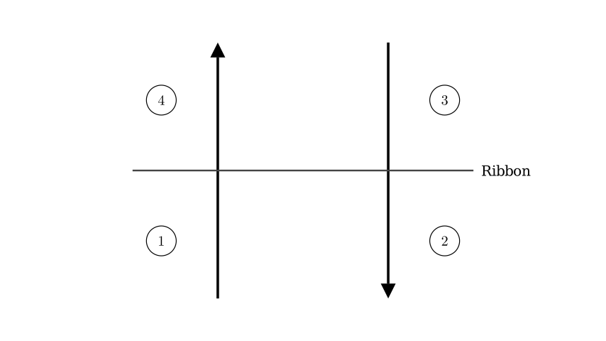
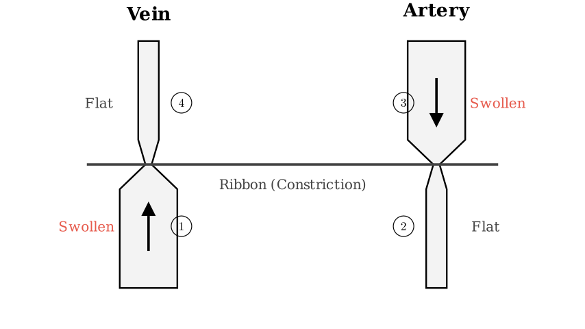
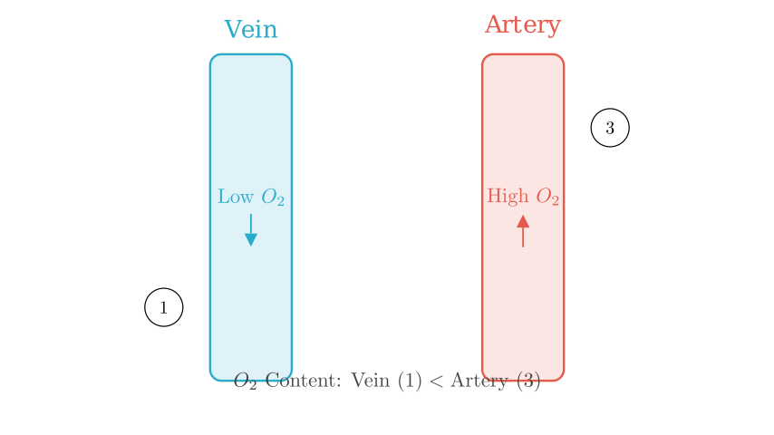

# problem_176_biology_g9

**Problem Statement:**
The figure on the right is a schematic diagram of a student tying their upper arm tightly with a ribbon. It is observed that:
- Blood vessel ① below the ribbon (closer to the fingers) swells, and blood vessel ② becomes flattened.
- Blood vessel ③ above the ribbon swells, and blood vessel ④ becomes flattened.

Which of the following statements is correct?

A. Blood vessels ① and ④ are arteries.
B. Blood vessels ② and ③ are veins.
C. The oxygen content of the blood in vessel ① is lower than in vessel ③.
D. The oxygen content of the blood in vessel ④ is higher than in vessel ②.

**Solution Approach:**
To solve this, we need to identify which vessel is an artery and which is a vein. We will use two key pieces of information:
1. The direction of blood flow indicated by the arrows.
2. The physical effect of the constriction (swelling vs. flattening) relative to the flow direction.
Once identified, we can determine the relative oxygen content based on the function of systemic arteries and veins.

**Step 1: Analyzing Blood Flow Direction**

In the human upper arm (systemic circulation):
- **Arteries** carry blood **away** from the heart, towards the extremities (fingers). In the diagram, this corresponds to downward flow.
- **Veins** carry blood **back** to the heart, away from the extremities. In the diagram, this corresponds to upward flow.

Looking at the arrows in the diagram:
- The left vessel (segments ① and ④) has an arrow pointing **UP**. This indicates flow towards the heart. Therefore, this vessel is a **Vein**.
- The right vessel (segments ② and ③) has an arrow pointing **DOWN**. This indicates flow towards the hand. Therefore, this vessel is an **Artery**.

**Step 2: Verifying with Physical Effects**

When a ribbon constricts a vessel, blood accumulates **upstream** (before the blockage), causing swelling, and drains **downstream** (after the blockage), causing the vessel to flatten.

**Confirmation of Vessel Types:**

- **Left Vessel (Vein):** Blood flows up. The ribbon blocks it. Blood piles up below the ribbon at ① (causing swelling) and drains from ④ above (causing flattening). This matches the problem description.
- **Right Vessel (Artery):** Blood flows down. The ribbon blocks it. Blood piles up above the ribbon at ③ (causing swelling) and is cut off from ② below (causing flattening). This also matches the description.

**Evaluating Options A and B:**
- A. "Vessels ① and ④ are arteries." — **Incorrect**. They are veins.
- B. "Vessels ② and ③ are veins." — **Incorrect**. They are arteries.

**Step 3: Analyzing Oxygen Content**

Now we compare the oxygen levels in these vessels. In the systemic circulation:
- **Arteries** carry oxygenated blood (high oxygen content) to the body tissues.
- **Veins** carry deoxygenated blood (low oxygen content) back to the heart after tissues have used the oxygen.

**Evaluating Options C and D:**

- **Option C:** "The oxygen content of the blood in vessel ① is lower than in vessel ③."
- Vessel ① is a systemic **Vein** (Low Oxygen).
- Vessel ③ is a systemic **Artery** (High Oxygen).
- Low < High. This statement is **Correct**.

- **Option D:** "The oxygen content of the blood in vessel ④ is higher than in vessel ②."
- Vessel ④ is a systemic **Vein** (Low Oxygen).
- Vessel ② is a systemic **Artery** (High Oxygen).
- Low > High. This statement is **Incorrect**.

**Final Conclusion:**
Based on the direction of flow and the physiological characteristics of systemic circulation, the vessel flowing upward is a vein (low oxygen) and the vessel flowing downward is an artery (high oxygen). Therefore, the blood in the vein (①) has a lower oxygen content than the blood in the artery (③).

**Correct Answer:** C

