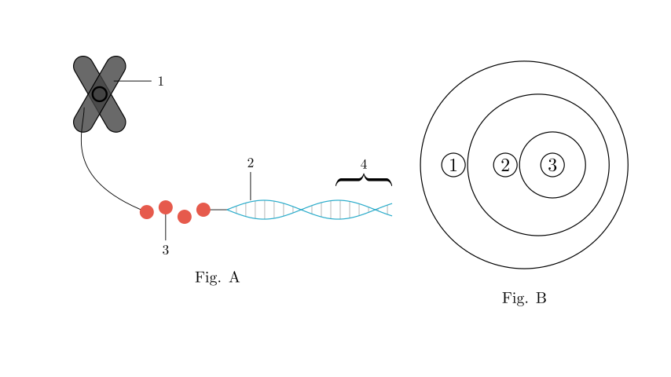
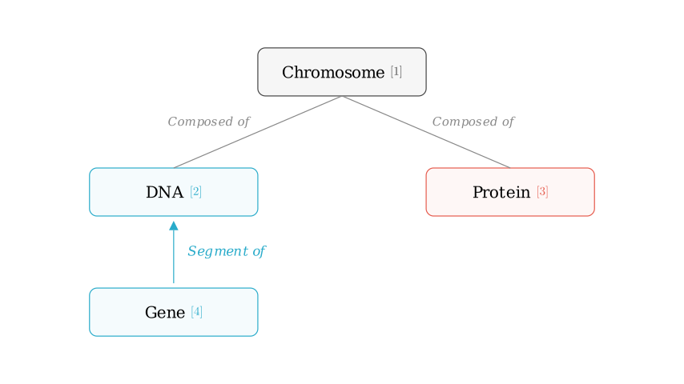
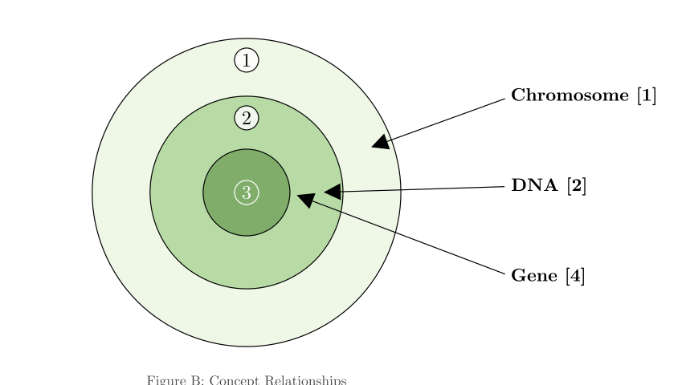
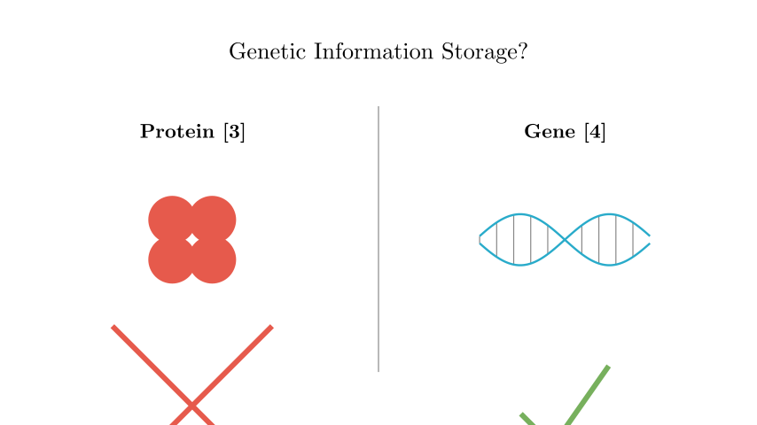

# problem_177_biology_g9

**Problem Statement:**
Figure A (甲) is a schematic diagram illustrating the relationship between chromosomes, DNA, and genes. Figure B (乙) represents the relationships between various concepts shown in Figure A. Which of the following statements is **incorrect**?

**Options:**
A. Both [3] and [4] in Figure A contain specific genetic information.
B. A segment of [2] that has hereditary effects is called a gene.
C. ① in Figure B can represent [1] in Figure A.
D. The shape and number of [1] in the cells of each species are constant.

**Solution Approach:**
To solve this, we must first identify the biological structures labeled [1], [2], [3], and [4] in Figure A. Then, we will map these biological hierarchies to the set relationships (concentric circles) in Figure B. Finally, we will evaluate each option based on biological principles regarding genetic information storage and chromosome structure.

**Step 1: Identifying the Structures in Figure A**

Let's analyze the anatomy shown in Figure A:
*   **[1] Chromosome:** The large X-shaped structure is a chromosome, consisting mainly of DNA and proteins.
*   **[2] DNA:** The long thread that makes up the chromosome structure is the DNA molecule.
*   **[3] Protein (Histone):** The bead-like structures that the DNA wraps around are proteins (specifically histones). Chromosomes are composed of DNA and proteins.
*   **[4] Gene:** This is a specific segment or fragment of the DNA molecule.

Therefore, the structural hierarchy is: **Chromosome ([1])** is composed of **DNA ([2])** and **Protein ([3])**. A **Gene ([4])** is a functional fragment of DNA.

**Step 2: Analyzing the Venn Diagram (Figure B)**

Figure B shows three concentric circles representing an inclusion relationship:
*   **① (Outer Circle):** The largest category.
*   **② (Middle Circle):** Contained within ①.
*   **③ (Inner Circle):** Contained within ②.

Biologically, a **Chromosome** contains **DNA**, and **DNA** contains **Genes**.
Therefore:
*   ① corresponds to Chromosome ([1]).
*   ② corresponds to DNA ([2]).
*   ③ corresponds to Gene ([4]).

This logical mapping allows us to evaluate the specific options provided in the question.

**Step 3: Evaluating the Options**

*   **Option A:** "Both [3] and [4] in Figure A contain specific genetic information."
*   [3] is Protein. Proteins are structural components in chromosomes; they do **not** carry genetic information.
*   [4] is a Gene. Genes are the specific sequences of DNA that **do** carry genetic information.
*   Since proteins do not store genetic info, this statement is **FALSE**.

*   **Option B:** "A segment of [2] with hereditary effects is called a gene."
*   [2] is DNA. By definition, a gene is a segment of DNA that has a hereditary effect (codes for a functional product).
*   This statement is **TRUE**.

*   **Option C:** "① in Figure B can represent [1] in Figure A."
*   As established in our Venn diagram analysis, ① represents the Chromosome ([1]), which contains DNA and Genes.
*   This statement is **TRUE**.

*   **Option D:** "The shape and number of [1] in the cells of each species are constant."
*   [1] is the Chromosome. A fundamental characteristic of a species is that its individuals have a constant and specific number and shape of chromosomes in their somatic cells.
*   This statement is **TRUE**.

**Conclusion**

The question asks to identify the **incorrect** statement.

We determined that Option A claims proteins ([3]) carry genetic information, which is biologically incorrect. Genetic information is stored in the nucleotide sequence of DNA (specifically in genes, [4]), not in the histone proteins ([3]) that support the structure.

**Final Answer:** The incorrect statement is **A**.

