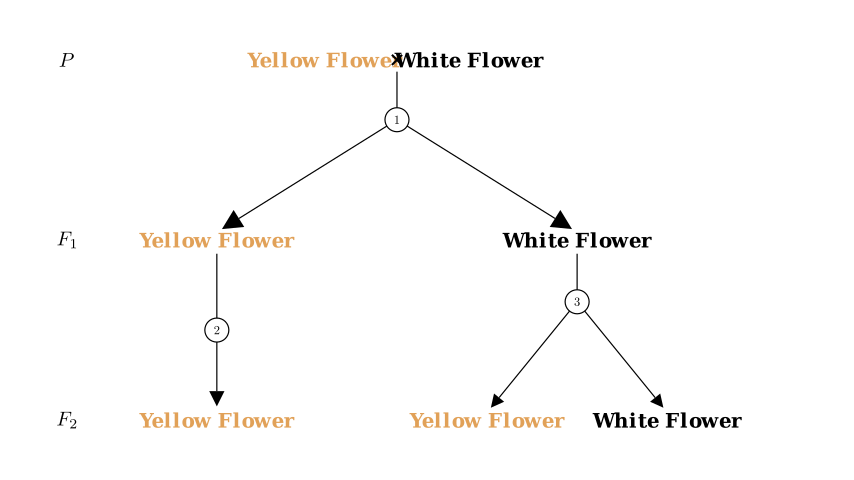
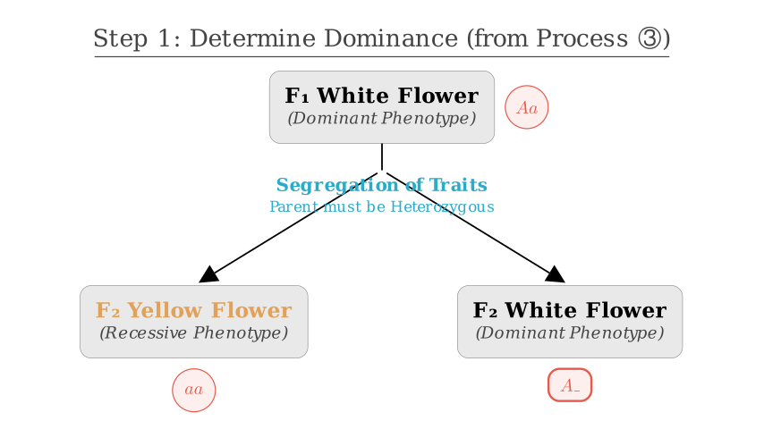
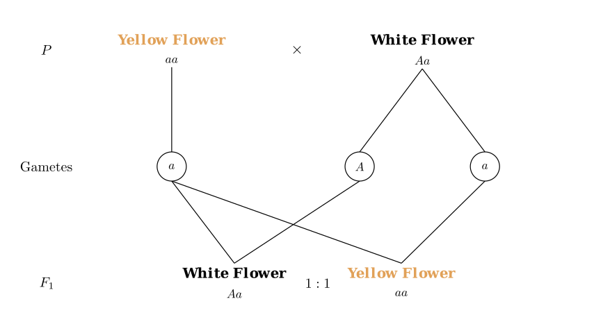
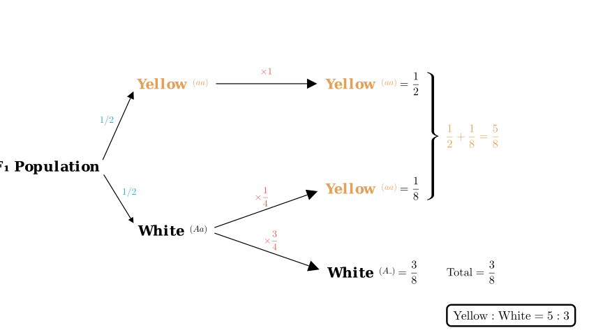

# problem_178_biology_g9

**Problem Statement:**
Pumpkin flower color is controlled by a pair of alleles. The relevant hybridization experiment and results are shown in the figure. Which of the following statements is **incorrect**?

A. The phenotype and ratio of $F_1$ can verify the law of gene segregation.
B. From process ③, it is known that white is the dominant trait.
C. The ratio of yellow flowers to white flowers in $F_2$ is $5:3$.
D. The genotypes of white flower individuals in $F_1$ and $F_2$ are the same.

**Solution Approach:**
We will analyze the genetic diagram to determine the dominant trait and the genotypes of the parents and offspring. Then, we will calculate the phenotypic ratios in the $F_1$ and $F_2$ generations to evaluate each option.

**Step 1: Determine Dominance (Evaluating Option B)**

Let's look at process ③. In this step, the $F_1$ White Flower produces offspring that are both Yellow and White.

- When an individual with a specific phenotype produces offspring with a *different* phenotype (segregation of traits), the parent must be heterozygous, and the parent's trait must be **dominant**.
- Here, White $\rightarrow$ Yellow + White. This implies that **White is dominant** (let's denote it as $A$) and **Yellow is recessive** ($a$).
- Therefore, the $F_1$ White Flower has the genotype $Aa$, and the newly appearing Yellow offspring are $aa$.

Statement **B** is correct.

**Step 2: Determine Parental and $F_1$ Genotypes (Evaluating Option A)**

Since Yellow is recessive ($aa$), the P generation Yellow Flower must be $aa$.
The $F_1$ generation contains Yellow flowers ($aa$). For an offspring to be $aa$, it must receive one $a$ allele from each parent.
- P Yellow parent ($aa$) provides one $a$.
- P White parent must therefore provide the other $a$. Thus, the P White parent is heterozygous ($Aa$).

**The Cross:** P ($aa \times Aa$) $\rightarrow$ $F_1$ ($1 aa : 1 Aa$).

This is a **Test Cross**. The results show a $1:1$ ratio of phenotypes (Yellow : White). This $1:1$ ratio directly reflects the $1:1$ ratio of gametes ($a$ and $A$) produced by the heterozygous parent, thereby verifying the **Law of Segregation**.

Statement **A** is correct.

**Step 3: Calculate $F_2$ Ratios (Evaluating Option C)**

The diagram implies self-pollination (or mating within the same phenotype) for the $F_1$ generation:

1.  **$F_1$ Yellow ($aa$)**: Being recessive, it breeds true.
- Proportion in $F_1$: $1/2$
- Offspring: $100\%$ Yellow ($aa$).
- Contribution to $F_2$ Yellow: $1/2 \times 1 = 1/2$.

2.  **$F_1$ White ($Aa$)**: Heterozygous self-crossing ($Aa \times Aa$).
- Proportion in $F_1$: $1/2$
- Offspring ratio: $1/4$ Yellow ($aa$) : $3/4$ White ($A\_$).
- Contribution to $F_2$ Yellow: $1/2 \times 1/4 = 1/8$.
- Contribution to $F_2$ White: $1/2 \times 3/4 = 3/8$.

**Total $F_2$ Ratios:**
- Total Yellow = $1/2$ (from yellow parent) + $1/8$ (from white parent) = $4/8 + 1/8 = 5/8$.
- Total White = $3/8$ (from white parent).
- Ratio Yellow : White = $5/8 : 3/8$ = **$5 : 3$**.

Statement **C** is correct.

**Step 4: Compare Genotypes (Evaluating Option D)**

- **$F_1$ White individuals:** We established these come from the cross $aa \times Aa$. Therefore, all $F_1$ White individuals are heterozygous (**$Aa$**).

- **$F_2$ White individuals:** These are produced by the selfing of $F_1$ White ($Aa \times Aa$). According to Mendelian ratios, the White offspring consists of:
- $1/3$ Homozygous Dominant (**$AA$**)
- $2/3$ Heterozygous (**$Aa$**)

The $F_1$ White flowers are exclusively $Aa$, while the $F_2$ White flowers are a mixture of $AA$ and $Aa$. Their genotypes are **not** the same.

Statement **D** is **incorrect**.

**Conclusion:**
The incorrect statement is D.

