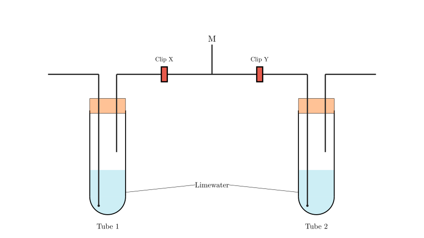
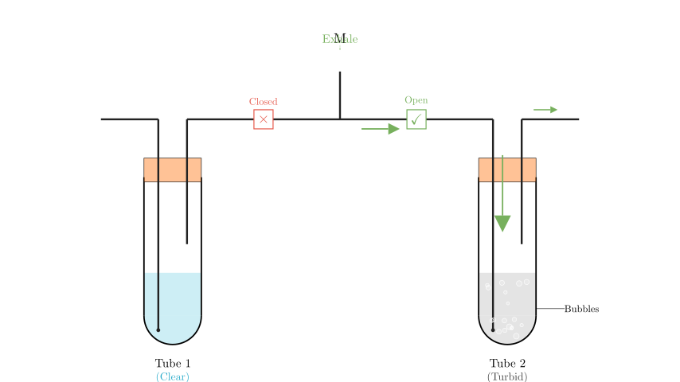

# problem_179_biology_g9

**Problem Statement:**
The diagram shows an apparatus used to compare the composition of inhaled and exhaled air. When exhaled gas passes through M, which of the following statements is correct?

A. Clip X open, Clip Y closed, Test tube 1 clear, Test tube 2 turbid.
B. Clip X open, Clip Y closed, Test tube 1 turbid, Test tube 2 clear.
C. Clip X closed, Clip Y open, Test tube 1 clear, Test tube 2 turbid.
D. Clip X closed, Clip Y open, Test tube 1 turbid, Test tube 2 clear.

**Solution Approach:**
To solve this problem, we must analyze the physical structure of the experimental setup to determine airflow direction during "exhalation." We will identify which test tube allows gas to bubble through the limewater based on the tube lengths. Then, we will apply chemical knowledge regarding the interaction between carbon dioxide ($CO_2$) and limewater to predict the visible results.

**Step 1: Analyze the Airflow Mechanics**

The key to this experiment is the arrangement of the glass tubes inside the test tubes. For gas to interact with the limewater (to test its composition), it must enter through a "long tube" that is submerged in the liquid. This forces the gas to bubble up through the solution.

*   **Test Tube 1 (Left):** The tube connecting to the mouthpiece (M) is short and ends above the liquid. If you exhale (blow) into this side, air would just press down on the liquid surface and try to force liquid up the other tube. If you inhale (suck) from this side, air is pulled from the outside, down the long submerged tube, bubbling through the liquid before reaching your mouth. Therefore, **Tube 1 is designed for inhaling**.

*   **Test Tube 2 (Right):** The tube connecting to the mouthpiece (M) is long and submerged in the liquid. If you exhale into this side, the air flows down into the liquid, bubbles up, and exits through the short tube. Therefore, **Tube 2 is designed for exhaling**.

Since the problem states we are dealing with **exhaled gas** passing through M, we need to direct the airflow into **Test Tube 2**.

**Step 2: Determine Valve Operation**

To ensure the exhaled air goes into Test Tube 2 and not Test Tube 1, we must manipulate the clips:
*   **Open Clip Y:** This allows the exhaled air to flow from M into Test Tube 2.
*   **Close Clip X:** This prevents air from entering Test Tube 1 (which would push liquid out or disrupt the flow).

**Step 3: Analyze the Chemical Result**

*   **Chemical Principle:** Limewater is a solution of calcium hydroxide, $Ca(OH)_2$. It is used to test for the presence of carbon dioxide ($CO_2$). When $CO_2$ reacts with limewater, it produces calcium carbonate ($CaCO_3$), a white precipitate that makes the water appear cloudy or "turbid."
*   **Comparison:** Exhaled air contains a significantly higher concentration of carbon dioxide compared to inhaled air (atmospheric air).
*   **Observation:** Since the exhaled air bubbles through Test Tube 2, the limewater in **Test Tube 2 will become turbid**. Since no air passes through Test Tube 1, it remains **clear**.

**Conclusion:**
The correct operation is to close Clip X and open Clip Y. The result is that Test Tube 1 remains clear and Test Tube 2 becomes turbid.

Matching this with the options:
*   A: X open... (Incorrect)
*   B: X open... (Incorrect)
*   C: X closed, Y open, Tube 1 clear, Tube 2 turbid. (**Correct**)
*   D: X closed, Y open, Tube 1 turbid... (Incorrect observation)

**Final Answer:**
The correct option is **C**.

**Verification and Recap:**

*   **Setup Check:** Tube 2 has the submerged inlet from the mouth, making it the correct path for exhaling.
*   **Clip Check:** To use Tube 2, Clip Y must be open. To isolate it, Clip X must be closed.
*   **Reaction Check:** Exhaled breath is rich in $CO_2$, which turns limewater cloudy. Tube 2 should be turbid.

The reasoning holds. The correct choice is C.

