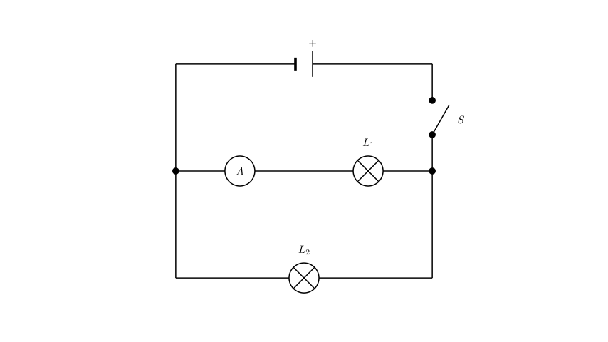
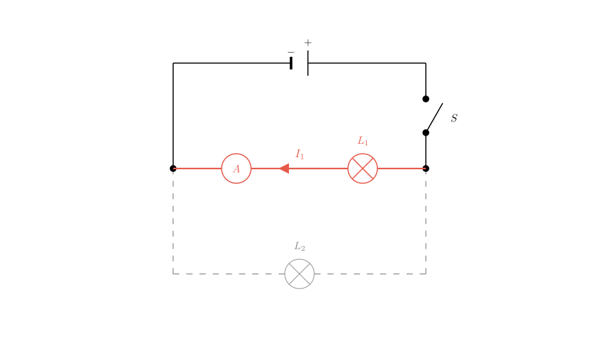
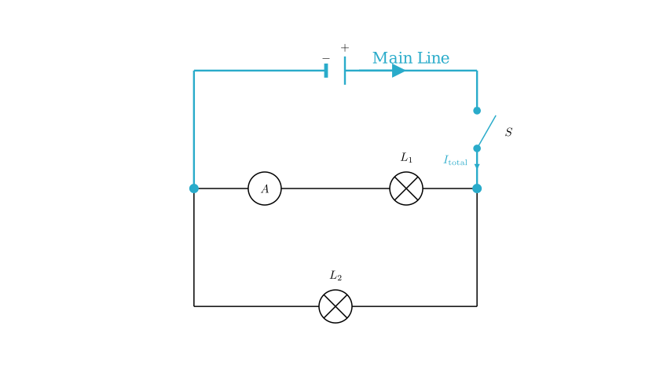

# problem_17_physics_g9

**Problem Statement:**
In the circuit shown in the figure, which of the following statements is correct? ( )
A. The lamps $L_1$ and $L_2$ are in series.
B. The ammeter measures the current of $L_1$.
C. The ammeter measures the current of $L_2$.
D. The switch controls only $L_2$.

**Solution Approach:**
To solve this problem, we need to translate the physical wiring diagram into a circuit schematic. We will trace the path of the current starting from the positive terminal of the power source, identify nodes where the current splits or combines, and determine the placement of the components (switch, bulbs, ammeter) to see if they are in series or parallel.

First, let's trace the current flow to determine the connection type (series vs. parallel).

Starting from the **positive terminal** of the battery pack, the wire connects to the **Switch (S)**. 
From the other side of the switch, the current reaches a junction point. One wire goes to bulb $L_2$ and another connects to bulb $L_1$. Since the current has two separate paths to flow through—one path through $L_1$ and another through $L_2$—the two bulbs are connected in **parallel**, not series.

This eliminates Option A.

Next, let's analyze what the **Ammeter** is measuring. 

Looking at the physical connections:
1. The current flows through bulb $L_1$.
2. It then enters the positive terminal of the Ammeter (the '0.6' post).
3. It exits the negative terminal of the Ammeter and returns to the battery.

The current for bulb $L_2$, however, connects directly to the negative terminal of the Ammeter (joining the return line) without passing *through* the Ammeter's measuring coil.

Since the Ammeter is placed in the same branch as $L_1$ (in series with $L_1$), it measures the current flowing through **$L_1$ only**.

This confirms Option B and eliminates Option C.

Finally, let's verify the function of the **Switch (S)**.

The switch is located on the main wire coming from the positive terminal of the battery, *before* the current splits into the two parallel branches for $L_1$ and $L_2$. This is known as the "dry line" or main trunk.

Because it is on the main line, opening the switch cuts off current to the entire circuit. Therefore, the switch controls **both** $L_1$ and $L_2$, not just $L_2$.

This eliminates Option D.

**Conclusion:**
- A is incorrect (they are in parallel).
- C is incorrect (it doesn't measure $L_2$).
- D is incorrect (it controls both).
- **B is correct**: The ammeter is in series with $L_1$ and measures its current.

**Correct Answer:** B

