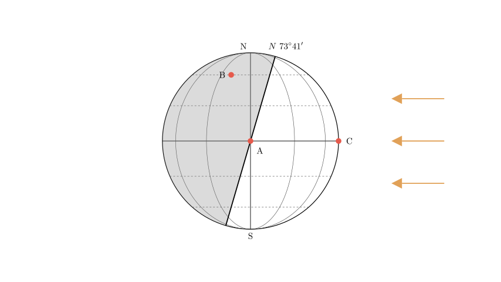
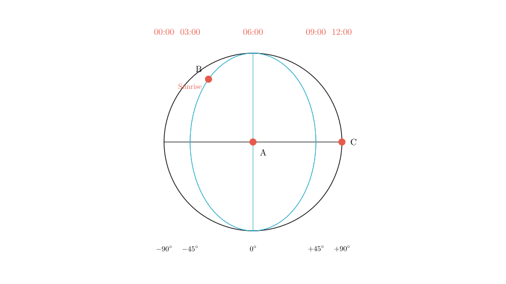
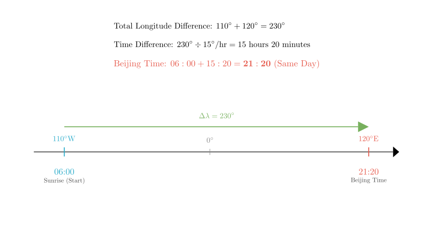

# problem_180_geography_g12

**Problem Statement:**

Read the illumination map of the Western Hemisphere at a certain time and answer the following questions.

(1) At this time, the solar altitude at point A is ________, and at point C is ________.
(2) The length of daytime at point B is ________ hours, and the length of night at point A is ________ hours.
(3) The status of day and night length in the Southern Hemisphere is ________.
(4) At this moment, the time in Beijing is ________ hours ________ minutes on that day.

**Solution Approach:**

To solve this problem, we will:
1.  **Analyze the Diagram:** Determine the sun's position, the terminator line (sunrise or sunset), and the coordinate system (latitude and longitude) based on the "Western Hemisphere" label.
2.  **Determine Solar Declination:** Use the latitude label ($73^\circ 41'$) to find the declination of the sun ($\delta$).
3.  **Calculate Solar Altitude:** Use the position of points A and C relative to the terminator and subsolar point.
4.  **Calculate Day Length:** Analyze the longitude difference between point B and the central meridian to determine sunrise time and day duration.
5.  **Calculate Time:** Use the longitude difference between the central meridian and Beijing to find the local time.

**Step 1: Diagram Analysis**

*   **Hemisphere:** The problem states this is the **Western Hemisphere**. The Western Hemisphere spans from $160^\circ$E (left edge) to $20^\circ$W (right edge). The central meridian is **$110^\circ$W**.
*   **Sun Position:** The sun rays come from the right, illuminating the right side of the Earth.
*   **Terminator:** The line separating day and night passes through points A and B. Since the Earth rotates from West (left) to East (right), points move from the shaded area (night) into the lit area (day). Therefore, the terminator represents the **Sunrise** line.
*   **Latitude info:** The label **N $73^\circ 41'$** indicates the latitude where the polar day begins (the terminator is tangent to this latitude). This allows us to calculate the Solar Declination ($\delta$):
$$ \delta = 90^\circ - 73^\circ 41' = 16^\circ 19' \text{ N} $$
The sun is vertically overhead at $16^\circ 19'$ N.

**Step 2: Solving Question (1) - Solar Altitude**

*   **Point A:** Point A is located on the terminator. By definition, any point on the terminator is experiencing sunrise or sunset, so the sun is on the horizon.
*   **Solar Altitude at A = $0^\circ$**.

*   **Point C:** Point C is on the Equator at the rightmost edge of the map.
*   Since A is the central meridian ($110^\circ$W) and is at sunrise (06:00 solar time on the Equator), and C is $90^\circ$ to the East (at $20^\circ$W), the time difference is 6 hours ($90^\circ / 15^\circ/\text{hr}$).
*   Time at C = 06:00 + 6 hours = **12:00 (Noon)**.
*   At noon, Solar Altitude ($H$) is calculated by: $H = 90^\circ - |\phi - \delta|$.
*   For C: Latitude $\phi = 0^\circ$, Declination $\delta = 16^\circ 19'$.
*   $H_C = 90^\circ - |0^\circ - 16^\circ 19'| = 73^\circ 41'$.
*   **Solar Altitude at C = $73^\circ 41'$**.

**Step 3: Solving Question (2) - Day and Night Length**

*   **Point B (Day Length):**
*   We need to determine the longitude of B relative to the sunrise line (Central Meridian A).
*   The map shows the hemisphere ($180^\circ$ wide) divided into 4 sections by the visible meridians (Left Edge, Middle-Left, Center, Middle-Right, Right Edge). Each section represents $45^\circ$ of longitude ($180^\circ / 4$).
*   Point B is located on the meridian one section to the left (West) of the center.
*   Longitude difference = $45^\circ$ West.
*   Time difference = $45^\circ / 15^\circ/\text{hr} = 3$ hours.
*   Since A is at 06:00 (Sunrise), and B is $45^\circ$ West, B's local time is $06:00 - 3\text{h} = 03:00$.
*   Because B is on the terminator, **Sunrise at B occurs at 03:00 local time**.
*   Day Length formula: $\text{Day Length} = (12 - \text{Sunrise Time}) \times 2$.
*   $\text{Day Length} = (12 - 3) \times 2 = 18$ hours.

*   **Point A (Night Length):**
*   Point A is on the **Equator**.
*   On the Equator, day and night are always equal throughout the year.
*   **Night Length at A = 12 hours**.

**Step 4: Solving Question (3) - Southern Hemisphere Conditions**

*   The North Pole region is illuminated (Polar Day), indicating it is summer in the Northern Hemisphere.
*   Consequently, it is winter in the Southern Hemisphere.
*   **Condition:** The Southern Hemisphere experiences **short days and long nights**. The area south of $73^\circ 41'$ S experiences Polar Night.

**Step 5: Solving Question (4) - Beijing Time**

*   **Reference Point:** The central meridian (Point A) is at **$110^\circ$W**. We established that the local time at A is **06:00** (Sunrise on the Equator).
*   **Target Point:** Beijing is located at **$120^\circ$E**.
*   **Longitude Difference:**
*   From $110^\circ$W eastward to $0^\circ$ (Prime Meridian) is $110^\circ$.
*   From $0^\circ$ eastward to $120^\circ$E is $120^\circ$.
*   Total difference = $110^\circ + 120^\circ = 230^\circ$.
*   **Time Difference:**
*   $230^\circ \div 15^\circ/\text{hour} = 15 \text{ hours and } 20 \text{ minutes}$.
*   Since Beijing is East of $110^\circ$W, its time is ahead.
*   **Calculation:**
*   Beijing Time = 06:00 + 15 hours 20 minutes = **21:20**.
*   The problem asks for the time on "that day" (gai ri), and 21:20 is still within the same calendar day.

**Final Answer Summary:**

(1) **0°**; **73° 41'**
(2) **18**; **12**
(3) **Short days and long nights** (or "Days are short, nights are long")
(4) **21**; **20**

