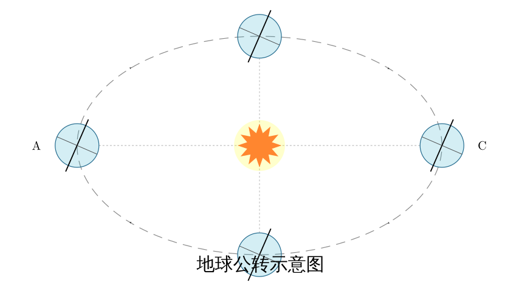
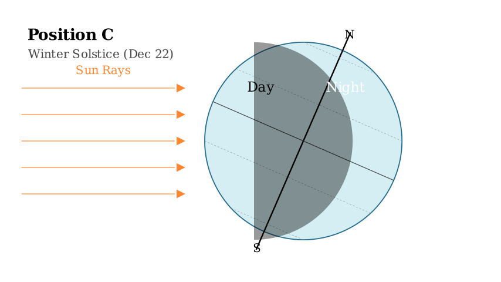
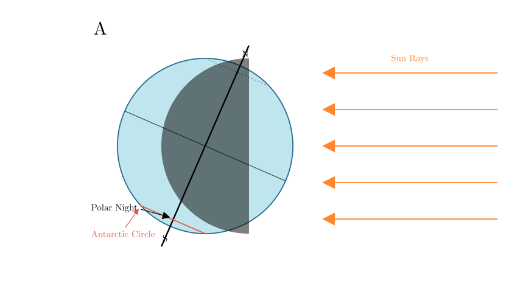
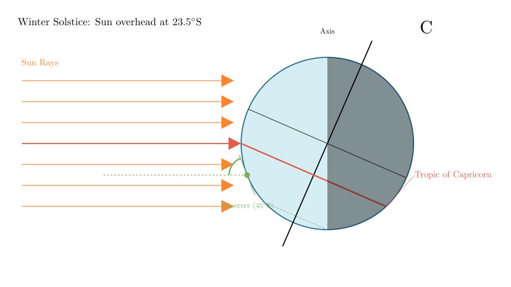

# problem_183_geography_g12

**Problem Statement:**
Read the schematic diagram of Earth's revolution and answer the following:
(1) The solar terms (seasons) shown at the four points in the figure are: A $\underline{\hspace{3cm}}$     C $\underline{\hspace{3cm}}$ 
(2) The time when days are shortest and nights are longest in the Northern Hemisphere is $\underline{\hspace{1cm}}$, the time when polar night occurs within the Antarctic Circle is $\underline{\hspace{1cm}}$, and the time when the noon sun altitude is highest in the region south of the Tropic of Capricorn is $\underline{\hspace{1cm}}$ (fill in the letter codes).

**Solution Approach:**
To solve this, we must determine the season at each position (A, B, C, D) by analyzing the tilt of the Earth's axis relative to the Sun. Once the seasons (Solstices and Equinoxes) are identified, we can deduce day lengths, polar phenomena, and solar altitude.

**Step 1: Identify the Solar Terms (Seasons) for A and C**

The key to identifying the seasons is the direction of the Earth's axis tilt:

*   **Position A:** Observe the Earth on the left. The North Pole (top of the axis) is leaning **towards** the Sun. This means the direct sunlight strikes the Northern Hemisphere (specifically the Tropic of Cancer). This position represents the **Summer Solstice**.

*   **Position C:** Observe the Earth on the right. The North Pole is leaning **away** from the Sun. Direct sunlight strikes the Southern Hemisphere (specifically the Tropic of Capricorn). This represents the **Winter Solstice**.

Therefore:
*   A is the Summer Solstice.
*   C is the Winter Solstice.

**Step 2: Analyze Day Length in the Northern Hemisphere**

The first part of question (2) asks for the time when the **Northern Hemisphere has the shortest days and longest nights**.

As shown in the diagram above (Position C):
*   Because the North Pole leans away from the Sun, the Northern Hemisphere receives the least amount of sunlight.
*   A large portion of the Northern Hemisphere is covered by the shadow (night) side.

This corresponds to the **Winter Solstice**, which is position **C**.

**Step 3: Analyze Polar Night in the Antarctic Circle**

The second part of question (2) asks when **polar night (continuous darkness) occurs within the Antarctic Circle**.

*   Look at Position **A** (Summer Solstice): The North Pole leans toward the Sun. Consequently, the South Pole leans *away*.
*   The diagram shows that the area around the South Pole (Antarctic Circle) stays in the shadow even as the Earth rotates.
*   Therefore, the Antarctic Circle experiences polar night at position **A**.

*(Note: At position C, the Antarctic circle experiences polar day/midnight sun.)*

**Step 4: Analyze Noon Sun Altitude**

The third part of question (2) asks when the **noon sun altitude is highest in the region south of the Tropic of Capricorn**.

*   The sun's altitude is highest when the sun is directly overhead or as close to overhead as possible.
*   The sun is directly overhead at the Tropic of Capricorn (23.5°S) during the **Winter Solstice**.
*   For any location south of the Tropic of Capricorn, the sun is closest to them (and thus highest in the sky) on this day.

This corresponds to position **C**.

**Final Verification:**
(1) A is Summer Solstice, C is Winter Solstice. Correct.
(2) Shortest day in North = Winter Solstice (C). Correct.
(2) Polar night in Antarctic = Summer Solstice (A). Correct.
(2) Max sun altitude South of Tropic of Capricorn = Winter Solstice (C). Correct.

**Final Answer:**
(1) A: **Summer Solstice**; C: **Winter Solstice**
(2) **C**; **A**; **C**

