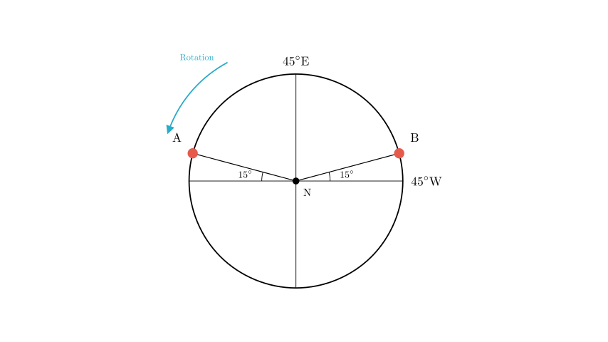
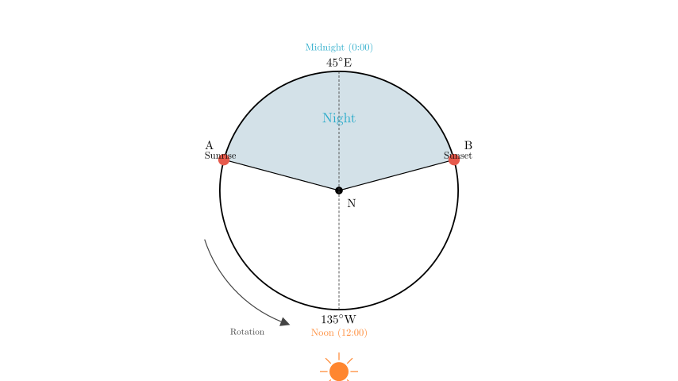
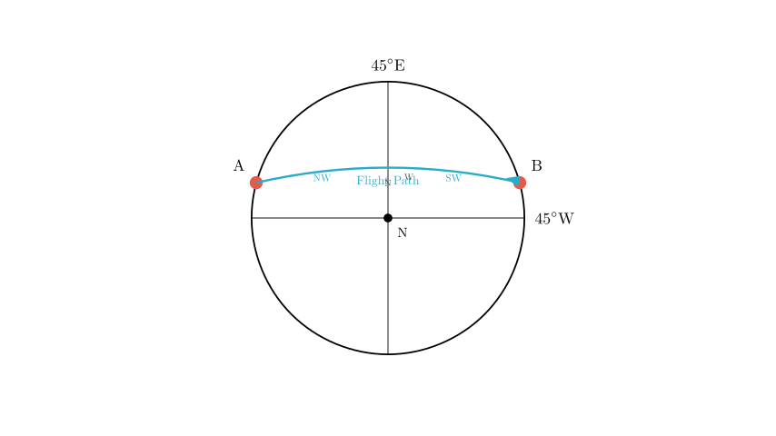

# problem_185_geography_g12

**Problem Statement:**
Points A and B in the figure are the intersections of the morning line (sunrise terminator) and evening line (sunset terminator) with the $30^\circ N$ latitude circle. Read the figure and complete the following requirements.

(1) If the terminator is tangent to the $70^\circ$ latitude circle on this day, the geographic coordinates of the subsolar point are $\underline{\hspace{5em}}$.
(2) The local time of sunrise at point A on this day is $\underline{\hspace{5em}}$.
(3) To fly from point A to point B covering the shortest distance, the flight direction should be $\underline{\hspace{5em}}$.
(4) If the subsolar point is moving South on this day, which of the following statements is credible? (    )
A. The sea area near the Cape of Good Hope has high winds and rough waves.
B. The Earth orbits to the vicinity of the aphelion.
C. Farmers in Australia are busy sowing wheat.
D. Sandstorms occur frequently in northern China.
E. The fire prevention task in the Greater and Lesser Khingan Mountains is severe.
F. The noon solar altitude on the $20^\circ S$ latitude circle is approximately $46.5^\circ$.

**Solution Approach:**
1.  **Determine Earth Orientation:** Analyze the longitude labels ($45^\circ E$, $45^\circ W$) to determine the rotation direction and hemisphere (North vs. South Pole view).
2.  **Analyze Day/Night Arcs:** Use the $15^\circ$ angles to determine the longitude of points A and B and identify which arc represents day vs. night.
3.  **Calculate Coordinates (Q1):** Use the tangency latitude to find solar declination and the center of the day arc to find the subsolar longitude.
4.  **Calculate Time (Q2):** Use the longitude difference between point A and the midnight meridian.
5.  **Determine Flight Path (Q3):** Apply Great Circle navigation principles on a polar projection.
6.  **Analyze Season (Q4):** Determine the specific time of year based on the solar declination and movement direction to evaluate the geographical phenomena.

**Step 1: Determine the Hemisphere and Rotation**

First, we must establish the viewing perspective.
*   The top of the diagram is labeled $45^\circ E$.
*   The right side is labeled $45^\circ W$.
*   Following the direction of increasing longitude for East: Moving from $45^\circ W$ (Right) to $45^\circ E$ (Top) represents a $90^\circ$ difference.
*   Since Earth rotates from West to East, we need to determine which direction represents East.
*   From $45^\circ W$ to $0^\circ$ to $45^\circ E$ is an Eastward progression. In this diagram, moving from Right ($45^\circ W$) to Top ($45^\circ E$) is a **Counter-Clockwise (CCW)** movement.
*   A Counter-Clockwise rotation indicates a view from above the **North Pole**.
*   Therefore, the center is the North Pole, and the outer circle is the $30^\circ N$ latitude line.

**Step 2: Analyze the Day/Night Arcs**

We need to determine if the arc between A and B (passing through $45^\circ E$) is the day arc or the night arc.
*   The problem states the terminator is tangent to $70^\circ$ latitude. This implies the Solar Declination is $90^\circ - 70^\circ = 20^\circ$.
*   Assuming for a moment this is the Northern Hemisphere Summer (Sun at $20^\circ N$), the Northern Hemisphere should have long days and short nights.
*   Let's calculate the angle of the arc at the top (containing $45^\circ E$).
*   Point A is $15^\circ$ above the horizontal on the left.
*   Point B is $15^\circ$ above the horizontal on the right.
*   The angle of the sector at the top is $180^\circ - 15^\circ - 15^\circ = 150^\circ$.
*   The angle of the sector at the bottom is $360^\circ - 150^\circ = 210^\circ$.
*   Since $150^\circ < 180^\circ$, the top arc represents the **Short Night**, and the bottom arc represents the **Long Day**.
*   This confirms it is Summer in the Northern Hemisphere (Solar Declination $20^\circ N$).
*   The center of the Night Arc corresponds to the **Midnight Meridian (0:00 Local Time)**.
*   Therefore, the $45^\circ E$ meridian is the 0:00 line.
*   The center of the Day Arc corresponds to the **Noon Meridian (12:00 Local Time)**.
*   The Noon Meridian is directly opposite $45^\circ E$, which is $180^\circ - 45^\circ = 135^\circ W$.

**(1) Solution:**
*   **Latitude:** Solar Declination is $20^\circ N$.
*   **Longitude:** The subsolar point is on the Noon Meridian, which is $135^\circ W$.
*   **Answer:** $(20^\circ N, 135^\circ W)$.

**Step 3: Calculate Sunrise Time at Point A (Question 2)**

*   Point A represents the transition from Night to Day (Sunrise) because Earth rotates Counter-Clockwise. As the Earth rotates, point A moves out of the shaded night region.
*   We established that the meridian $45^\circ E$ is Midnight (0:00).
*   We need to find the longitude difference between Point A and the Midnight meridian ($45^\circ E$).
*   In the diagram, Point A is $15^\circ$ above the horizontal axis on the left.
*   The angle from the Top ($45^\circ E$) to the Left Horizontal is $90^\circ$.
*   Therefore, the angle from Top ($45^\circ E$) to Point A is $90^\circ - 15^\circ = 75^\circ$.
*   Point A is $75^\circ$ West of the Midnight line (in terms of rotation, A is "ahead" of midnight, or physically to the East of $45^\circ E$ by $75^\circ$ in longitude... wait, let's look at the map).
*   **Correction on Geometry:**
*   North Pole View (CCW is East).
*   Top is $45^\circ E$.
*   Move CCW (East) $90^\circ$ $\rightarrow$ Left is $135^\circ E$.
*   A is $15^\circ$ "up" (Clockwise/West) from $135^\circ E$.
*   So A is at $120^\circ E$.
*   Longitude difference between A ($120^\circ E$) and Midnight ($45^\circ E$) is $120 - 45 = 75^\circ$.
*   **Time Calculation:**
*   Earth rotates $15^\circ$ per hour.
*   $75^\circ / 15^\circ/\text{hr} = 5$ hours.
*   Since A is the Sunrise point, and the night arc spans $150^\circ$ (10 hours total), sunrise is half the night length before/after midnight?
*   Night is 10 hours long. Sunrise is $12:00 - \text{DayLength}/2$ or $0:00 + \text{NightLength}/2$.
*   Sunrise = $0:00 + 5 \text{ hours} = 5:00$.
*   **Answer:** 5:00.

**Step 4: Flight Direction from A to B (Question 3)**

*   **Start:** Point A ($120^\circ E$).
*   **End:** Point B.
*   B is symmetric to A. B is near $45^\circ W$.
*   Top ($45^\circ E$) $\rightarrow$ Clockwise (West) $90^\circ$ $\rightarrow$ Right ($45^\circ W$).
*   B is $15^\circ$ "up" (CCW/East) from Right.
*   So B is at $30^\circ W$.
*   **Path:** From $120^\circ E$ to $30^\circ W$.
*   **Longitude Difference:** $120^\circ + 30^\circ = 150^\circ$.
*   Since the difference ($150^\circ$) is less than $180^\circ$, the shortest path (Great Circle) is the minor arc between them.
*   This arc crosses the $45^\circ E$ meridian.
*   **Direction:**
*   East/West component: To go from $120^\circ E$ to $30^\circ W$ across $45^\circ E$, we are moving **West**. (Check: $120^\circ E \rightarrow 45^\circ E \rightarrow 30^\circ W$ is decreasing East longitude/moving into West longitude).
*   North/South component: In the Northern Hemisphere, the Great Circle path between two points at the same latitude bulges towards the North Pole.
*   Therefore, the path goes **Northwest** first (approaching the pole), reaches the highest latitude, and then curves **Southwest** to reach B.
*   **Answer:** Northwest then Southwest.

**Step 5: Analyze Geographical Phenomena (Question 4)**

**Condition:** The subsolar point is moving **South**.
*   Current State: Subsolar point is at $20^\circ N$.
*   Context: The sun is at $20^\circ N$ twice a year: once moving North (late May) and once moving South (late July).
*   Since it is moving South, the date is approximately **late July**.

**Evaluate Options:**
*   **A. Cape of Good Hope (high winds/rough waves):** The Cape of Good Hope is in the Southern Hemisphere (Mediterranean climate). In July, it is **Winter**. During winter, the Westerlies belt shifts North, controlling this region. Westerlies are known for bringing storms, high winds, and rough waves. **(Credible)**
*   **B. Earth near Aphelion:** Aphelion occurs around **July 4th**. The date is late July. This is relatively "near" compared to Perihelion (January), but we are moving away from it. While astronomically related, Option A describes a specific climatic characteristic often tested in geography. However, both A and B are scientifically plausible. In the context of standard geography examinations, the specific climatic impact (A) is often the intended answer, as "near" is subjective. Let's re-verify the "moving South" timing. Solstice is June 22 ($23.5^\circ$). Moving to $20^\circ$ takes about a month. Late July. July 24 is reasonably close to July 4. However, the stormy winter sea at the Cape is a definitive seasonal feature.
*   **C. Australia sowing wheat:** Australia is in the Southern Hemisphere. July is **Winter**. Wheat is typically sown in Autumn (April-May) and grows during Winter. Harvest is in late Spring/Summer. Farmers would not be sowing in July. **(False)**
*   **D. Sandstorms in Northern China:** These occur primarily in **Spring** (March-May). July is the rainy season (Summer Monsoon), so sandstorms are rare. **(False)**
*   **E. Fire prevention in Khingan Mountains:** July is the **Summer** rainy season in Northeast China. Fire risk is lowest. Fire risk is high in Spring and Autumn. **(False)**
*   **F. Noon solar altitude at $20^\circ S$:**
*   Formula: $H = 90^\circ - |\phi - \delta|$
*   $\phi = 20^\circ S = -20^\circ$
*   $\delta = 20^\circ N = +20^\circ$
*   $H = 90^\circ - |-20^\circ - 20^\circ| = 90^\circ - 40^\circ = 50^\circ$.
*   The option claims $46.5^\circ$. **(False)**

**Conclusion:** Option A is the most credible statement describing the Southern Hemisphere winter conditions.

**Final Recap:**
1.  **Coordinates:** $(20^\circ N, 135^\circ W)$
2.  **Sunrise:** 5:00
3.  **Flight Direction:** Northwest then Southwest
4.  **Credible Statement:** A

