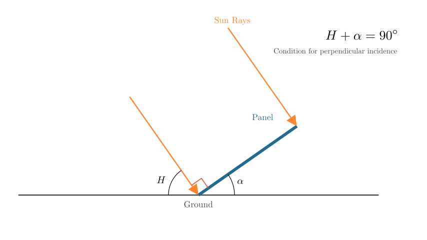
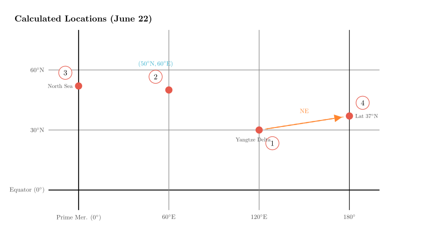

# problem_187_geography_g12

**Problem Statement:**
The figure below shows the inclination angle of solar water heaters at four locations in the Northern Hemisphere on June 22nd when the local sun is due south at different times.

(1) The order of the noon solar altitude at the four locations on this day from largest to smallest is ________, and the order of the day length at the four locations on this day from longest to shortest is ________.
(2) The geographic coordinates of location ② are ________, and location ④ is in the ________ direction of location ①.
(3) If location ① is on a continent, the famous industrial base nearby is the ________ industrial base; if location ④ were land, the famous industrial base nearby would be ________.
(4) The famous fishing ground near the country of location ③ is the ________ fishing ground, and the climate of that country is deeply influenced by the ________ ocean current.

**Solution Approach:**
1.  **Analyze the Geometry:** Understand the relationship between the solar water heater's tilt angle ($\alpha$), the noon solar altitude ($H$), and the location's latitude ($\phi$).
2.  **Calculate Coordinates:** Use the given dates (June 22nd) and times (World Time/UTC) to determine the latitude and longitude of each location.
3.  **Sort Values:** Rank solar altitudes and day lengths based on the calculated latitudes.
4.  **Identify Locations:** Map the coordinates to real-world geography to identify industrial bases, fishing grounds, and ocean currents.

Let's start by visualizing the relationship between the solar heater angle and the sun's position.

**Step 1: Analyzing Solar Altitude and Latitude**

For a solar water heater to work most efficiently, the sun's rays must be perpendicular to the collector panel. From the diagram in Scene 1, we can derive the relationship between the noon solar altitude ($H$) and the heater's tilt angle ($\alpha$):
$$H + \alpha = 90^\circ \implies H = 90^\circ - \alpha$$

This means a **smaller tilt angle** corresponds to a **larger solar altitude** (sun is higher in the sky).

**Ordering Solar Altitude:**
Looking at the angles given in the problem:
- ① (4h): $6^\circ 34'$
- ② (8h): $26^\circ 34'$
- ③ (12h): $28^\circ 34'$
- ④ (24h): $13^\circ 34'$

Sorting from smallest angle to largest angle (which gives largest $H$ to smallest $H$):
$6^\circ 34' < 13^\circ 34' < 26^\circ 34' < 28^\circ 34'$

**Result:** ① > ④ > ② > ③

**Calculating Latitude:**
The formula for noon solar altitude on the Summer Solstice (June 22nd) in the Northern Hemisphere is:
$$H = 90^\circ - |\phi - \delta|$$
Where $\phi$ is the local latitude and $\delta$ is the solar declination ($23^\circ 26'$ N).

Substituting $H = 90^\circ - \alpha$, we get:
$$\alpha = |\phi - 23^\circ 26'|$$

Since all locations are in the Northern Hemisphere ($\phi > 0$), we calculate $\phi$ for each:
- **①:** $|\phi - 23^\circ 26'| = 6^\circ 34' \rightarrow \phi = 30^\circ$ N (Reasonable for industrial base)
- **②:** $|\phi - 23^\circ 26'| = 26^\circ 34' \rightarrow \phi = 50^\circ$ N
- **③:** $|\phi - 23^\circ 26'| = 28^\circ 34' \rightarrow \phi = 52^\circ$ N
- **④:** $|\phi - 23^\circ 26'| = 13^\circ 34' \rightarrow \phi = 37^\circ$ N

**Ordering Day Length:**
On June 22nd (Summer Solstice), day length in the Northern Hemisphere increases as you move North. Therefore, higher latitude = longer day.

Latitudes: ③ ($52^\circ$) > ② ($50^\circ$) > ④ ($37^\circ$) > ① ($30^\circ$)

**Result:** ③ > ② > ④ > ①

**Step 2: Calculating Longitude and Direction**

We are given the "World Time" (UTC) when local noon occurs. Local noon is always 12:00 Local Time.
Formula: $\text{Longitude} = (12 - \text{UTC Time}) \times 15^\circ/\text{hour}$.
(Positive = East, Negative = West).

- **① (UTC 4h):** $(12 - 4) \times 15^\circ = 120^\circ$ E
- **② (UTC 8h):** $(12 - 8) \times 15^\circ = 60^\circ$ E
- **③ (UTC 12h):** $(12 - 12) \times 15^\circ = 0^\circ$
- **④ (UTC 24h/0h):** $(12 - 24) \times 15^\circ = -180^\circ$ (or $180^\circ$ W/E)

**Coordinates of ②:**
Latitude $50^\circ$ N, Longitude $60^\circ$ E.
**Answer:** ($50^\circ$N, $60^\circ$E)

**Direction of ④ relative to ①:**
- Location ①: ($30^\circ$N, $120^\circ$E)
- Location ④: ($37^\circ$N, $180^\circ$)

Latitude comparison: $37^\circ$N is North of $30^\circ$N.
Longitude comparison: $180^\circ$ is East of $120^\circ$E.

**Answer:** Northeast.

**Step 3: Geographic Identification**

**Question (3): Industrial Bases**
- **Location ① ($30^\circ$N, $120^\circ$E):** This coordinates points exactly to the **Yangtze River Delta** in China (near Shanghai/Hangzhou). This is China's largest comprehensive industrial base.
- **Location ④ ($37^\circ$N, $180^\circ$):** This point falls in the Pacific Ocean. However, the question asks "If ④ were land...". We look for a famous industrial base at **$37^\circ$N latitude** on the nearest continent or globally famous at that latitude. The most prominent one is **Silicon Valley** (San Francisco Bay Area, USA), located around $37^\circ$N.

**Question (4): Fishing Ground and Current**
- **Location ③ ($52^\circ$N, $0^\circ$):** These are the coordinates for London, UK.
- **Fishing Ground:** The famous fishing ground nearby is the **North Sea Fishing Ground**.
- **Ocean Current:** The climate of Western Europe (UK) is heavily influenced by the **North Atlantic Drift** (or North Atlantic Warm Current), which keeps it warmer than other regions at the same latitude.

**Final Recap & Verification:**

1.  **Solar Altitude:** Inversely related to heater angle. Order: ① > ④ > ② > ③.
2.  **Day Length:** Directly related to Latitude in Summer. Order: ③ > ② > ④ > ①.
3.  **Coordinates ②:** ($50^\circ$N, $60^\circ$E).
4.  **Direction:** ④ is Northeast of ①.
5.  **Industrial Bases:** ① is Yangtze River Delta; ④ is Silicon Valley (implied by $37^\circ$N latitude).
6.  **Location ③:** UK. Fishery: North Sea. Current: North Atlantic Warm Current.

All derived locations and physical geography facts are consistent with standard geographical data.

