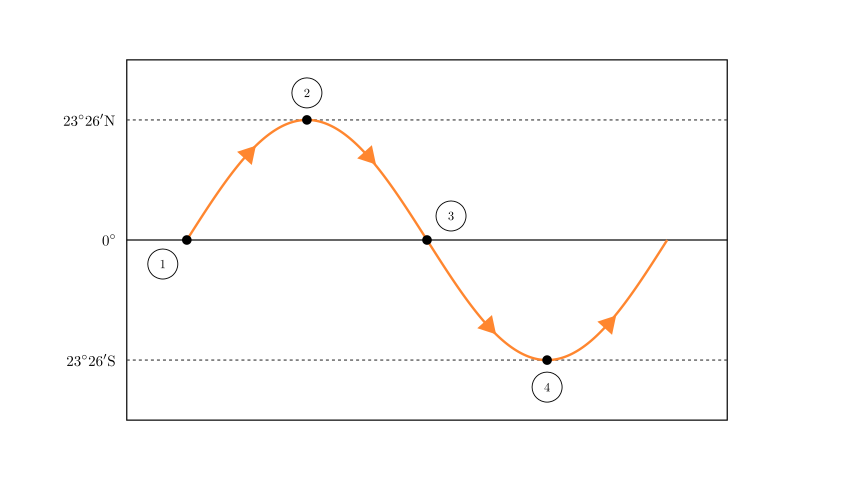
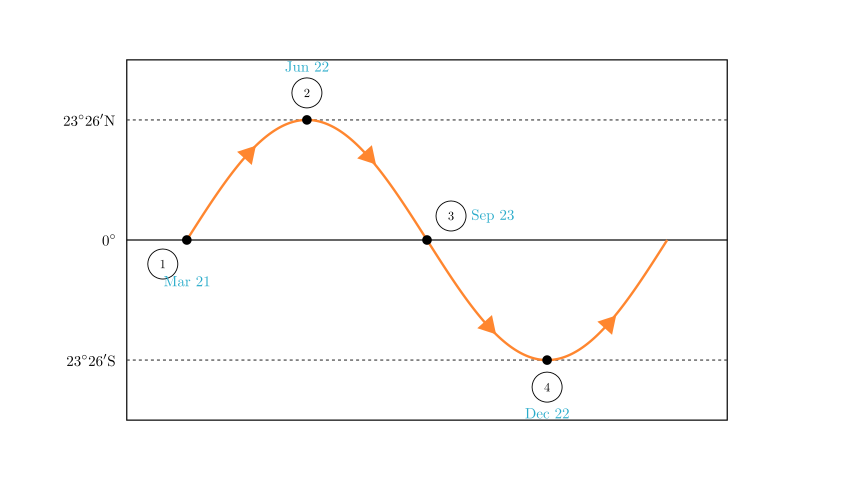
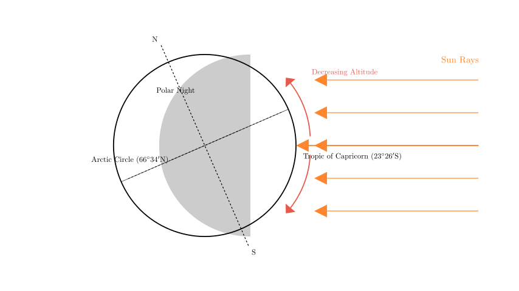

# problem_188_geography_g12

**Problem Statement:**
Read the schematic diagram of the regression movement of the sun's direct point (subsolar point) and complete the following requirements:

(1) Among the four points ①, ②, ③, ④ in the figure, $\underline{\hspace{5em}}$ is the position of the sun's direct point on December 22, and $\underline{\hspace{5em}}$ is the position of the sun's direct point on March 21.
(2) Among the four points ①, ②, ③, ④, the earliest sunrise in Baicheng occurs at $\underline{\hspace{5em}}$; the longest day in Baicheng occurs at $\underline{\hspace{5em}}$.
(3) On the day of point ④ in the figure, the noon sun altitude decreases from $\underline{\hspace{5em}}$ towards the north and south sides; the range where the noon sun altitude reaches the maximum value in the year is $\underline{\hspace{5em}}$; the range where polar night appears is $\underline{\hspace{5em}}$.
(4) On the day of the Summer Solstice, on the schematic diagram of the regression movement of the sun's direct point, the sun shines directly on the $\underline{\hspace{5em}}$ position; after that day, the sun's direct point moves towards the $\underline{\hspace{5em}}$ (direction).
(5) Among the four points ①, ②, ③, ④, those representing equal day and night across the globe are $\underline{\hspace{5em}}$.

**Solution Approach:**
This problem involves understanding Earth's revolution around the Sun and how the subsolar point (the latitude where the sun is directly overhead at noon) shifts throughout the year. We will interpret the provided graph, which tracks latitude over time, to identify the Equinoxes and Solstices. Then, we will apply the principles of solar altitude and day length associated with these specific dates.

**Step 1: Identifying the Dates (Question 1)**

The diagram tracks the latitude of the subsolar point (where the sun is directly overhead) throughout the year. The sun moves between the Tropic of Cancer ($23^{\circ}26'N$) and the Tropic of Capricorn ($23^{\circ}26'S$).

*   **Point ①:** The sun is at the Equator ($0^{\circ}$) and moving northward. This corresponds to the **Spring Equinox**, approximately **March 21**.
*   **Point ②:** The sun reaches its northernmost point, the Tropic of Cancer ($23^{\circ}26'N$). This is the **Summer Solstice**, approximately **June 22**.
*   **Point ③:** The sun is back at the Equator ($0^{\circ}$) but moving southward. This is the **Autumn Equinox**, approximately **September 23**.
*   **Point ④:** The sun reaches its southernmost point, the Tropic of Capricorn ($23^{\circ}26'S$). This is the **Winter Solstice**, approximately **December 22**.

**Answer (1):** ④; ①

**Step 2: Day Length and Sunrise in Baicheng (Question 2)**

Baicheng is located in Jilin Province, China, which is in the **Northern Hemisphere**.

*   **Longest Day:** In the Northern Hemisphere, the days are longest when the sun is furthest north (Summer Solstice). This corresponds to **Point ②**.
*   **Earliest Sunrise:** Sunrise time is directly related to day length. The longer the day, the earlier the sun rises. Therefore, the earliest sunrise also occurs on the Summer Solstice, **Point ②**.

**Answer (2):** ②; ②

**Step 3: Solar Altitude and Polar Night on December 22 (Question 3)**

Point ④ represents the Winter Solstice (Dec 22). On this day:
*   The sun is directly overhead at the **Tropic of Capricorn** ($23^{\circ}26'S$).
*   **Solar Altitude Distribution:** The noon sun altitude is $90^{\circ}$ at the subsolar point. It decreases as you move away from this latitude in both directions (North and South).
*   **Maximum Annual Value:** For locations south of the Tropic of Capricorn, the sun never gets closer to them than it is on this day. Thus, the region from the Tropic of Capricorn to the South Pole sees its maximum noon sun height of the year.
*   **Polar Night:** Since the sun is far south, the area around the North Pole receives no sunlight. The polar night extends from the Arctic Circle ($66^{\circ}34'N$) to the North Pole ($90^{\circ}N$).

**Answer (3):** Tropic of Capricorn (or $23^{\circ}26'S$); Tropic of Capricorn and the area south of it; Arctic Circle and the area north of it (or $66^{\circ}34'N \sim 90^{\circ}N$).

**Step 4: Summer Solstice Movement (Question 4)**

*   **Position:** On the Summer Solstice (June 22), the sun is directly overhead at the **Tropic of Cancer** (Point ②).
*   **Direction of Movement:** Looking at the graph in Scene 1 or 2, after Point ②, the curve slopes downward. This means the subsolar point begins moving **South** towards the Equator.

**Answer (4):** ② (or Tropic of Cancer); South.

**Step 5: Global Equal Day and Night (Question 5)**

*   Day and night are equal length (12 hours each) everywhere on Earth when the sun is directly overhead at the **Equator**.
*   This occurs on the Equinoxes.
*   Looking at the graph, the points on the Equator are **①** (Spring Equinox) and **③** (Autumn Equinox).

**Answer (5):** ①, ③

**Final Recap:**
1.  **Dec 22:** ④; **Mar 21:** ①
2.  **Earliest Sunrise:** ②; **Longest Day:** ②
3.  **Decreases from:** Tropic of Capricorn; **Max annual altitude:** Tropic of Capricorn and south; **Polar Night:** Arctic Circle and north.
4.  **Directly at:** ② (Tropic of Cancer); **Moves:** South.
5.  **Equal Day/Night:** ①, ③

