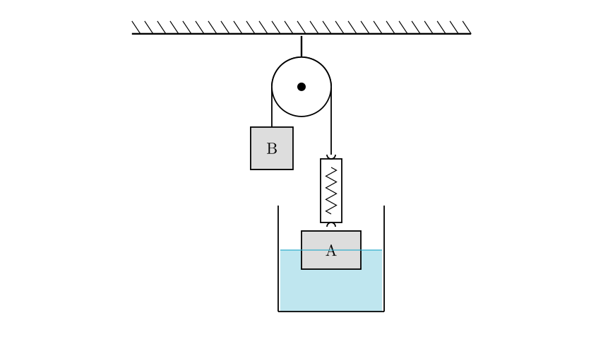
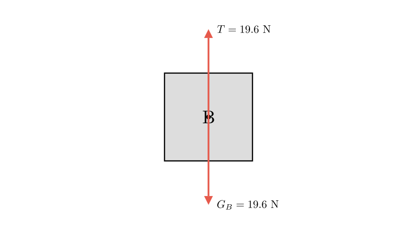
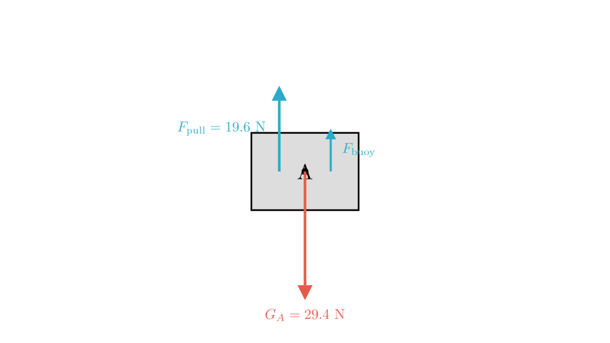
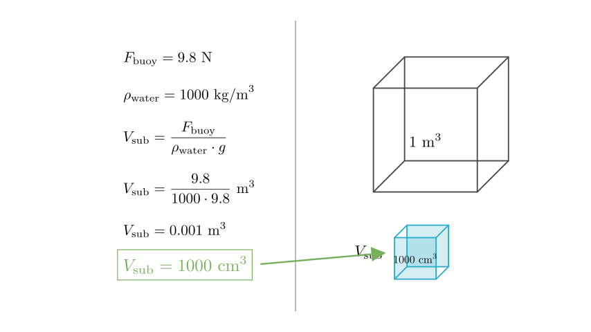

# problem_18_physics_g9

**Problem Statement:**
As shown in the figure, object A immersed in water has a mass of $3\text{ kg}$, and object B has a mass of $2\text{ kg}$. The entire system is in a static (stationary) state. The weight of the spring scale itself is negligible. Which of the following statements is correct? ($g=9.8\text{ N/kg}$)

A. The reading of the spring scale is $19.6\text{ N}$.
B. The volume of object A immersed in the water is $500\text{ cm}^3$.
C. Object A is in a non-equilibrium state.
D. The gravity acting on object B and the pulling force of B on the rope are a pair of balanced forces.

**Solution Approach:**
To solve this, we will apply Newton's Laws of Motion and Archimedes' Principle.
1. Analyze the forces acting on object B to determine the tension in the rope and the reading on the spring scale.
2. Analyze the forces acting on object A to determine the buoyant force and the submerged volume.
3. Evaluate each option based on these calculations.

**Step 1: Analyzing Object B**

Let's look at object B first. Since the problem states the whole system is static, object B is stationary. This means it is in equilibrium.

We need to calculate the gravity acting on B ($G_B$):
$$G_B = m_B \times g$$
$$G_B = 2\text{ kg} \times 9.8\text{ N/kg} = 19.6\text{ N}$$

Since B is stationary, the tension in the rope ($T$) pulling it upward must equal the force of gravity pulling it downward.
$$T = G_B = 19.6\text{ N}$$

**Evaluating Option A:**
The spring scale measures the tension in the rope. Since we found $T = 19.6\text{ N}$, the reading is indeed $19.6\text{ N}$.
**Therefore, Option A is Correct.**

**Evaluating Option D:**
Option D claims gravity on B and B's pull on the rope are balanced forces.
- **Balanced forces** must act on the *same* object.
- Gravity acts on B.
- B's pull acts on the *rope*.
Since these forces act on different objects, they cannot be balanced forces. (They are actually an interaction pair, but not an equilibrium pair). Thus, Option D is incorrect.

**Step 2: Analyzing Object A**

Now let's analyze object A.

**Evaluating Option C:**
The problem states the system is "static." By definition, if an object is static (at rest), it is in equilibrium. Therefore, object A is in an equilibrium state.
**Option C is incorrect.**

To check Option B, we need to analyze the forces on A.
Forces acting on A:
1.  Gravity ($G_A$) acting downward.
2.  Tension from the spring scale ($F_{\text{pull}}$) acting upward.
3.  Buoyant force ($F_{\text{buoy}}$) acting upward.

First, calculate the gravity on A:
$$G_A = m_A \times g$$
$$G_A = 3\text{ kg} \times 9.8\text{ N/kg} = 29.4\text{ N}$$

**Step 3: Calculating Buoyancy and Volume**

Since A is in equilibrium, the upward forces equal the downward forces:
$$F_{\text{pull}} + F_{\text{buoy}} = G_A$$

We know $F_{\text{pull}}$ is the same as the tension we found earlier ($19.6\text{ N}$).
$$19.6\text{ N} + F_{\text{buoy}} = 29.4\text{ N}$$
$$F_{\text{buoy}} = 29.4\text{ N} - 19.6\text{ N} = 9.8\text{ N}$$

**Evaluating Option B:**
We use Archimedes' principle to find the submerged volume ($V_{\text{sub}}$).
$$F_{\text{buoy}} = \rho_{\text{water}} \cdot g \cdot V_{\text{sub}}$$

Where $\rho_{\text{water}} = 1000\text{ kg/m}^3$ (standard density of water).

$$9.8\text{ N} = 1000\text{ kg/m}^3 \times 9.8\text{ N/kg} \times V_{\text{sub}}$$
$$V_{\text{sub}} = \frac{9.8}{1000 \times 9.8} = \frac{1}{1000}\text{ m}^3$$

Now, convert cubic meters to cubic centimeters ($1\text{ m}^3 = 1,000,000\text{ cm}^3$):
$$V_{\text{sub}} = 0.001\text{ m}^3 \times 1,000,000\text{ cm}^3/\text{m}^3 = 1000\text{ cm}^3$$

Option B claims the volume is $500\text{ cm}^3$. Since our calculated volume is $1000\text{ cm}^3$, **Option B is incorrect.**

**Final Conclusion:**

- **A:** The spring scale reading is $19.6\text{ N}$. (Correct)
- **B:** The submerged volume is $1000\text{ cm}^3$, not $500\text{ cm}^3$. (Incorrect)
- **C:** Object A is stationary, so it is in equilibrium. (Incorrect)
- **D:** Gravity on B and B's pull on the rope act on different objects, so they are not balanced forces. (Incorrect)

**Correct Answer:** A

