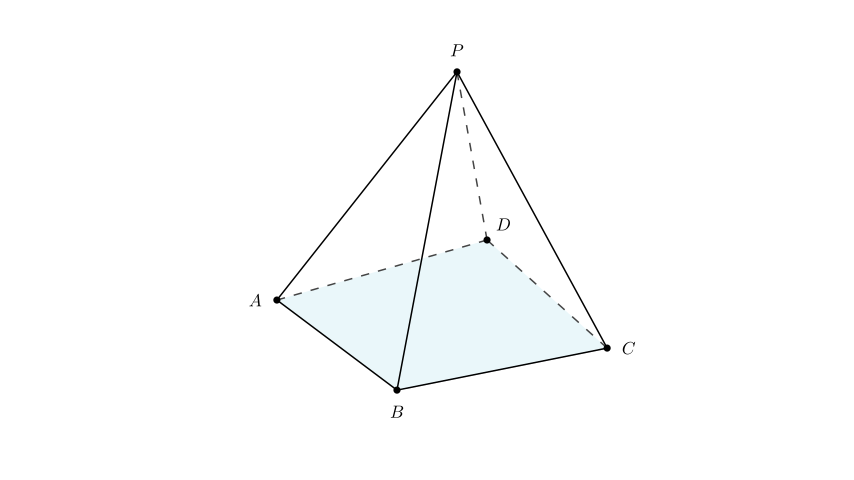
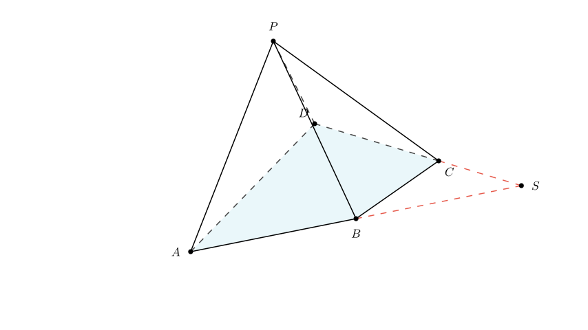
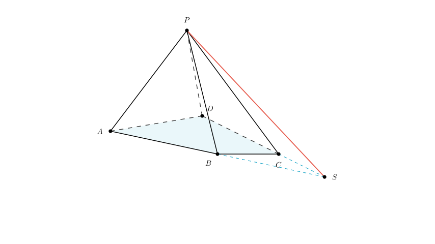
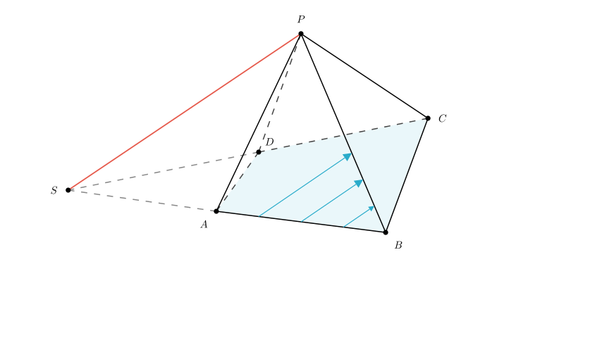

# problem_190_math_g12

**Problem Statement:**
As shown in the figure, in the quadrilateral pyramid $P-ABCD$, the two pairs of opposite sides of the base quadrilateral $ABCD$ are not parallel.

1. There does not exist a straight line in plane $PAB$ that is parallel to $DC$.
2. There exist infinitely many straight lines in plane $PAB$ that are parallel to plane $PDC$.
3. The intersection line of plane $PAB$ and plane $PDC$ is not parallel to the base plane $ABCD$.

The serial number(s) of the correct proposition(s) among the above is $\underline{\hspace{3cm}}$.

**Solution Approach:**
We will analyze each of the three geometric propositions step-by-step using the properties of lines and planes in space. We will use the condition that the base $ABCD$ is a general quadrilateral (no parallel sides) to derive contradictions or proofs for each statement.

**Analysis of Proposition ①:**
"In plane $PAB$ there does not exist a straight line parallel to $DC$."

Let's assume the opposite is true: Suppose there exists a line $L$ in plane $PAB$ such that $L \parallel DC$.

If line $L$ is parallel to line $DC$, and line $L$ lies in plane $PAB$, then by the line-plane parallelism criterion, the line $DC$ must be parallel to the plane $PAB$ (since $DC$ is outside plane $PAB$).

If $DC$ is parallel to plane $PAB$, then $DC$ must be parallel to the intersection line of plane $PAB$ and plane $ABCD$. The intersection of these two planes is the line segment $AB$.

Therefore, this assumption implies that $DC \parallel AB$.

However, the problem explicitly states that "the two pairs of opposite sides of the base quadrilateral $ABCD$ are not parallel." This means $AB$ is not parallel to $DC$. This creates a contradiction.

**Conclusion:** The assumption is false. Therefore, no line in plane $PAB$ is parallel to $DC$. Proposition ① is **Correct**.

**Analysis of Proposition ③:**
"The intersection line of plane $PAB$ and plane $PDC$ is not parallel to the base $ABCD$."

To find the intersection of plane $PAB$ and plane $PDC$, look for common points.
1. Point $P$ is clearly on both planes.
2. In the previous step, we found that line $AB$ (in plane $PAB$) and line $DC$ (in plane $PDC$) intersect at point $S$. Therefore, point $S$ lies on both extended planes.

Consequently, the intersection of plane $PAB$ and plane $PDC$ is the straight line connecting $P$ and $S$ (Line $PS$).

Since point $S$ lies on the plane of the base $ABCD$, the intersection line $PS$ intersects the base plane at point $S$. If a line intersects a plane, it cannot be parallel to it.

**Conclusion:** The intersection line is not parallel to the base. Proposition ③ is **Correct**.

**Analysis of Proposition ②:**
"In plane $PAB$ there exist infinitely many straight lines parallel to plane $PDC$."

We have established that the intersection of plane $PAB$ and plane $PDC$ is the line $PS$.

According to the properties of line-plane parallelism: A line inside plane $PAB$ is parallel to plane $PDC$ if and only if it is parallel to the intersection line of the two planes (Line $PS$).

In the triangle (or geometric space) defined by plane $PAB$, we can draw infinitely many lines parallel to the line $PS$. Since all these lines are parallel to the intersection line $PS$, they are all parallel to the plane $PDC$.

**Conclusion:** There are infinitely many such lines. Proposition ② is **Correct**.

**Final Verification and Recap:**

1.  **Proposition ①:** True. Because $AB \nparallel DC$, no line in $PAB$ can be parallel to $DC$.
2.  **Proposition ②:** True. Any line in $PAB$ parallel to the intersection line $PS$ is parallel to plane $PDC$. There are infinitely many such lines.
3.  **Proposition ③:** True. The intersection line $PS$ passes through point $S$, which lies on the base plane. Therefore, the line intersects the base and is not parallel to it.

Since all three statements are correct, the correct answer is the set of all three.

**Final Answer:** ①②③

