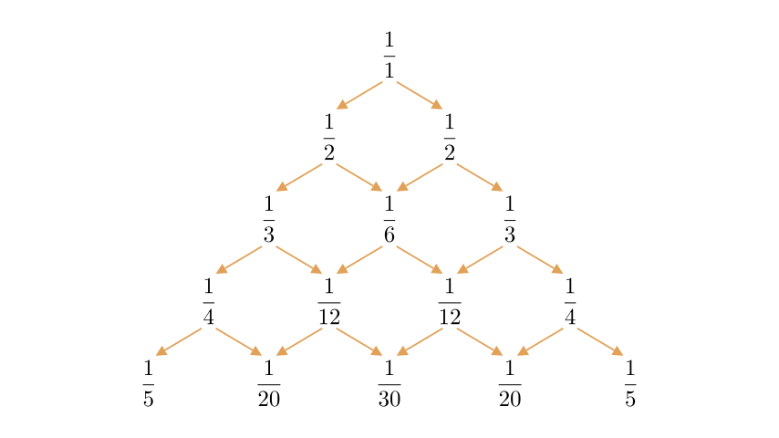
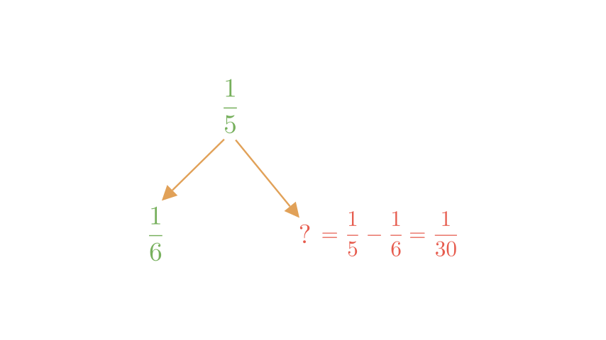
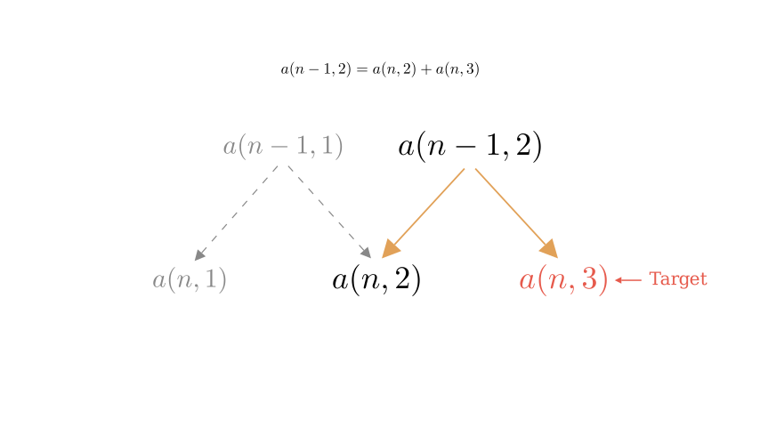

# problem_192_math_g12

**Problem Statement:**
The triangular number array shown in the figure is called "Newton's Harmonic Triangle". It is composed of reciprocals of integers. The $n$-th row has $n$ numbers, and the numbers at both ends are $\frac{1}{n}$ (for $n \ge 2$). Each number is the sum of the two adjacent numbers in the next row (left and right). For example:
$$ \frac{1}{1} = \frac{1}{2} + \frac{1}{2}, \quad \frac{1}{2} = \frac{1}{3} + \frac{1}{6}, \quad \frac{1}{3} = \frac{1}{4} + \frac{1}{12}, \dots $$

(1) The 2nd number in the 6th row (counting from left to right) is \_\_\_\_\_\_.
(2) The 3rd number in the $n$-th row (counting from left to right) is \_\_\_\_\_\_.

**Solution Approach:**
We will analyze the recursive relationship defined in the problem: a number in row $n$ is the sum of the two numbers directly below it in row $n+1$. This is essentially the reverse of Pascal's Triangle logic. We will use this subtraction property to find the specific value for the 6th row and then derive a general formula for the 3rd column of the $n$-th row.

**Part (1): Finding the 2nd number in the 6th row**

Let's denote the number in the $n$-th row and $k$-th position as $a(n, k)$.
The problem states that a number is the sum of the two numbers below it. Mathematically, this relationship is:
$$ a(n, k) = a(n+1, k) + a(n+1, k+1) $$

We need to find the 2nd number in the 6th row, which corresponds to $a(6, 2)$.
Looking at the relationship between Row 5 and Row 6, the first number in Row 5 ($a(5, 1)$) is the sum of the first two numbers in Row 6 ($a(6, 1)$ and $a(6, 2)$).

We know:
1. The first number in Row 5 is $a(5, 1) = \frac{1}{5}$.
2. The boundary condition states that the numbers at the ends of the $n$-th row are $\frac{1}{n}$. Therefore, the first number in Row 6 is $a(6, 1) = \frac{1}{6}$.

We can rearrange the formula to solve for the unknown:
$$ a(6, 2) = a(5, 1) - a(6, 1) $$
$$ a(6, 2) = \frac{1}{5} - \frac{1}{6} $$
$$ a(6, 2) = \frac{6}{30} - \frac{5}{30} = \frac{1}{30} $$

So, the 2nd number in the 6th row is $\frac{1}{30}$.

**Part (2): Finding the 3rd number in the $n$-th row**

We need to find a general formula for $a(n, 3)$. To do this, let's first determine the pattern for the 2nd number in any row, $a(n, 2)$, because $a(n, 3)$ depends on it.

**Step A: Find the formula for the 2nd column $a(n, 2)$**
Using the subtraction logic:
$$ a(n, 2) = a(n-1, 1) - a(n, 1) $$
Since the first number in any row $k$ is $\frac{1}{k}$:
$$ a(n, 2) = \frac{1}{n-1} - \frac{1}{n} $$
$$ a(n, 2) = \frac{n - (n-1)}{n(n-1)} = \frac{1}{n(n-1)} $$

**Step B: Find the formula for the 3rd column $a(n, 3)$**
Now we move down one row. The number in the 2nd position of row $n-1$ is the sum of the 2nd and 3rd numbers in row $n$.
$$ a(n-1, 2) = a(n, 2) + a(n, 3) $$
Rearranging for our target $a(n, 3)$:
$$ a(n, 3) = a(n-1, 2) - a(n, 2) $$

Now, substitute the formula we found in Step A into our equation for Step B.

We know $a(n, 2) = \frac{1}{n(n-1)}$.
Therefore, $a(n-1, 2)$ (which is the term above it) is found by replacing $n$ with $n-1$:
$$ a(n-1, 2) = \frac{1}{(n-1)(n-2)} $$

Now substitute both into the subtraction equation:
$$ a(n, 3) = \frac{1}{(n-1)(n-2)} - \frac{1}{n(n-1)} $$

To subtract these fractions, find a common denominator, which is $n(n-1)(n-2)$:
$$ a(n, 3) = \frac{n}{n(n-1)(n-2)} - \frac{n-2}{n(n-1)(n-2)} $$
$$ a(n, 3) = \frac{n - (n-2)}{n(n-1)(n-2)} $$
$$ a(n, 3) = \frac{2}{n(n-1)(n-2)} $$

**Verification:**
Let's test this formula with a known value from the diagram.
For Row 5, the 3rd number ($n=5$) is $\frac{1}{30}$.
Using our formula:
$$ a(5, 3) = \frac{2}{5(5-1)(5-2)} = \frac{2}{5 \cdot 4 \cdot 3} = \frac{2}{60} = \frac{1}{30} $$
The calculation matches the diagram.

**Final Answer:**
(1) The 2nd number in the 6th row is $\mathbf{\frac{1}{30}}$.
(2) The 3rd number in the $n$-th row is $\mathbf{\frac{2}{n(n-1)(n-2)}}$.

