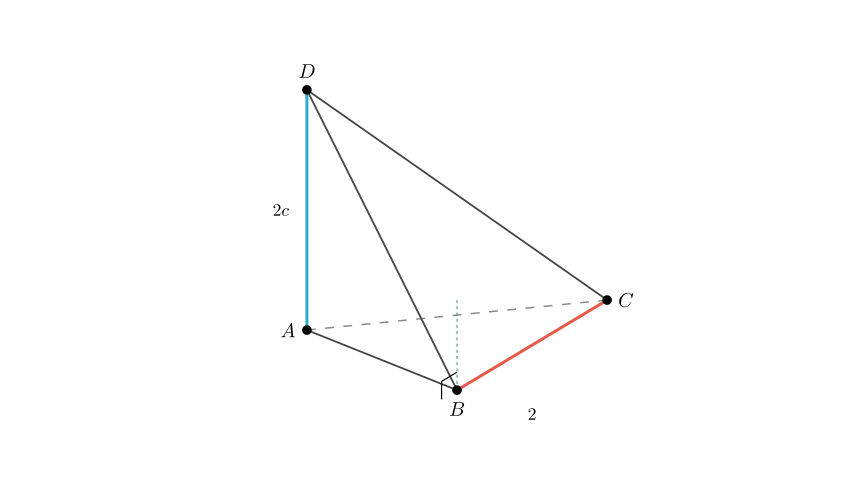
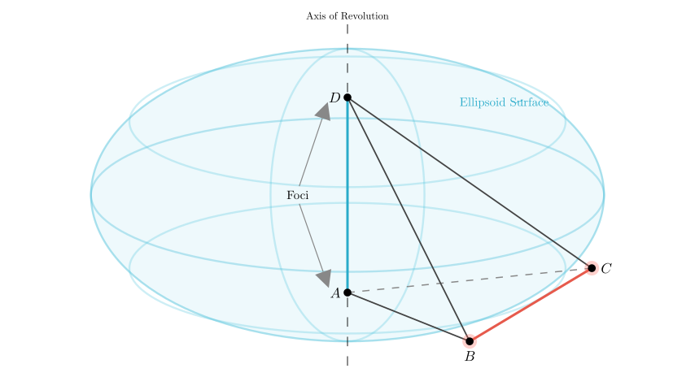
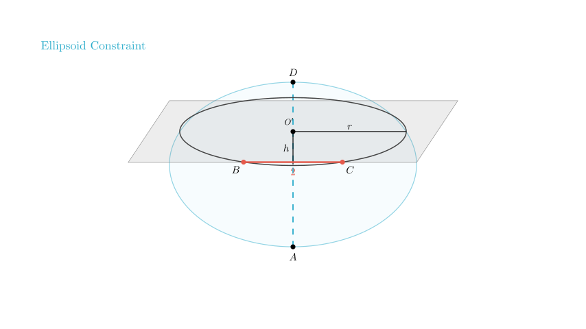
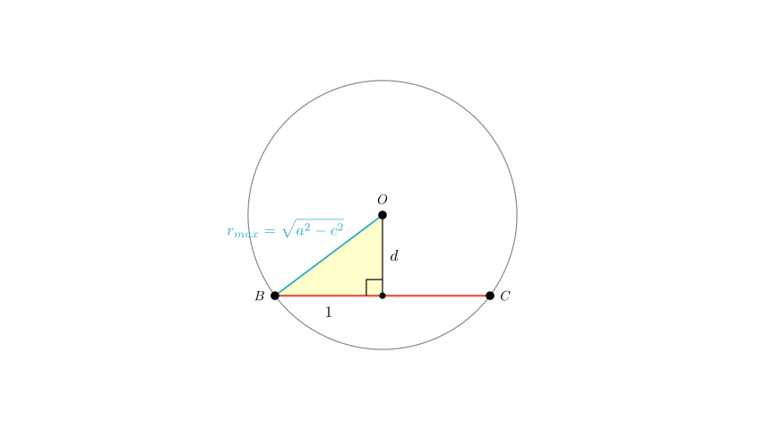

# problem_194_math_g12

**Problem Statement:**
As shown in the figure, $AD$ and $BC$ are mutually perpendicular edges in tetrahedron $ABCD$, with $BC=2$. If $AD=2c$, and $AB+BD=AC+CD=2a$, where $a$ and $c$ are constants, find the maximum value of the volume of tetrahedron $ABCD$.

**Solution Approach:**
To solve this, we will use the geometric properties of tetrahedra and the definition of an ellipsoid.
1. We interpret the sum of distances condition ($AB+BD=2a$) as placing points $B$ and $C$ on the surface of an ellipsoid with foci $A$ and $D$.
2. We use the perpendicularity of $AD$ and $BC$ to determine the orientation of the segment $BC$.
3. We apply the volume formula for a tetrahedron based on the distance between two skew edges to maximize the volume.

**Step 1: Analyzing the Geometric Locus**

We are given that $AB + BD = 2a$ and $AC + CD = 2a$.
In geometry, the locus of points where the sum of distances to two fixed points ($A$ and $D$) is constant is an **ellipsoid of revolution** (a prolate spheroid).

- The fixed points $A$ and $D$ are the **foci**.
- The distance between foci is $AD = 2c$.
- The major axis length is $2a$.

Therefore, vertices $B$ and $C$ must lie on the surface of this ellipsoid.

**Step 2: Analyzing the Perpendicular Condition**

The problem states that edge $AD$ is perpendicular to edge $BC$ ($AD \perp BC$).
Let's set up a coordinate system to visualize this:
- Let the center of $AD$ be the origin $O(0,0,0)$.
- Let line $AD$ lie along the $z$-axis. Then $A = (0,0,c)$ and $D = (0,0,-c)$.

Since $AD$ is vertical (along $z$) and perpendicular to $BC$, the vector $\vec{BC}$ must be horizontal. This means the $z$-coordinates of $B$ and $C$ must be equal ($z_B = z_C = h$).

Consequently, the segment $BC$ lies entirely within a horizontal cross-section of the ellipsoid at some height $h$. This cross-section is a **circle**.

**Step 3: Calculating Volume and Maximizing**

The volume $V$ of a tetrahedron given two opposite edges $AD$ and $BC$, their lengths, the angle $\theta$ between them, and the distance $d$ between their lines is:
$$V = \frac{1}{6} \cdot |AD| \cdot |BC| \cdot d \cdot \sin(\theta)$$

Given:
- $|AD| = 2c$
- $|BC| = 2$
- $\theta = 90^\circ$ (since $AD \perp BC$, $\sin(90^\circ)=1$)
- $d$ is the distance between the line containing $AD$ (the $z$-axis) and the line containing $BC$.

Substituting these values:
$$V = \frac{1}{6} (2c) (2) d (1) = \frac{2}{3} c d$$

To maximize the volume $V$, we must maximize the distance $d$.

In the horizontal circle at height $h$, $d$ is the perpendicular distance from the center of the circle to the chord $BC$.
Let $r$ be the radius of this circular cross-section. Using the Pythagorean theorem on the triangle formed by the center, the midpoint of the chord, and point $B$:
$$r^2 = d^2 + \left(\frac{BC}{2}\right)^2$$
$$r^2 = d^2 + 1^2 \implies d = \sqrt{r^2 - 1}$$

To maximize $d$, we need the largest possible radius $r$. The cross-section of an ellipsoid is largest at the "equator" (where $h=0$, the plane bisecting $AD$).

The semi-minor axis of the ellipsoid (the radius at the equator) is $b = \sqrt{a^2 - c^2}$.
Thus, $r_{max} = \sqrt{a^2 - c^2}$.

**Final Calculation:**

We found that the maximum distance $d$ occurs when the cross-section is the largest circle with radius $r_{max} = \sqrt{a^2 - c^2}$.

Substitute $r_{max}$ back into the equation for $d$:
$$d_{max} = \sqrt{r_{max}^2 - 1} = \sqrt{(a^2 - c^2) - 1}$$
$$d_{max} = \sqrt{a^2 - c^2 - 1}$$

Finally, substitute $d_{max}$ into the volume formula:
$$V_{max} = \frac{2}{3} c \cdot d_{max}$$
$$V_{max} = \frac{2}{3} c \sqrt{a^2 - c^2 - 1}$$

**Answer:**
The maximum value of the volume of tetrahedron $ABCD$ is $\frac{2c}{3}\sqrt{a^2-c^2-1}$.

