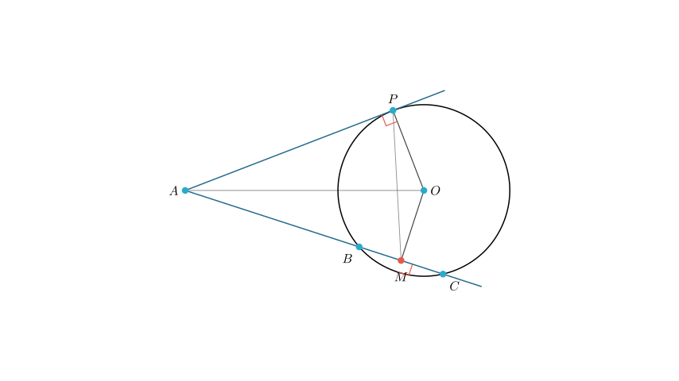
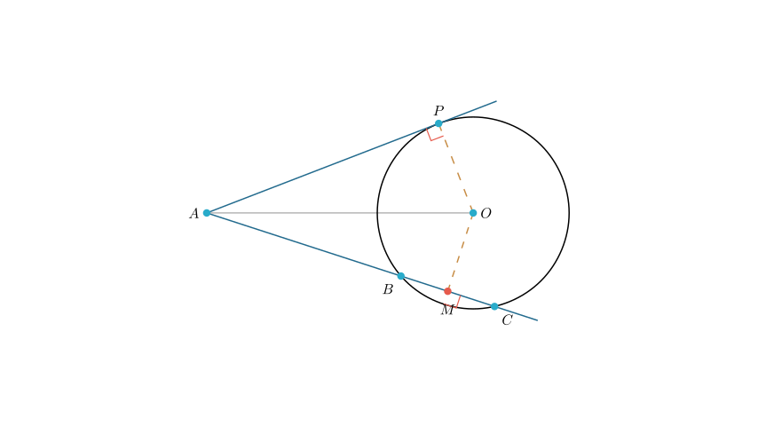
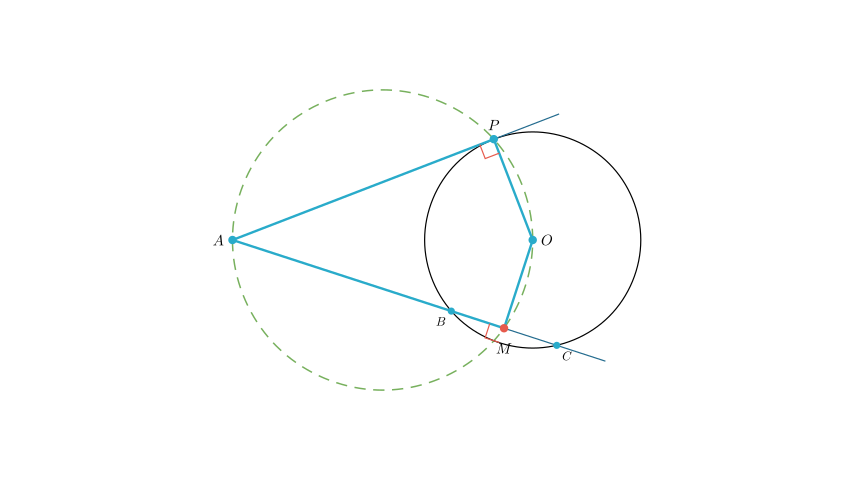
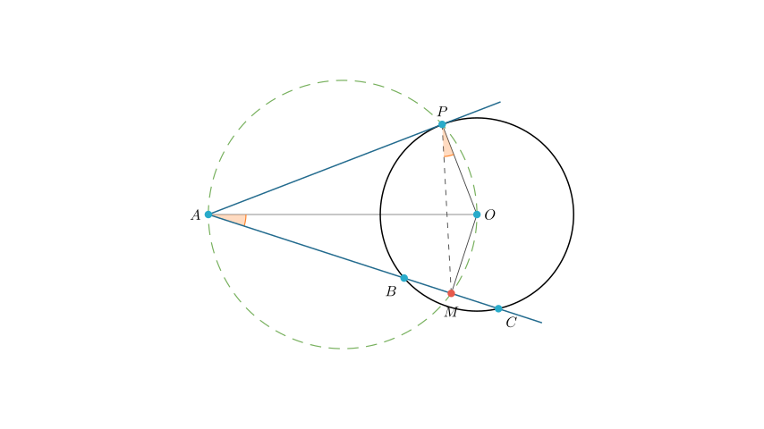
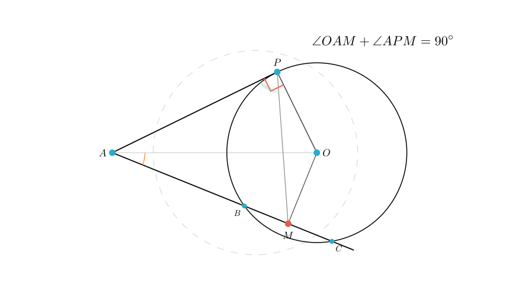

# problem_196_math_g12

**Problem Statement:**
As shown in the figure, $AP$ is a tangent to circle $O$, with $P$ being the point of tangency. $AC$ is a secant line of circle $O$, intersecting the circle at two points $B$ and $C$. The center $O$ lies within the interior of $\angle PAC$. Point $M$ is the midpoint of $BC$. Find the value of $\angle OAM + \angle APM$.

**Solution Approach:**
To solve this problem, we will utilize properties of circle tangents and chords to identify right angles. Specifically, we will show that points $A$, $P$, $O$, and $M$ lie on a common circle (are concyclic). This will allow us to use the properties of cyclic quadrilaterals and inscribed angles to relate $\angle OAM$ to $\angle APM$ and find their sum.

**Step 1: Identifying Right Angles**

First, let's analyze the geometric properties given in the problem statement:
1.  $AP$ is a tangent to circle $O$ at point $P$. A fundamental property of tangents is that the radius drawn to the point of tangency is perpendicular to the tangent line. Therefore, $OP \perp AP$, which means $\angle APO = 90^\circ$.
2.  $M$ is the midpoint of the chord $BC$. A property of chords states that the line segment connecting the center of the circle to the midpoint of a chord is perpendicular to that chord. Therefore, $OM \perp AC$, which means $\angle AMO = 90^\circ$.

**Step 2: Proving Concyclic Points**

Consider the quadrilateral formed by points $A$, $P$, $O$, and $M$.
From Step 1, we determined that $\angle APO = 90^\circ$ and $\angle AMO = 90^\circ$.

In quadrilateral $APOM$, the opposite angles are $\angle APO$ and $\angle AMO$.
The sum of these opposite angles is $90^\circ + 90^\circ = 180^\circ$.

When the opposite angles of a quadrilateral sum to $180^\circ$, the quadrilateral is **cyclic**. This means that points $A$, $P$, $O$, and $M$ all lie on the same circle. The segment $AO$ acts as the diameter of this imaginary circumcircle.

**Step 3: Using Angles in the Same Segment**

Now that we know $A, P, O, M$ lie on a circle, we can use the property that angles subtended by the same arc (in the same segment) are equal.

Let's look at the chord $OM$ of this new cyclic quadrilateral.
- $\angle OPM$ subtends the arc $OM$.
- $\angle OAM$ also subtends the arc $OM$.

Therefore, $\angle OAM = \angle OPM$.

**Step 4: Calculation and Conclusion**

The problem asks for the value of $\angle OAM + \angle APM$.

Using the equality we just found ($\angle OAM = \angle OPM$), we can substitute $\angle OAM$ in the expression:
$$ \angle OAM + \angle APM = \angle OPM + \angle APM $$

Looking at the diagram, the angles $\angle OPM$ and $\angle APM$ are adjacent and together form the larger angle $\angle APO$.
$$ \angle OPM + \angle APM = \angle APO $$

From Step 1, we know that $\angle APO = 90^\circ$ because $AP$ is tangent to the radius $OP$.

**Final Answer:**
Therefore, $\angle OAM + \angle APM = 90^\circ$.

**Recap:**
1.  We identified that the tangent creates a $90^\circ$ angle at $P$ and the chord midpoint creates a $90^\circ$ angle at $M$.
2.  This proved that $A, P, O, M$ form a cyclic quadrilateral.
3.  Using the cyclic property, we shifted $\angle OAM$ to $\angle OPM$.
4.  The sum then combined perfectly to form the right angle at $P$.

**Answer:** $90^\circ$

