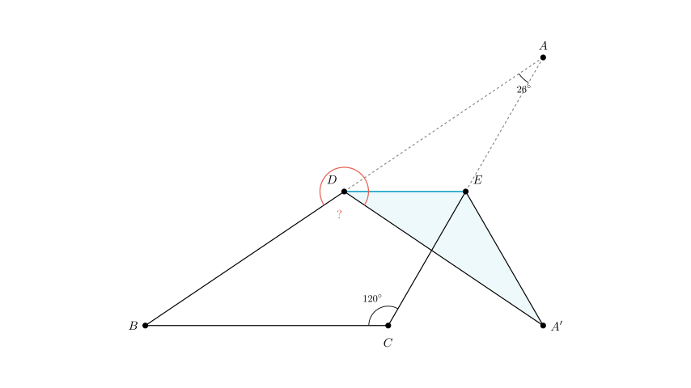
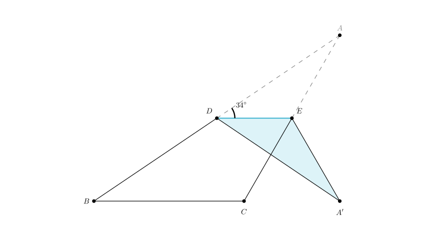
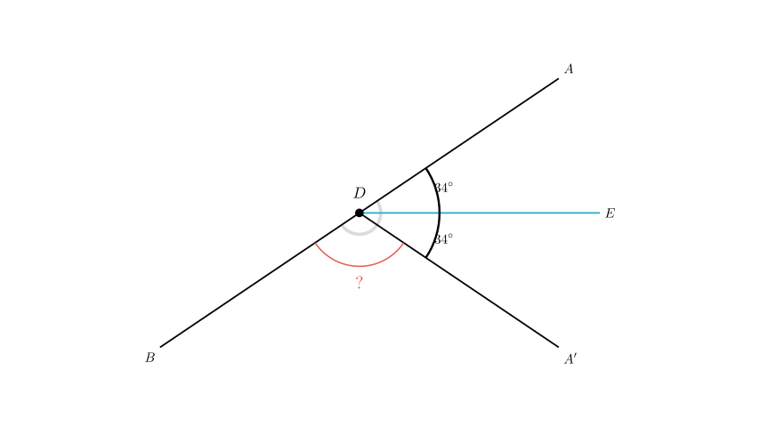

# problem_197_math_g12

**Problem Statement:**
As shown in the figure, triangle $ABC$ is folded along its mid-segment $DE$, so that point $A$ lands on point $A'$. If $\angle C = 120^\circ$ and $\angle A = 26^\circ$, calculate the degree measure of $\angle A'DB$.

**Solution Outline:**
1.  Determine the measure of $\angle B$ using the sum of angles in $\triangle ABC$.
2.  Use the property of the mid-segment $DE$ to find the relationship between $\angle ADE$ and $\angle B$.
3.  Apply the properties of geometric folding (reflection) to determine angle $\angle A'DE$.
4.  Calculate the final angle $\angle A'DB$ using the concept of angles on a straight line.

**Step 1: Calculate Angle B**
First, we calculate the third angle of $\triangle ABC$. The sum of angles in any triangle is always $180^\circ$.
$$ \angle B = 180^\circ - \angle A - \angle C $$
$$ \angle B = 180^\circ - 26^\circ - 120^\circ = 34^\circ $$

**Step 2: Use Mid-segment Properties**
The problem states that $DE$ is the **mid-segment** of the triangle. A key property of the mid-segment is that it is parallel to the base of the triangle.
$$ DE \parallel BC $$
Because $DE$ is parallel to $BC$, the corresponding angles formed by the transversal line $AB$ are equal. Therefore:
$$ \angle ADE = \angle B = 34^\circ $$

**Step 3: Analyze the Folded Angles**
Folding $\triangle ABC$ along the line $DE$ is geometrically equivalent to reflecting $\triangle ADE$ across the line $DE$. This means the folded triangle $\triangle A'DE$ is congruent to the original triangle $\triangle ADE$.

Consequently, the corresponding angles are equal:
$$ \angle A'DE = \angle ADE $$
Since we found that $\angle ADE = 34^\circ$, it follows that:
$$ \angle A'DE = 34^\circ $$

**Step 4: Calculate Angle A'DB**
Now, focus on the straight line segment $AB$, which contains point $D$. The angles around point $D$ on this straight line must relate to the flat angle of $180^\circ$.

The angle $\angle ADA'$ (the total angle "opened" by the fold) is the sum of the original angle and the reflected angle:
$$ \angle ADA' = \angle ADE + \angle A'DE = 34^\circ + 34^\circ = 68^\circ $$

Since $A, D, B$ lie on a straight line, the angle $\angle A'DB$ and the angle $\angle ADA'$ are supplementary (forming a linear pair).
$$ \angle A'DB = 180^\circ - \angle ADA' $$
$$ \angle A'DB = 180^\circ - 68^\circ = 112^\circ $$

**Final Answer:**
The degree measure of $\angle A'DB$ is **112°**.

**Verification:**
- $\angle B = 34^\circ$ (Correct derived from $180 - 120 - 26$).
- $\angle ADE = 34^\circ$ (Correct due to parallel lines).
- $\angle ADA' = 68^\circ$ (Correct due to symmetry of folding).
- $\angle A'DB = 180^\circ - 68^\circ = 112^\circ$ (Correct linear pair calculation).

