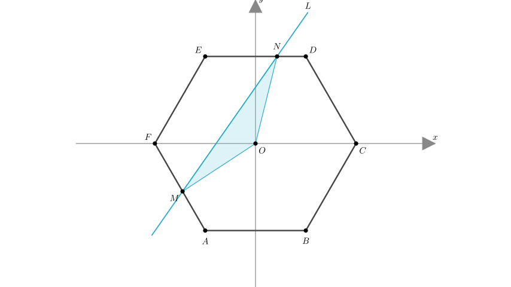
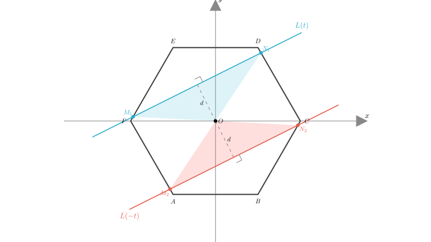

# problem_199_math_g12

**Problem Statement:**
As shown in the figure, in the Cartesian coordinate plane, there is a regular hexagon $ABCDEF$ with side length $a$ and center at the origin $O$, with side $AB$ parallel to the x-axis ($AB \parallel Ox$). A line $L: y=kx+t$ ($k$ is a constant) intersects the regular hexagon at two points $M$ and $N$. Let $S$ be the area of $\triangle OMN$. Determine the parity (evenness or oddness) of the function $S=f(t)$.

**Solution Approach:**
1.  **Analyze the Symmetry:** We will examine the geometric properties of the regular hexagon and the intersecting line. The regular hexagon is symmetric with respect to the origin (central symmetry).
2.  **Evaluate $f(-t)$:** We will compare the geometric setup for the parameter $t$ (Line $L_1: y=kx+t$) with the setup for the parameter $-t$ (Line $L_2: y=kx-t$).
3.  **Compare Areas:** By establishing the symmetry between the two scenarios, we will determine if the area $S(t)$ equals $S(-t)$ (even), $-S(t)$ (odd), or neither.

**Geometric Analysis:**

The area of triangle $OMN$, denoted as $S(t)$, can be calculated using the formula for the area of a triangle given the base and height:
$$S(t) = \frac{1}{2} \cdot \text{base} \cdot \text{height}$$

In this context:
*   The **base** is the length of the chord segment $MN$, denoted as $|MN|$.
*   The **height** is the perpendicular distance from the origin $O$ to the line $L$, denoted as $d$.

**Step 1: Analyze the distance $d$**
The distance from the origin $(0,0)$ to the line $kx - y + t = 0$ is given by the standard point-to-line distance formula:
$$d(t) = \frac{|k(0) - 0 + t|}{\sqrt{k^2 + (-1)^2}} = \frac{|t|}{\sqrt{k^2 + 1}}$$

Notice that $d(t)$ depends only on the absolute value of $t$. Therefore, the distance is an **even function** of $t$:
$$d(-t) = \frac{|-t|}{\sqrt{k^2 + 1}} = \frac{|t|}{\sqrt{k^2 + 1}} = d(t)$$

This means the perpendicular distance from the origin to the line is the same for $t$ and $-t$.

**Step 2: Analyze the chord length $|MN|$**

The regular hexagon is a **centrally symmetric figure** with respect to the origin $O$. This means that if you rotate the entire shape by $180^\circ$ around the origin, it maps onto itself.

Consider the two lines:
1.  $L(t): y = kx + t$
2.  $L(-t): y = kx - t$

These two lines are symmetric with respect to the origin. If a point $(x, y)$ lies on $L(t)$, then the point $(-x, -y)$ lies on $L(-t)$.

Because the hexagon itself is symmetric about the origin, the intersection of the hexagon with line $L(t)$ is the central reflection of the intersection of the hexagon with line $L(-t)$.

Consequently, the length of the chord segment $MN$ cut by the hexagon on line $L(t)$ is equal to the length of the chord segment cut on line $L(-t)$:
$$|MN|_t = |MN|_{-t}$$

**Step 3: Combine to find the parity of $S(t)$**

Now we substitute these findings back into the area formula:
$$S(t) = \frac{1}{2} \cdot |MN|_t \cdot d(t)$$
$$S(-t) = \frac{1}{2} \cdot |MN|_{-t} \cdot d(-t)$$

Since $|MN|_t = |MN|_{-t}$ and $d(t) = d(-t)$, it follows that:
$$S(t) = S(-t)$$

**Conclusion:**

A function $f(x)$ is defined as an **even function** if $f(-x) = f(x)$ for all $x$ in its domain.

We have shown that for any parameter $t$, the area of the triangle formed by the line $y=kx-t$ is identical to the area formed by the line $y=kx+t$ due to the central symmetry of the regular hexagon and the symmetry of the distance function.

Therefore, the function $S=f(t)$ is an **even function**.

**Final Answer:** Even function (偶函数).

**Verification:**
- If $t=0$, the line passes through the origin. The area is 0. $f(0)=0$.
- If $|t|$ is very large such that the line does not intersect the hexagon, $S=0$. $f(t)=f(-t)=0$.
- Since area is a geometric quantity (non-negative), it cannot be an odd function (which would require $f(-t) = -f(t)$) unless the function is identically zero everywhere, which is not the case here. The only non-trivial possibility for a non-negative area function is to be even.

