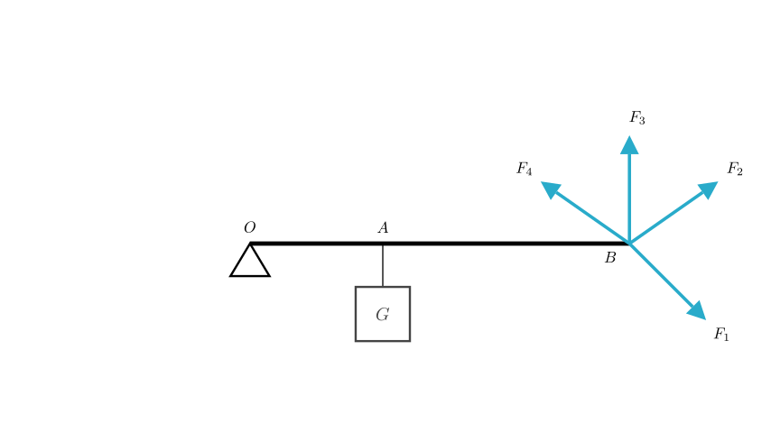
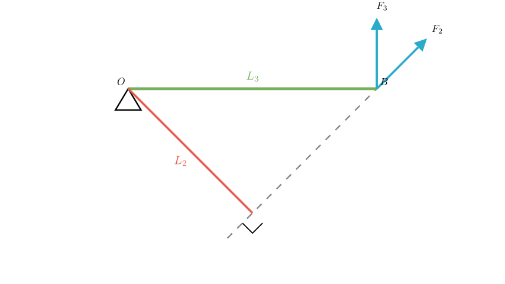

# problem_1_physics_g9

**Problem Statement:**
As shown in the figure, the lever $OAB$ can rotate around point $O$. A weight $G$ is hung at point $A$. To keep the lever balanced in a horizontal position, four forces are applied at point $B$. Which of the four forces is the smallest?
A. $F_{1}$
B. $F_{2}$
C. $F_{3}$
D. $F_{4}$

**Solution Approach:**
This problem involves the **equilibrium conditions for a lever**. According to the principle of moments (torque), for the lever to remain balanced horizontally, the clockwise torque produced by the weight $G$ must be balanced by a counter-clockwise torque produced by the force applied at $B$.

The equilibrium equation is:
$$F \times L = G \times OA$$
Where:
- $F$ is the applied force.
- $L$ is the **moment arm** (force arm) of the applied force.
- $G$ is the weight of the object.
- $OA$ is the resistance arm (distance from pivot to weight).

Since the resistance torque ($G \times OA$) is constant, to minimize the applied force $F$, we must **maximize the moment arm $L$**.

**Step 1: Analyze Force Directions**

First, let's determine which forces can actually maintain equilibrium.
- The weight $G$ pulls downwards, creating a **clockwise rotation** around pivot $O$.
- To balance this, the applied force must create a **counter-clockwise rotation** (pulling the lever up).

Looking at the diagram:
- Forces $F_2$, $F_3$, and $F_4$ all have upward components that pull the lever counter-clockwise.
- Force $F_1$ points downwards. This would pull the lever clockwise, adding to the rotation of the weight rather than balancing it. Therefore, $F_1$ cannot be the solution.

**Step 2: Analyze Moment Arms**

Now we compare the magnitudes of $F_2$, $F_3$, and $F_4$.
Recall the relationship:
$$F = \frac{\text{Constant Torque}}{L}$$
The force $F$ is smallest when the moment arm $L$ is largest.

**Definition of Moment Arm:** The moment arm is the **perpendicular distance** from the pivot point $O$ to the line of action of the force.

**Step 3: Geometric Comparison**

Let's look at the geometry illustrated above:

1.  **For Force $F_3$:** The force acts vertically, which is perpendicular to the horizontal lever $OB$.
- The line of action passes vertically through $B$.
- The perpendicular distance from $O$ to this line is the entire length of the lever, $OB$.
- So, moment arm $L_3 = OB$.

2.  **For Force $F_2$ (or $F_4$):** The force acts at an angle.
- To find the moment arm, we draw a line from $O$ perpendicular to the line of action of $F_2$.
- This forms a right-angled triangle where the lever $OB$ is the **hypotenuse** and the moment arm $L_2$ is one of the **legs**.
- In any right triangle, the hypotenuse is always longer than any leg.
- Therefore, $L_3 (OB) > L_2$.

**Conclusion:**
Since the moment arm $L_3$ corresponds to the full length of the lever, it is the maximum possible moment arm.

Because the force required is inversely proportional to the moment arm ($F \propto 1/L$), the force with the largest moment arm will be the smallest in magnitude.

$$L_3 \text{ is max} \implies F_3 \text{ is min}$$

**Final Answer:**
To maintain equilibrium with the minimum force, the force should be applied perpendicular to the lever arm to maximize the moment arm. Force $F_3$ is perpendicular to the lever $OB$, providing the longest moment arm and thus requiring the smallest magnitude.

The correct option is **C**.

