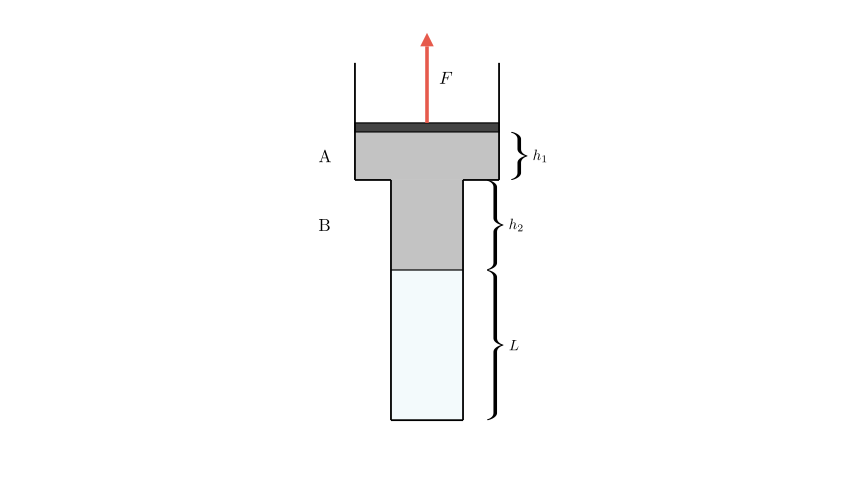
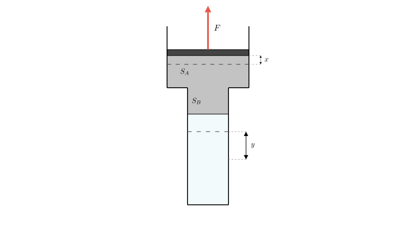
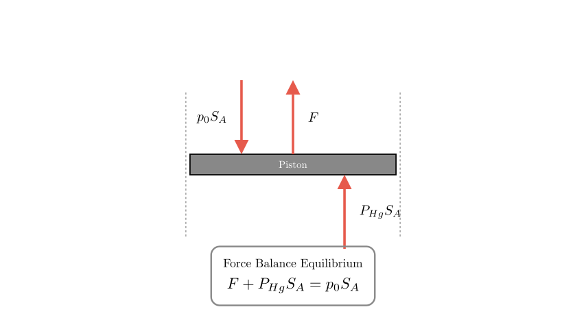
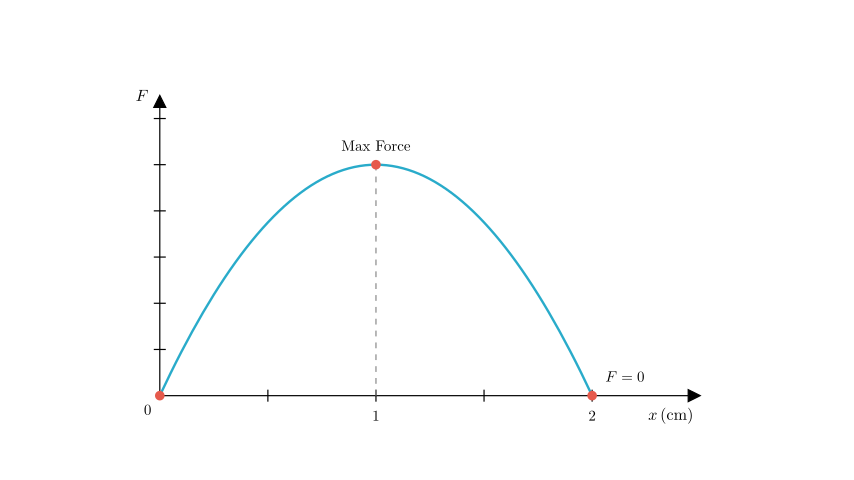

# problem_200_physics_g12

**Problem Statement:**
As shown in the figure, a cylindrical container is placed vertically. The cross-sectional area of the upper tube A is 4 times that of the lower tube B. There is mercury in the middle. A column of air of length $L=112\text{ cm}$ is sealed below tube B. The mercury height in A is $h_1=5\text{ cm}$, and the mercury height in B is $h_2=10\text{ cm}$. There is a piston above the mercury (gravity and friction of the piston are negligible). Atmospheric pressure $p=75\text{ cmHg}$.

(1) What is the pressure of the sealed gas in cmHg?
(2) Now a vertical upward force $F$ is used to slowly pull the piston. What is the gas pressure when the piston moves up $1\text{ cm}$?
(3) During the process of slowly pulling the piston up, it is found that the magnitude of pulling force $F$ changes. Find the displacement of the piston when the pulling force $F$ becomes zero.
(4) Through calculation, analyze and explain how the magnitude of the pulling force $F$ changes during the process of slowly pulling the piston up (assuming mercury is always present in tube B).

**Solution Approach:**
We will apply Boyle's Law ($P_1V_1 = P_2V_2$) for the isothermal expansion of the trapped gas. We will analyze the force balance on the piston, considering atmospheric pressure, the pressure from the mercury column, and the external force $F$. The key geometric relationship is the conservation of mercury volume, which relates the piston's displacement to the change in the mercury levels in the differing cross-sectional areas ($S_A = 4S_B$).

**Part 1: Initial Pressure of the Sealed Gas**

First, let's determine the pressure equilibrium in the initial state. The piston is massless and frictionless, and initially, there is no external force pulling it up (or rather, we are analyzing the static state before pulling).

The pressure at the top surface of the mercury (just below the piston) is equal to the atmospheric pressure $p_0$ because the piston is in equilibrium with the atmosphere.

The pressure of the trapped gas $p_1$ supports the atmospheric pressure plus the total weight of the mercury column per unit area.

$$p_1 = p_0 + h_{total\_Hg}$$

The total height of the mercury is the sum of the height in tube A and tube B:
$$h_{total} = h_1 + h_2 = 5\text{ cm} + 10\text{ cm} = 15\text{ cm}$$

Substituting the values:
$$p_1 = 75\text{ cmHg} + 15\text{ cmHg} = 90\text{ cmHg}$$

**Answer (1):** The pressure of the sealed gas is **90 cmHg**.

**Part 2: Gas Pressure after Piston Moves Up 1 cm**

Let $S_B = S$ be the cross-sectional area of tube B. Then $S_A = 4S$.
Let the piston move upward by a distance $x = 1\text{ cm}$.

The total volume increase of the space inside the container below the piston is the volume swept by the piston:
$$\Delta V_{total} = S_A \cdot x = 4S \cdot 1 = 4S$$

Since mercury is incompressible, this entire volume change corresponds to the expansion of the air column.
$$\Delta V_{air} = 4S$$

The initial volume of the air is $V_1 = L \cdot S_B = 112S$.
The final volume of the air is $V_2 = V_1 + \Delta V_{air} = 112S + 4S = 116S$.

Assuming the process is slow, the temperature remains constant (isothermal). We apply Boyle's Law:
$$p_1 V_1 = p_2 V_2$$
$$90 \cdot 112S = p_2 \cdot 116S$$
$$p_2 = \frac{90 \cdot 112}{116} \approx 86.9\text{ cmHg}$$

**Answer (2):** The gas pressure is approximately **86.9 cmHg**.

**Part 3: When does Force F become Zero?**

To find when $F=0$, we need to analyze how the force depends on the changing geometry.

**Force Balance:**
The forces acting on the massless piston are the upward pull $F$, the upward pressure from the mercury below ($p_{Hg\_top}$), and the downward atmospheric pressure ($p_0$).
$$F + p_{Hg\_top} = p_0 \quad \text{(in terms of pressure)}$$
$$F = (p_0 - p_{Hg\_top}) S_A$$

The pressure at the top of the mercury is related to the gas pressure $p_{gas}$ and the current total height of the mercury $h'_{total}$:
$$p_{gas} = p_{Hg\_top} + h'_{total} \implies p_{Hg\_top} = p_{gas} - h'_{total}$$

Substituting this into the force equation:
$$F = [p_0 - (p_{gas} - h'_{total})] S_A = (p_0 + h'_{total} - p_{gas}) S_A$$

We know that initially ($x=0$), $p_0 + h_{total} = 75 + 15 = 90$ and $p_{gas} = 90$, so $F=0$. We are looking for another point where this term becomes zero again.

**Geometric Relationships:**
Let $y$ be the increase in length of the air column (how much the interface in B moves down).
From Part 2 logic, the volume change is $\Delta V = S_B \cdot y$.
The piston displacement $x$ is related to $y$ by volume conservation:
$$S_A \cdot x = S_B \cdot y \implies 4S \cdot x = S \cdot y \implies x = \frac{y}{4}$$

Now, let's find the new mercury height $h'_{total}$.
As the air expands by $y$ (downward in B), mercury moves from B to A.
- Decrease in height in B: $y$.
- Increase in height in A: Volume $S \cdot y$ enters A. Height increase $= \frac{S \cdot y}{S_A} = \frac{y}{4}$.

New total height:
$$h'_{total} = (h_1 + \frac{y}{4}) + (h_2 - y) = 15 - 0.75y$$

New gas pressure (Boyle's Law):
$$p_{gas} = \frac{p_1 L}{L + y} = \frac{90 \cdot 112}{112 + y}$$

**Solving for F = 0:**
Set the term inside the Force equation bracket to zero:
$$p_0 + h'_{total} - p_{gas} = 0$$
$$75 + (15 - 0.75y) - \frac{10080}{112 + y} = 0$$
$$90 - 0.75y = \frac{10080}{112 + y}$$

Multiply by $(112+y)$:
$$(90 - 0.75y)(112 + y) = 10080$$
$$10080 + 90y - 84y - 0.75y^2 = 10080$$
$$6y - 0.75y^2 = 0$$
$$y(6 - 0.75y) = 0$$

The solutions are $y=0$ (initial state) and $y = \frac{6}{0.75} = 8\text{ cm}$.

The question asks for the **piston displacement** $x$.
$$x = \frac{y}{4} = \frac{8}{4} = 2\text{ cm}$$

**Answer (3):** The pulling force $F$ becomes zero when the piston has moved up by **2 cm**.

**Part 4: Analysis of Force Variation**

We derived the expression proportional to the force in Part 3:
$$F \propto 6y - 0.75y^2$$
Since $y = 4x$, we can substitute to find the relationship with piston displacement $x$:
$$F(x) \propto 6(4x) - 0.75(4x)^2$$
$$F(x) \propto 24x - 12x^2$$

This is a quadratic equation describing a downward-opening parabola ($F = ax^2 + bx$ where $a$ is negative).

**Analysis:**
1.  **Start ($x=0$):** Force is 0.
2.  **Ascent:** As $x$ increases from 0, the linear term ($24x$) dominates initially, so the force increases.
3.  **Maximum:** The vertex of the parabola occurs at $x = -b/(2a) = -24 / (2 \cdot -12) = 1\text{ cm}$. At this point, the force is maximum.
4.  **Descent:** As $x$ increases beyond 1 cm, the squared term dominates, and the force decreases.
5.  **Return to Zero:** At $x=2\text{ cm}$, the force returns to 0.

**Answer (4):** During the process of slowly pulling the piston up, the pulling force $F$ **first increases and then decreases**. It reaches its maximum value when the piston has moved up by 1 cm and returns to zero when the piston has moved up by 2 cm.

