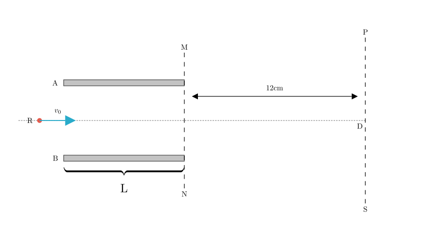
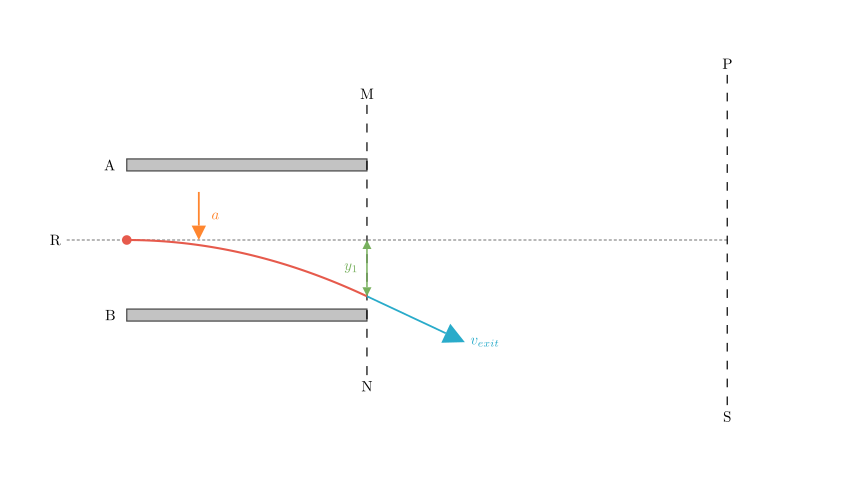
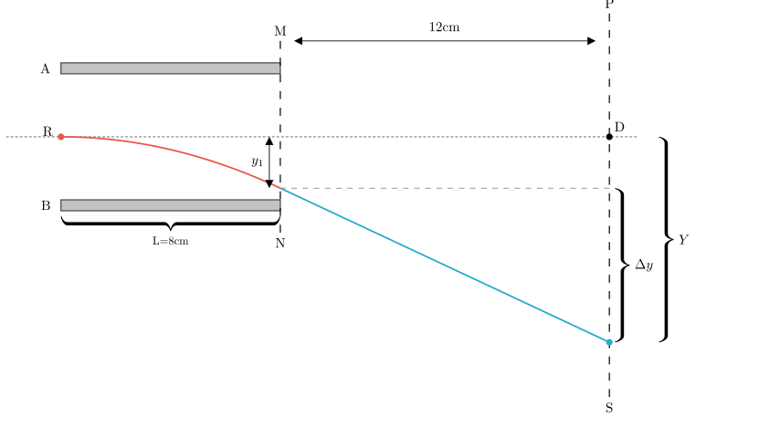

# problem_203_physics_g12

**Problem Statement:**
As shown in the figure, two parallel metal plates A and B have a length $L = 8\text{ cm}$ and are separated by a distance $d = 8\text{ cm}$. Plate A has a potential 300 V higher than Plate B. A positively charged particle with charge $q = 10^{-10}\text{ C}$ and mass $m = 10^{-20}\text{ kg}$ flies into the electric field along the centerline RD, perpendicular to the electric field lines, with an initial velocity $v_0 = 2 \times 10^6\text{ m/s}$. After flying out of the parallel plate electric field, the particle passes through a field-free region between interfaces MN and PS.

**Find:**
1. How far does the particle deviate from the centerline RD when passing through interface MN?
2. How far is the particle from point D when it reaches the PS interface?
*(Given: The distance between interfaces MN and PS is 12 cm. The electrostatic constant $k$ is provided but not required for this parallel plate setup).*

**Solution Approach:**
We will solve this by analyzing the particle's motion in two distinct stages:
1. **Inside the Electric Field (Region A-B):** The particle experiences a constant vertical force, resulting in parabolic motion (similar to a projectile). We will calculate the vertical displacement $y_1$ and the vertical velocity $v_y$ at the exit.
2. **Outside the Electric Field (Region MN-PS):** The particle moves in a field-free region, meaning it travels in a straight line with the velocity it had upon exiting the plates. We will calculate the further vertical displacement $y_2$ and add it to $y_1$.

**Step 1: Motion Inside the Electric Field**

First, we determine the forces acting on the particle. Since Plate A is at a higher potential than Plate B, the electric field points downward. A positive charge experiences a downward force.

**Calculations:**
1. **Electric Field Intensity ($E$):**
$$E = \frac{U}{d} = \frac{300\text{ V}}{0.08\text{ m}} = 3750\text{ V/m}$$

2. **Acceleration ($a$):**
Using Newton's Second Law ($F = ma$) and the electric force formula ($F = qE$):
$$a = \frac{qE}{m} = \frac{(10^{-10}\text{ C})(3750\text{ V/m})}{10^{-20}\text{ kg}} = 3.75 \times 10^{13}\text{ m/s}^2$$

3. **Time in Field ($t_1$):**
The horizontal motion is uniform at velocity $v_0$.
$$t_1 = \frac{L}{v_0} = \frac{0.08\text{ m}}{2 \times 10^6\text{ m/s}} = 4.0 \times 10^{-8}\text{ s}$$

Now we can find the vertical displacement at the exit (interface MN), which we call $y_1$.

**Calculating Displacement and Velocity at MN:**

**Vertical Displacement ($y_1$):**
Using the kinematic equation for displacement with zero initial vertical velocity:
$$y_1 = \frac{1}{2}at_1^2$$
$$y_1 = \frac{1}{2}(3.75 \times 10^{13})(4.0 \times 10^{-8})^2$$
$$y_1 = 0.5 \times (3.75 \times 10^{13}) \times (16 \times 10^{-16})$$
$$y_1 = 30 \times 10^{-3}\text{ m} = 3\text{ cm}$$

**Vertical Velocity at Exit ($v_y$):**
$$v_y = at_1 = (3.75 \times 10^{13})(4.0 \times 10^{-8}) = 1.5 \times 10^6\text{ m/s}$$

So, when the particle crosses interface MN, it is **3 cm** below the centerline.

**Step 2: Motion Outside the Field (MN to PS)**

After crossing MN, the electric field is zero. The particle continues in a straight line with the velocity it had at MN.

**Calculating Final Deviation:**

1. **Time in Field-Free Region ($t_2$):**
The horizontal velocity remains $v_0$. The horizontal distance is $L_2 = 12\text{ cm}$.
$$t_2 = \frac{L_2}{v_0} = \frac{0.12\text{ m}}{2 \times 10^6\text{ m/s}} = 6.0 \times 10^{-8}\text{ s}$$

2. **Additional Vertical Displacement ($\Delta y$):**
The particle travels vertically with the constant vertical velocity $v_y$ it acquired in the field.
$$\Delta y = v_y \times t_2$$
$$\Delta y = (1.5 \times 10^6\text{ m/s})(6.0 \times 10^{-8}\text{ s}) = 9.0 \times 10^{-2}\text{ m} = 9\text{ cm}$$

3. **Total Distance from Point D ($Y$):**
The total distance is the sum of the displacement inside the field ($y_1$) and the displacement outside the field ($\Delta y$).
$$Y = y_1 + \Delta y = 3\text{ cm} + 9\text{ cm} = 12\text{ cm}$$

**Final Answer:**
- The particle deviates **3 cm** from the centerline when crossing interface MN.
- The particle is **12 cm** away from point D when it reaches the PS interface.

*Verification (Midpoint Rule):*
In physics, the tangent to the trajectory at the exit of a uniform field traces back to the midpoint of the field region ($L/2$).
Total horizontal distance from midpoint = $\frac{L}{2} + L_2 = 4 + 12 = 16\text{ cm}$.
Deflection angle $\tan \theta = \frac{v_y}{v_x} = \frac{1.5}{2.0} = 0.75$.
Total $Y = 16\text{ cm} \times 0.75 = 12\text{ cm}$. The result matches.

