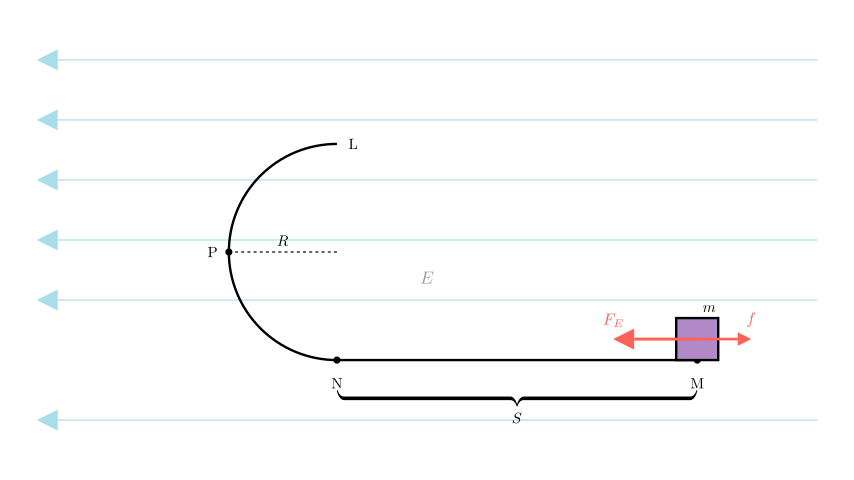
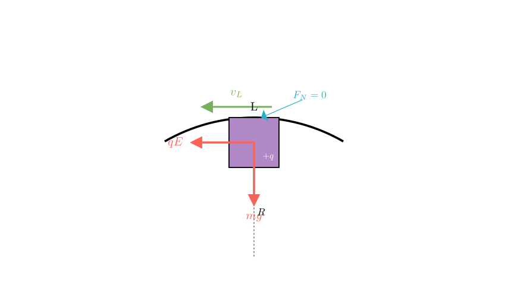
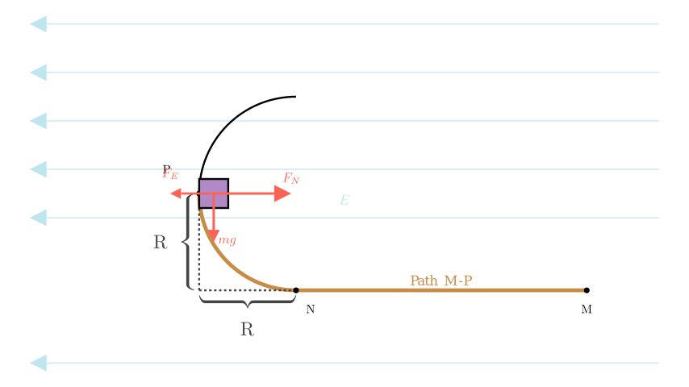
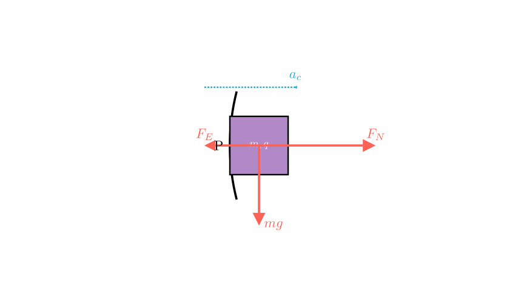

# problem_205_physics_g12

**Problem Statement:**

As shown in the figure, a small block of mass $m = 80\text{ g}$ carrying a positive charge $q = 2 \times 10^{-4}\text{ C}$ is placed at point $M$ on a horizontal track. The coefficient of sliding friction between the block and the horizontal track is $\mu = 0.2$. The track is located in a uniform electric field pointing horizontally to the left with magnitude $E = 10^{3}\text{ V/m}$. At the end of the horizontal track $N$, a smooth semi-circular track with radius $R = 40\text{ cm}$ is connected. Take $g = 10\text{ m/s}^{2}$.

Calculate:
1. To enable the small block to reach the highest point $L$ of the track, what is the minimum distance $S$ between $M$ and $N$?
2. If the block is released from the position calculated in (1), what is the pressure (force) exerted by the block on the track when it reaches point $P$ (the midpoint of the semi-circular track)?

**Solution Approach:**
We will solve this using the Work-Energy Theorem and Newton's Second Law for circular motion. 
1. First, we determine the critical velocity required at the top of the loop ($L$) to maintain contact. Then, we use energy conservation from start ($M$) to finish ($L$) to find the starting distance.
2. Second, we calculate the velocity at point $P$ using energy methods, then analyze the radial forces to find the normal force exerted by the track.

**Part 1: Minimum Distance S**

**Step 1: Analyze the critical condition at the highest point L.**

For the block to complete the circular loop and reach point $L$, it must maintain contact with the track. The critical limiting case occurs when the Normal Force ($F_N$) exerted by the track on the block becomes zero just as it passes point $L$.

At point $L$ (the top of the circle):
- Gravity ($mg$) acts downwards.
- The Electric Force ($qE$) acts horizontally to the left.
- Since $F_E$ is horizontal, it is tangential to the circle at the top and does not contribute to the centripetal force.
- The centripetal force is provided solely by gravity (and the normal force, if any).

The condition for minimum velocity $v_L$ is:
$$mg = m \frac{v_L^2}{R}$$

Solving for $v_L^2$:
$$v_L^2 = gR$$

**Step 2: Apply the Work-Energy Theorem from M to L.**

We track the energy change from the starting point $M$ to the top of the loop $L$.

*   **Initial State (M):** Velocity $v_0 = 0$.
*   **Final State (L):** Velocity $v_L = \sqrt{gR}$.
*   **Forces doing work:**
1.  **Electric Force ($qE$):** Acts to the left. The block moves left from $M$ to $N$ (distance $S$). From $N$ to $L$, the horizontal displacement is zero (since $L$ is directly above $N$ - *Correction*: Wait, $L$ is the end of a semi-circle. If $N$ is the start, $L$ is the top. The horizontal displacement from $N$ to $L$ depends on the shape. Assuming a standard vertical semi-circle where $N$ is the bottom and $L$ is the top, the horizontal displacement relative to $N$ is 0. However, looking at the diagram, the track enters at $N$ and curves *back*? No, standard loops usually curve up. Let's assume $N$ is bottom, $L$ is top. Horizontal displacement from $N$ to $L$ is 0).
*   Work by Electric Force = $W_E = qE \cdot S$.
2.  **Friction ($\mu mg$):** Acts to the right (opposing motion) only on the horizontal segment $M \to N$.
*   Work by Friction = $W_f = -(\mu mg) S$.
3.  **Gravity ($mg$):** Acts downwards. The block rises by height $2R$ (diameter).
*   Work by Gravity = $W_g = -mg(2R)$.

**Work-Energy Equation:**
$$W_{total} = \Delta K$$
$$(qE \cdot S) - (\mu mg \cdot S) - mg(2R) = \frac{1}{2}m v_L^2 - 0$$

Substituting $v_L^2 = gR$:
$$(qE - \mu mg)S - 2mgR = \frac{1}{2}mgR$$
$$(qE - \mu mg)S = 2.5 mgR$$

**Step 3: Calculate values.**
First, convert units to SI:
- $m = 80\text{ g} = 0.08\text{ kg}$
- $R = 40\text{ cm} = 0.4\text{ m}$
- $q = 2 \times 10^{-4}\text{ C}$
- $E = 10^3\text{ V/m}$
- $\mu = 0.2$

Calculate Forces:
- Electric Force $F_E = qE = (2 \times 10^{-4})(10^3) = 0.2\text{ N}$
- Weight $G = mg = 0.08 \times 10 = 0.8\text{ N}$
- Friction Force $f = \mu mg = 0.2 \times 0.8 = 0.16\text{ N}$

Substitute into the energy equation:
$$(0.2 - 0.16)S = 2.5 \times 0.8 \times 0.4$$
$$0.04 S = 0.8$$
$$S = \frac{0.8}{0.04} = 20\text{ m}$$

**Answer (1):** The minimum distance is **20 m**.

**Part 2: Pressure on the track at point P**

**Step 1: Apply Work-Energy Theorem from M to P.**
Point $P$ is the midpoint of the semi-circle.
- Vertical height at $P$: $h = R$.
- Horizontal displacement from $N$ to $P$: $R$ (to the left).

Work done:
1.  **Friction (M to N):** $W_f = -0.16 \times 20 = -3.2\text{ J}$.
2.  **Electric Force (M to P):** The total horizontal displacement is $S + R$ (since $P$ is to the left of $N$).
- $W_E = qE(S + R) = 0.2(20 + 0.4) = 0.2(20.4) = 4.08\text{ J}$.
3.  **Gravity (M to P):** The block rises by $R$.
- $W_g = -mgR = -0.8 \times 0.4 = -0.32\text{ J}$.

Kinetic Energy at P:
$$\frac{1}{2} m v_P^2 = W_{total} = 4.08 - 3.2 - 0.32$$
$$\frac{1}{2} m v_P^2 = 0.56\text{ J}$$
$$v_P^2 = \frac{2 \times 0.56}{0.08} = \frac{1.12}{0.08} = 14\text{ (m/s)}^2$$

**Step 2: Force Analysis at P.**
At point $P$ (vertical section of the track):
- The track is vertical, so the Normal Force ($F_N$) points horizontally to the right (towards the center of the circle).
- The Electric Force ($F_E = qE$) points horizontally to the left (outwards from the center).
- Gravity ($mg$) points vertically downwards (tangential to the circle).

The centripetal force is the net force in the radial (horizontal) direction:
$$F_{net\_radial} = F_N - F_E = m \frac{v_P^2}{R}$$

**Step 3: Calculate the Normal Force.**

Rearranging the centripetal force equation:
$$F_N = m \frac{v_P^2}{R} + F_E$$

Substitute the known values ($m=0.08$, $v_P^2=14$, $R=0.4$, $F_E=0.2$):
$$F_N = 0.08 \left( \frac{14}{0.4} \right) + 0.2$$
$$F_N = 0.08 (35) + 0.2$$
$$F_N = 2.8 + 0.2$$
$$F_N = 3.0\text{ N}$$

**Conclusion:**
The normal force exerted by the track on the block is $3.0\text{ N}$.
According to Newton's Third Law, the pressure (force) exerted by the block *on* the track is equal in magnitude and opposite in direction.

**Final Answers:**
1. The minimum distance $S$ is **20 m**.
2. The pressure on the track at point $P$ is **3.0 N**.

