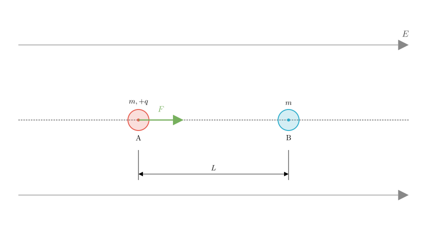
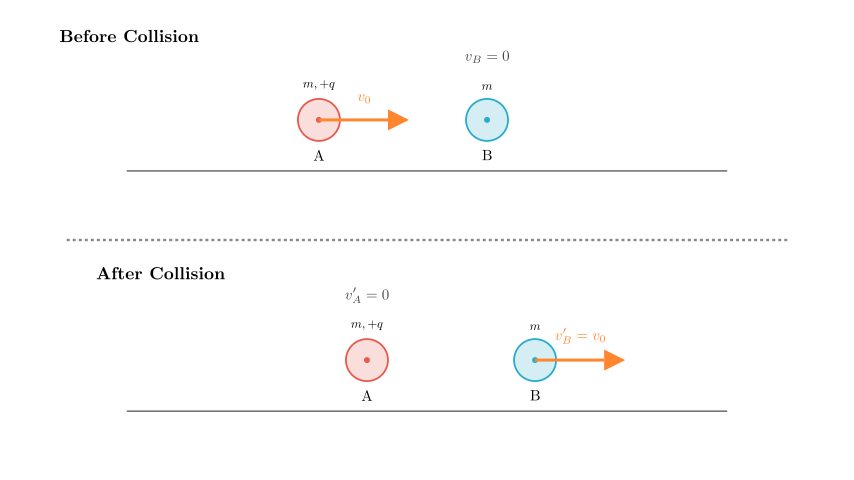
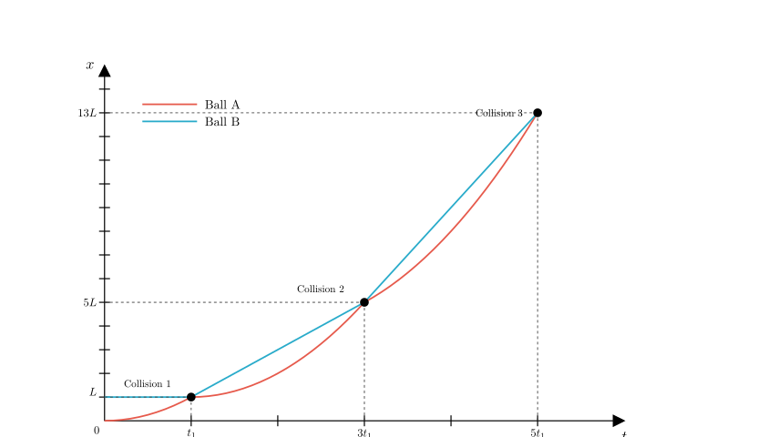
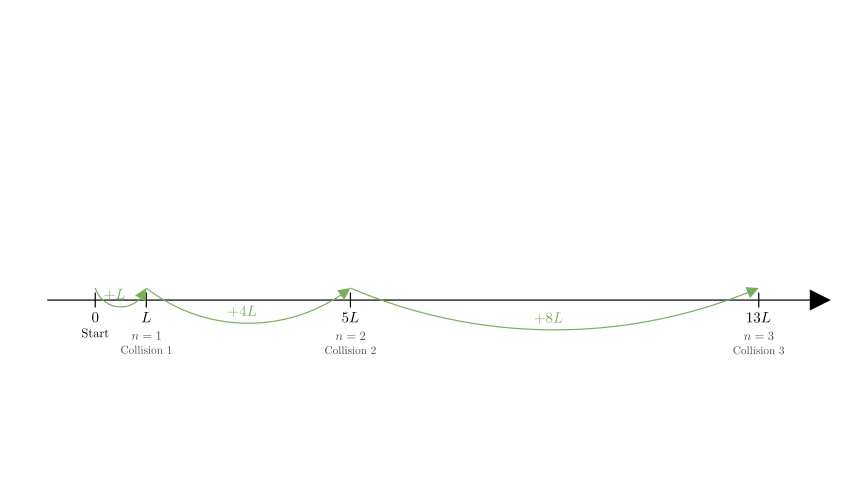

# problem_206_physics_g12

**Problem Statement:**
On a smooth (frictionless), insulating horizontal surface, there is a uniform electric field pointing to the right with intensity $E$. Two small balls, A and B (both can be treated as point masses), are placed at rest on the horizontal surface. Both balls have mass $m$. Ball A carries a positive charge $+q$, while ball B is uncharged. The line connecting A and B is parallel to the electric field lines. Initially, the distance between the two balls is $L$. Under the action of the electric force, ball A begins to move (this moment is taken as $t=0$). Subsequently, it undergoes a head-on collision with ball B. During the collision, there is no loss of total kinetic energy for the system of balls A and B (elastic collision). Assume that there is no charge transfer between balls A and B during any collision, and neglect the collision duration and the gravitational attraction between the balls.

**Find:**
(1) The velocities of balls A and B immediately after the first collision.
(2) The total time elapsed from $t=0$ until the moment just before the third collision.
(3) The displacement magnitude of ball A from $t=0$ until the moment just before the $n$-th collision.

**Solution Approach:**
We will analyze the motion in stages. First, we calculate the acceleration of ball A due to the electric field. We then determine the velocity of A just before the first collision using kinematics. Since the masses are equal and the collision is elastic, the balls will exchange velocities. We will then analyze the subsequent intervals between collisions to find the time patterns and displacement series.

**Part (1): Velocities after the first collision**

**Step 1: Motion before the first collision**
Ball A carries charge $+q$ in an electric field $E$, so it experiences a constant electric force $F = qE$. Ball B is neutral and experiences no electric force.
According to Newton's Second Law, the acceleration of ball A is:
$$a = \frac{F}{m} = \frac{qE}{m}$$

Ball A starts from rest and travels a distance $L$ to hit ball B. Let $v_0$ be the velocity of A just before the collision. Using the kinematic equation $v^2 - u^2 = 2ax$:
$$v_0^2 - 0 = 2aL \implies v_0 = \sqrt{2aL} = \sqrt{\frac{2qEL}{m}}$$

The time taken for the first collision, $t_1$, is:
$$v_0 = a t_1 \implies t_1 = \frac{v_0}{a} = \sqrt{\frac{2L}{a}} = \sqrt{\frac{2mL}{qE}}$$

**Step 2: The First Collision**
The collision is perfectly elastic (no kinetic energy loss) and head-on. Both balls have equal mass $m$.
Let $v_A$ and $v_B$ be velocities before collision, and $v_A'$ and $v_B'$ be velocities after.
Before collision: $v_A = v_0$, $v_B = 0$.

For elastic collisions with equal masses, the objects simply **exchange velocities**.
Therefore, immediately after the first collision:
$$v_A' = 0$$
$$v_B' = v_0 = \sqrt{\frac{2qEL}{m}}$$

**Part (2): Time until the third collision**

**Step 1: Motion between 1st and 2nd collision**
After the 1st collision:
- Ball A is instantaneously at rest ($v_A' = 0$) but continues to accelerate at $a = \frac{qE}{m}$.
- Ball B moves with constant velocity $v_B' = v_0$ (since it is neutral and the surface is frictionless).

Let $\Delta t$ be the time interval between the 1st and 2nd collisions.
Displacement of B: $x_B = v_0 \Delta t$
Displacement of A: $x_A = \frac{1}{2} a (\Delta t)^2$

They collide again when $x_A = x_B$:
$$\frac{1}{2} a (\Delta t)^2 = v_0 \Delta t$$
Since $\Delta t \neq 0$:
$$\frac{1}{2} a \Delta t = v_0 \implies \Delta t = \frac{2v_0}{a}$$

Recall from Part 1 that $t_1 = \frac{v_0}{a}$. Therefore, the interval between collisions is $\Delta t = 2t_1$.

**Step 2: Analysis of the 2nd Collision**
Just before the 2nd collision:
- Velocity of B: $v_B = v_0$ (constant).
- Velocity of A: $v_A = a(\Delta t) = a(2t_1) = 2at_1 = 2v_0$.

Since masses are equal, they exchange velocities again.
After 2nd collision: $v_A'' = v_0$, $v_B'' = 2v_0$.

**Step 3: Motion between 2nd and 3rd collision**
Ball B moves at constant $2v_0$. Ball A starts at $v_0$ and accelerates.
Let the new interval be $\Delta t'$.
$x_B = 2v_0 \Delta t'$
$x_A = v_0 \Delta t' + \frac{1}{2} a (\Delta t')^2$

Equating displacements:
$$2v_0 \Delta t' = v_0 \Delta t' + \frac{1}{2} a (\Delta t')^2$$
$$v_0 \Delta t' = \frac{1}{2} a (\Delta t')^2 \implies \Delta t' = \frac{2v_0}{a} = 2t_1$$

**Conclusion for Time:**
The time interval between any two consecutive collisions is constant: $\Delta T = 2t_1$.
Total time to 3rd collision = (Time to 1st) + (Interval 1-2) + (Interval 2-3)
$$T_{total} = t_1 + 2t_1 + 2t_1 = 5t_1$$

Substituting $t_1 = \sqrt{\frac{2mL}{qE}}$:
$$T_{total} = 5\sqrt{\frac{2mL}{qE}}$$

**Part (3): Displacement of A before the n-th collision**

We need to sum the displacements of ball A during each interval.

1.  **Start to 1st collision:**
Displacement $x_1 = L$.

2.  **1st to 2nd collision:**
Ball B moves at constant velocity $v_0$ for time $2t_1$.
Since A catches B, their displacement is the same during this interval.
$\Delta x_2 = v_B \times \text{time} = v_0 (2t_1)$.
Since $v_0 = a t_1$ and $L = \frac{1}{2} a t_1^2$, we have $v_0 t_1 = 2L$.
$\Delta x_2 = 2(v_0 t_1) = 2(2L) = 4L$.

3.  **2nd to 3rd collision:**
After 2nd collision, B has velocity $2v_0$. Interval is $2t_1$.
$\Delta x_3 = (2v_0)(2t_1) = 4(v_0 t_1) = 4(2L) = 8L$.

4.  **General Pattern:**
After the $(k-1)$-th collision, ball B acquires velocity $(k-1)v_0$.
The time interval to the next collision is always $2t_1$.
Displacement during the $k$-th interval (leading to $k$-th collision):
$$\Delta x_k = [(k-1)v_0] \times (2t_1) = 2(k-1)(v_0 t_1) = 2(k-1)(2L) = 4(k-1)L$$

*Note: This formula works for $k \ge 2$. For $k=1$, displacement is $L$.*

**Summing the displacements:**
Total displacement $S_n$ just before $n$-th collision:
$$S_n = x_1 + \sum_{k=2}^{n} \Delta x_k$$
$$S_n = L + \sum_{k=2}^{n} 4(k-1)L$$
Let $j = k-1$. As $k$ goes from 2 to $n$, $j$ goes from 1 to $n-1$.
$$S_n = L + 4L \sum_{j=1}^{n-1} j$$
Using the sum of arithmetic series $\sum_{j=1}^{N} j = \frac{N(N+1)}{2}$:
$$S_n = L + 4L \left[ \frac{(n-1)n}{2} \right]$$
$$S_n = L + 2n(n-1)L$$
$$S_n = (1 + 2n^2 - 2n)L = (2n^2 - 2n + 1)L$$

**Verification:**
For $n=1$: $S_1 = (2(1)^2 - 2(1) + 1)L = L$. (Correct)
For $n=2$: $S_2 = (2(4) - 4 + 1)L = 5L$. ($L + 4L$, Correct)
For $n=3$: $S_3 = (2(9) - 6 + 1)L = 13L$. ($L + 4L + 8L$, Correct)

**Final Answer:**
(1) $v_A = 0$, $v_B = \sqrt{\frac{2qEL}{m}}$
(2) $t = 5\sqrt{\frac{2mL}{qE}}$
(3) $x = (2n^2 - 2n + 1)L$

**Recap:**
The problem utilizes the properties of elastic collisions between equal masses (velocity exchange) and the kinematics of constant acceleration vs. constant velocity. By identifying that the time interval between subsequent collisions is constant ($2t_1$) and the velocity of ball B increases in arithmetic progression ($0, v_0, 2v_0, ...$), we derived the displacement series as an arithmetic progression sum.

