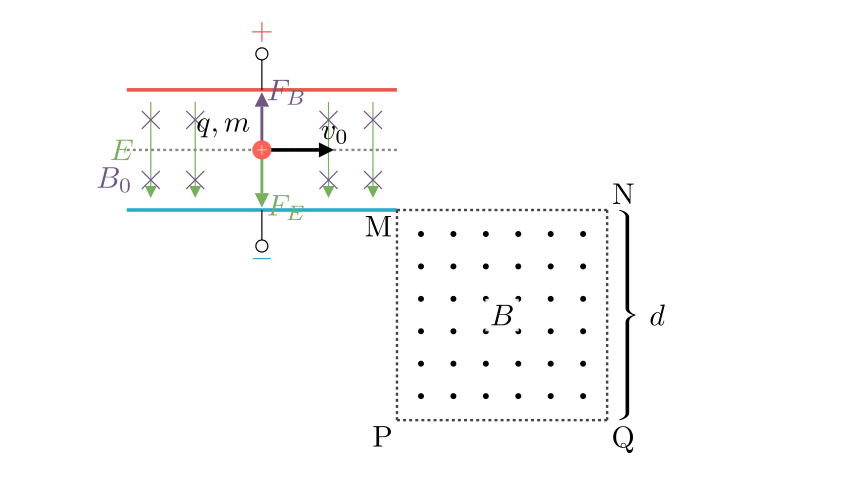
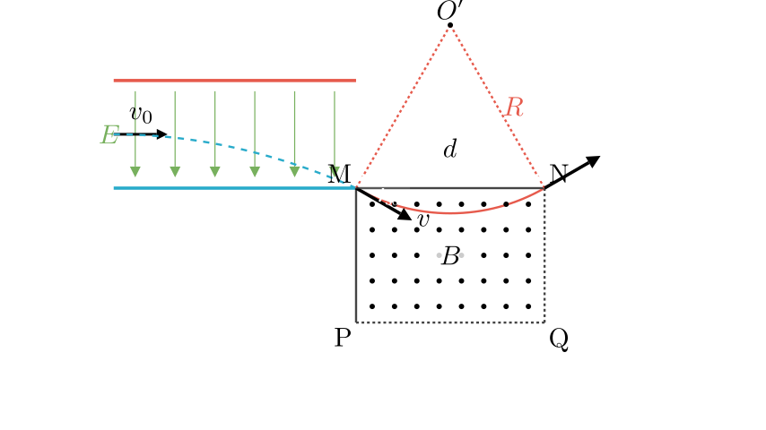
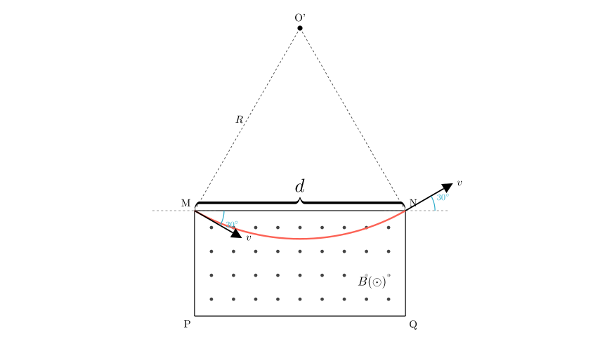

# problem_208_physics_g12

**Problem Statement:**
As shown in the diagram, two parallel metal plates are placed horizontally. Between the plates, there exists a uniform magnetic field perpendicular to the plane of the paper and a uniform electric field with intensity $E$. To the lower right of the metal plates, in the region bounded by MN (upper boundary), PQ (lower boundary), and MP (left boundary), there exists a uniform magnetic field perpendicular to the paper and pointing outwards. The width of this magnetic field is $d$. MN is at the same height as the lower plate, and MP is in the same vertical line as the right end of the metal plates. A positive ion with charge $q$ and mass $m$ enters the space between the metal plates with an initial velocity $v_0$ along a dashed line parallel to the plates. The gravity of the particle is ignored.

(1) Given that the ion moves in a straight line at a constant speed between the plates, find the magnetic induction strength $B_0$ between the plates.
(2) If the magnetic field $B_0$ between the plates is removed, the ion exits the electric field exactly from the right edge of the lower plate, with its velocity direction forming a 30° angle with the horizontal. After entering the magnetic field region, the ion exits from a boundary point of the magnetic field. Find the magnitude $B$ of this magnetic field.

**Solution Approach:**
We will solve this in two parts. First, we analyze the balance of forces in the velocity selector setup (Part 1). Second, we analyze the deflection in the electric field to find the entry velocity for the second stage, and then use geometry to determine the trajectory radius and magnetic field strength required for the particle to traverse the second magnetic field region (Part 2).

**Part 1: Motion between the plates**

The problem states that the ion moves in a straight line at a constant speed $v_0$. This implies that the net force on the ion is zero. The ion is subject to the electric force $F_E$ and the Lorentz force $F_B$.

Since the particle is positive and the electric field direction is generally from the positive (top) plate to the negative (bottom) plate (assuming standard capacitor configuration to allow $E$ and $B$ interaction), the electric force acts downwards:
$$F_E = qE$$

For the net force to be zero, the magnetic force must act upwards. According to the left-hand rule (or right-hand rule for forces), for a positive charge moving right to experience an upward force, the magnetic field $B_0$ must point **into the page**.

The magnitude of the Lorentz force is:
$$F_B = qv_0B_0$$

Equating the magnitudes:
$$qE = qv_0B_0$$

Solving for $B_0$:
$$B_0 = \frac{E}{v_0}$$

**Part 2: Deflection in the Electric Field**

When $B_0$ is removed, the particle is subject only to the electric force $F_E = qE$ acting downwards. It performs a parabolic motion similar to a horizontal projectile.

At the moment the particle exits the electric field (at the right edge of the lower plate, point M), its velocity $v$ makes an angle $\theta = 30^\circ$ with the horizontal.

We can decompose the exit velocity $v$:
- The horizontal component remains unchanged: $v_x = v_0$.
- The vertical component is $v_y$.

Using trigonometry on the velocity vector triangle:
$$\cos(30^\circ) = \frac{v_x}{v} = \frac{v_0}{v}$$

Therefore, the speed $v$ with which the particle enters the second magnetic field is:
$$v = \frac{v_0}{\cos(30^\circ)} = \frac{v_0}{\sqrt{3}/2} = \frac{2v_0}{\sqrt{3}}$$

**Part 2: Motion in the Magnetic Field Region**

The particle enters the magnetic field region at point M with velocity $v$ directed $30^\circ$ below the horizontal. The magnetic field $B$ is perpendicular **out** of the paper.

**Force Direction:**
Using the left-hand rule for a positive charge:
- Velocity is down-right.
- B-field is Out.
- The Lorentz force is directed perpendicular to velocity, pointing **up-right**.

Because the force has an upward component, the particle will curve upwards. The trajectory is a circular arc.

**Geometric Analysis:**
1. The particle enters at M ($y=0$) with angle $-30^\circ$.
2. The force curves it upwards. It will travel through the field and exit.
3. Due to the symmetry of the entrance angle and the field boundaries, and assuming the "boundary point" refers to the opposite top corner or edge N (traversing the width $d$), the path is symmetric.
4. The particle exits at the top boundary MN at a horizontal distance $x$.
5. The entry angle is $30^\circ$ below horizontal, and by symmetry, the exit angle will be $30^\circ$ above horizontal.
6. The chord connecting the entry and exit points is horizontal. The length of this chord corresponds to the width of the field, $d$.

From the geometry of the circular sector:
- The angle of the velocity changes from $-30^\circ$ to $+30^\circ$.
- The arc corresponds to a central angle of $60^\circ$ (since the radius is perpendicular to velocity).
- The triangle formed by the Center of Curvature ($O'$), Entry Point ($M$), and Exit Point ($N$) is an equilateral triangle (two radii $R$ with a $60^\circ$ angle between them).
- Therefore, the chord length (horizontal distance) equals the radius $R$.

Since the particle traverses the width of the field $d$:
$$R = d$$

**Calculation of B:**
The radius of motion for a charged particle in a magnetic field is given by:
$$R = \frac{mv}{qB}$$

Substituting $R = d$ and $v = \frac{2v_0}{\sqrt{3}}$:
$$d = \frac{m}{qB} \left( \frac{2v_0}{\sqrt{3}} \right)$$

Solving for $B$:
$$B = \frac{2mv_0}{\sqrt{3}qd} = \frac{2\sqrt{3}mv_0}{3qd}$$

**Final Answer Recap:**
(1) The magnetic induction strength between the plates is $B_0 = \frac{E}{v_0}$.
(2) The magnetic induction strength in the right-hand region is $B = \frac{2\sqrt{3}mv_0}{3qd}$.

