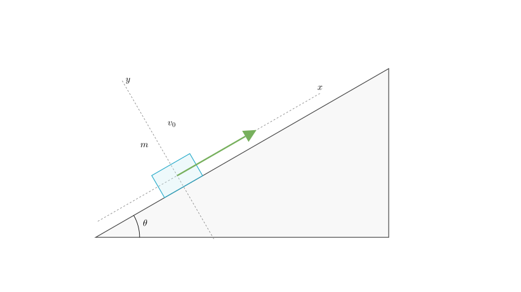
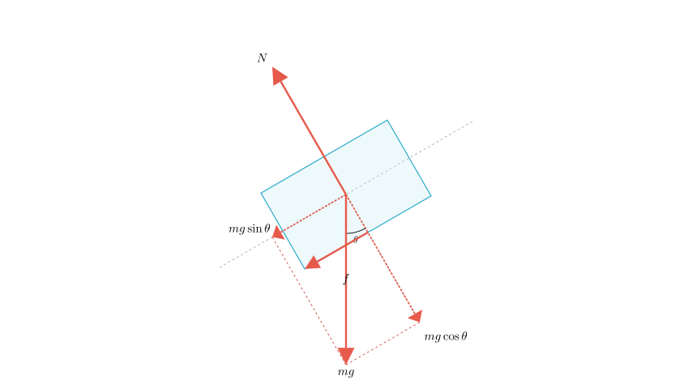
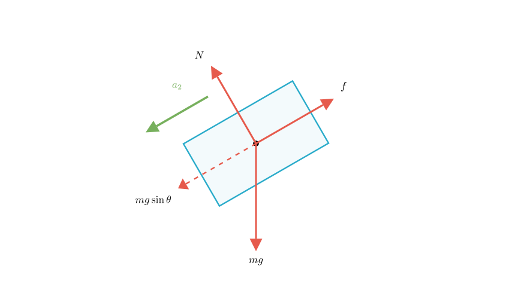

# problem_209_physics_g12

**Problem Statement:**
As shown in Figure (a), a block slides up a fixed inclined plane at time $t=0$. Its velocity-time ($v-t$) graph is shown in Figure (b). Given the gravitational acceleration $g$, the inclination angle $\theta$ of the slope, and the quantities $v_0$, $v_1$, and $t_1$ shown in the graph, find the coefficient of kinetic friction between the block and the slope.

**Solution Approach:**
To find the coefficient of kinetic friction ($\mu$), we will analyze the motion in two phases: the upward sliding phase and the downward sliding phase.
1.  **Kinematics:** Determine the magnitude of acceleration for both phases using the slope of the $v-t$ graph.
2.  **Dynamics:** Use Newton's Second Law to relate these accelerations to the forces acting on the block (gravity and friction).
3.  **Calculation:** Solve the resulting system of equations for $\mu$.

**Step 1: Analyze the Upward Motion ($0 < t < t_1$)**

From the $v-t$ graph in Figure (b), the block starts with velocity $v_0$ and comes to a momentary stop at $t_1$.
The slope of the velocity-time graph represents acceleration. The magnitude of the acceleration during the ascent, denoted as $a_1$, is:
$$a_1 = \frac{|\Delta v|}{\Delta t} = \frac{v_0 - 0}{t_1} = \frac{v_0}{t_1}$$

Now, let's analyze the forces acting on the block as it slides up. Friction opposes the motion, so it points down the slope. The component of gravity along the slope also points down.

**Step 2: Newton's Second Law for Upward Motion**

Applying Newton's Second Law along the slope (where "down the slope" is the direction of the net force causing deceleration):
$$F_{net} = mg \sin\theta + f = m a_1$$

We know that kinetic friction is $f = \mu N$. From the forces perpendicular to the slope, $N = mg \cos\theta$.
Substituting these into the equation:
$$mg \sin\theta + \mu mg \cos\theta = m a_1$$
$$g(\sin\theta + \mu \cos\theta) = a_1$$

Substituting $a_1 = \frac{v_0}{t_1}$:
**Equation (1):**  $g(\sin\theta + \mu \cos\theta) = \frac{v_0}{t_1}$

**Step 3: Analyze the Downward Motion ($t_1 < t < 3t_1$)**

From the graph, the block accelerates from rest at $t_1$ to velocity $-v_1$ at $3t_1$. The time interval is $\Delta t = 3t_1 - t_1 = 2t_1$.
The magnitude of the acceleration during descent, $a_2$, is:
$$a_2 = \frac{|\Delta v|}{\Delta t} = \frac{v_1 - 0}{2t_1} = \frac{v_1}{2t_1}$$

During descent, the block moves down the slope, so friction acts **up** the slope, opposing the motion.

**Step 4: Newton's Second Law for Downward Motion**

For the downward phase, the component of gravity ($mg \sin\theta$) pulls the block down, while friction ($f$) resists it. Since the block accelerates downwards, gravity wins.
$$F_{net} = mg \sin\theta - f = m a_2$$

Substituting $f = \mu mg \cos\theta$:
$$mg \sin\theta - \mu mg \cos\theta = m a_2$$
$$g(\sin\theta - \mu \cos\theta) = a_2$$

Substituting $a_2 = \frac{v_1}{2t_1}$:
**Equation (2):** $g(\sin\theta - \mu \cos\theta) = \frac{v_1}{2t_1}$

**Step 5: Solve for $\mu$**

We now have a system of two linear equations:
1) $g \sin\theta + \mu g \cos\theta = \frac{v_0}{t_1}$
2) $g \sin\theta - \mu g \cos\theta = \frac{v_1}{2t_1}$

To isolate $\mu$, we can subtract Equation (2) from Equation (1):
$$(g \sin\theta + \mu g \cos\theta) - (g \sin\theta - \mu g \cos\theta) = \frac{v_0}{t_1} - \frac{v_1}{2t_1}$$
$$2\mu g \cos\theta = \frac{2v_0}{2t_1} - \frac{v_1}{2t_1}$$
$$2\mu g \cos\theta = \frac{2v_0 - v_1}{2t_1}$$

**Final Calculation:**

Solving for $\mu$:
$$\mu = \frac{2v_0 - v_1}{2t_1 \cdot 2g \cos\theta}$$
$$\mu = \frac{2v_0 - v_1}{4 g t_1 \cos\theta}$$

**Final Answer:**
The coefficient of kinetic friction between the block and the slope is:
$$\mu = \frac{2v_0 - v_1}{4 g t_1 \cos\theta}$$

**Verification:**
- **Units:** The numerator is velocity ($L/T$). The denominator is acceleration ($L/T^2$) $\times$ time ($T$), which results in velocity ($L/T$). The ratio is dimensionless, which is correct for a coefficient of friction.
- **Sign:** Since the block slides up and then back down, the upward deceleration must be greater than the downward acceleration (friction aids deceleration but hinders acceleration). This implies $a_1 > a_2$, or $\frac{v_0}{t_1} > \frac{v_1}{2t_1}$, so $2v_0 > v_1$. Thus, the numerator is positive, yielding a valid positive physical constant.

