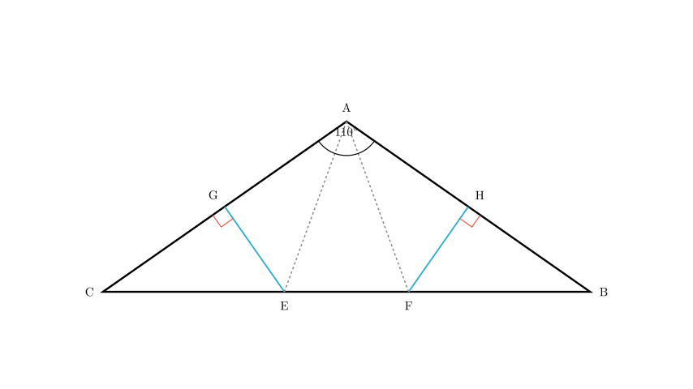
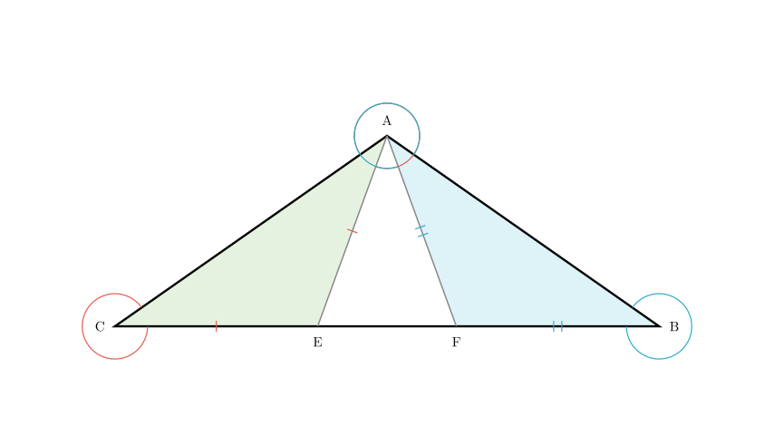
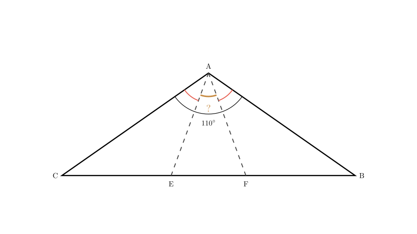

# problem_214_math_g9

**Problem Statement:**
As shown in the figure, in $\triangle ABC$, the perpendicular bisectors of sides $AB$ and $AC$ intersect side $BC$ at points $F$ and $E$ respectively (Note: Based on the diagram structure, the perpendicular from $AC$ connects to $E$ and the perpendicular from $AB$ connects to $F$). If $\angle BAC = 110^\circ$, what is the measure of $\angle EAF$?

A. 35°  
B. 40°  
C. 45°  
D. 50°

**Solution Approach:**
1.  Identify the geometric properties of points on perpendicular bisectors.
2.  Establish the relationship between the angles in the isosceles triangles formed.
3.  Use the sum of angles in $\triangle ABC$ to find the sum of base angles $\angle B$ and $\angle C$.
4.  Subtract the side angles from the total vertex angle $\angle BAC$ to find $\angle EAF$.

**Step 1: Analyze the Perpendicular Bisectors**

Recall the **Perpendicular Bisector Theorem**: Any point on the perpendicular bisector of a segment is equidistant from the endpoints of that segment.

*   **For side $AC$:** The line $GE$ is the perpendicular bisector of $AC$. This means point $E$ is equidistant from $A$ and $C$.
$$EA = EC$$
Consequently, $\triangle ACE$ is an isosceles triangle, and its base angles are equal:
$$\angle EAC = \angle C$$

*   **For side $AB$:** The line $HF$ is the perpendicular bisector of $AB$. This means point $F$ is equidistant from $A$ and $B$.
$$FA = FB$$
Consequently, $\triangle ABF$ is an isosceles triangle, and its base angles are equal:
$$\angle FAB = \angle B$$

**Step 2: Calculate the Sum of Base Angles**

We are given that $\angle BAC = 110^\circ$. In any triangle, the sum of internal angles is $180^\circ$. We can calculate the sum of the remaining two angles, $\angle B$ and $\angle C$:

$$\angle B + \angle C = 180^\circ - \angle BAC$$
$$\angle B + \angle C = 180^\circ - 110^\circ = 70^\circ$$

**Step 3: Solve for $\angle EAF$**

From the diagram, the angle $\angle BAC$ is composed of three parts: $\angle FAB$, $\angle EAF$, and $\angle EAC$.

We can express $\angle EAF$ by subtracting the outer angles from the total angle:
$$\angle EAF = \angle BAC - (\angle FAB + \angle EAC)$$

Substituting the equalities we found in Step 1 ($\angle FAB = \angle B$ and $\angle EAC = \angle C$):
$$\angle EAF = \angle BAC - (\angle B + \angle C)$$

**Final Calculation:**

Now, substitute the values we know:
*   $\angle BAC = 110^\circ$
*   $\angle B + \angle C = 70^\circ$

$$\angle EAF = 110^\circ - 70^\circ$$
$$\angle EAF = 40^\circ$$

**Conclusion:**
The measure of $\angle EAF$ is $40^\circ$. This corresponds to option B.

**Answer Verification:**
If $\angle B = 30^\circ$ and $\angle C = 40^\circ$ (sum is 70°), then $\angle FAB = 30^\circ$ and $\angle EAC = 40^\circ$.
$\angle EAF = 110^\circ - 30^\circ - 40^\circ = 40^\circ$. The calculation holds true regardless of the individual values of B and C, as long as their sum is 70°.

**Final Answer:** B

