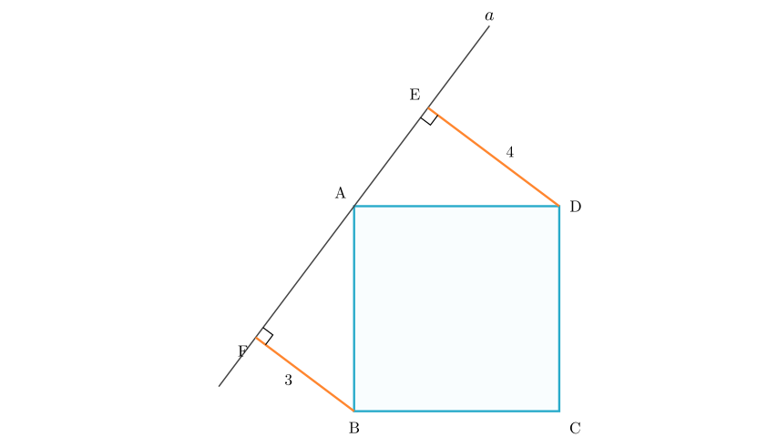
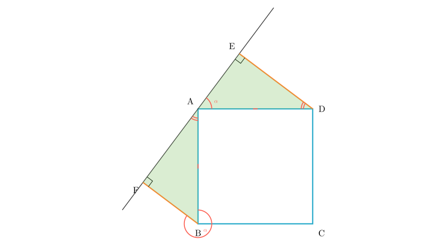
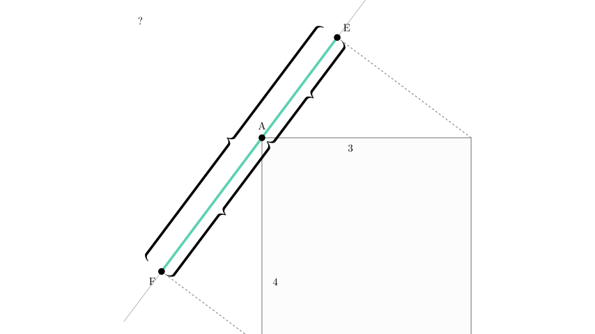

# problem_215_math_g9

**Problem Statement:**
As shown in the figure, line $a$ passes through vertex $A$ of square $ABCD$. Perpendiculars $DE$ and $BF$ are drawn from vertices $D$ and $B$ to line $a$, intersecting it at points $E$ and $F$ respectively. If $DE = 4$ and $BF = 3$, what is the length of $EF$?

**Options:**
A. 1
B. 5
C. 7
D. 12

**Solution Approach:**
We will use the properties of the square and the geometry of right-angled triangles. By analyzing the angles around vertex $A$, we will prove that triangle $ABF$ is congruent to triangle $DAE$. This congruence will allow us to relate the unknown lengths of segments on the line $EF$ to the given lengths $DE$ and $BF$.

**Step 1: Analyze the Angles**

First, let's examine the relationship between the two right-angled triangles, $\triangle ABF$ and $\triangle DAE$.

1.  Since $ABCD$ is a square, the side lengths are equal ($AB = AD$) and the corner angle is $90^\circ$ ($\angle BAD = 90^\circ$).
2.  The line $E-A-F$ is a straight line, so the angle sum around point $A$ on this line is $180^\circ$.
3.  Therefore, $\angle F AB + \angle BAD + \angle DAE = 180^\circ$.
4.  Substituting $\angle BAD = 90^\circ$, we get:
$$ \angle F AB + \angle DAE = 90^\circ $$
This means $\angle F AB$ and $\angle DAE$ are complementary.

Now, look at triangle $\triangle ABF$. Since it is a right-angled triangle (because $BF \perp a$):
$$ \angle F AB + \angle ABF = 90^\circ $$

Comparing the two equations:
- $\angle DAE = 90^\circ - \angle F AB$
- $\angle ABF = 90^\circ - \angle F AB$

**Conclusion:** $\angle DAE = \angle ABF$.

**Step 2: Prove Congruence**

We now have three conditions to prove that $\triangle ABF$ and $\triangle DAE$ are congruent:
1.  **Angle:** $\angle AFB = \angle DEA = 90^\circ$ (Given perpendiculars).
2.  **Angle:** $\angle ABF = \angle DAE$ (Proved in Step 1).
3.  **Side:** $AB = AD$ (Sides of the square).

By the **AAS (Angle-Angle-Side)** congruence criterion, we establish:
$$ \triangle ABF \cong \triangle DAE $$

**Step 3: Determine Lengths**

Because the triangles are congruent, their corresponding sides are equal in length:
- The side $AF$ in $\triangle ABF$ corresponds to the side $DE$ in $\triangle DAE$.
$$ AF = DE = 4 $$
- The side $AE$ in $\triangle DAE$ corresponds to the side $BF$ in $\triangle ABF$.
$$ AE = BF = 3 $$

**Step 4: Calculate Final Length**

The points $E$, $A$, and $F$ lie on the same straight line $a$, with $A$ between $E$ and $F$. Therefore, the total length of segment $EF$ is the sum of segments $EA$ and $AF$.

$$ EF = EA + AF $$

Substituting the values we found:
$$ EF = 3 + 4 $$
$$ EF = 7 $$

**Final Answer:**
The length of $EF$ is 7. This corresponds to **Option C**.

**Recap:**
1.  We identified two right-angled triangles formed by the perpendiculars and the sides of the square.
2.  We proved these triangles ($\triangle ABF$ and $\triangle DAE$) are congruent by "angle chasing" around the vertex $A$.
3.  We mapped the known vertical/horizontal lengths ($BF=3, DE=4$) to the segments along the line ($AE=3, AF=4$).
4.  We summed these segments to find the total length.

