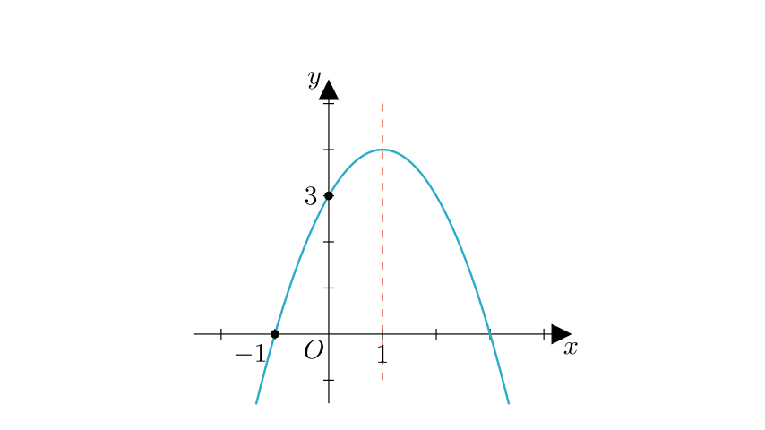
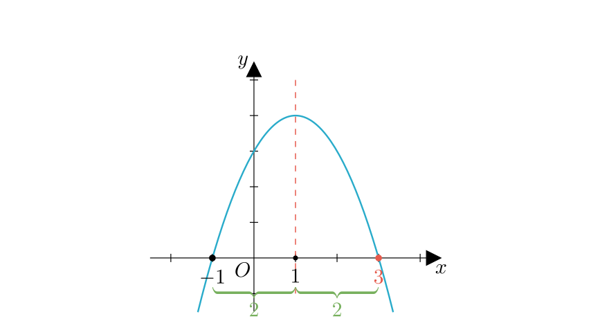
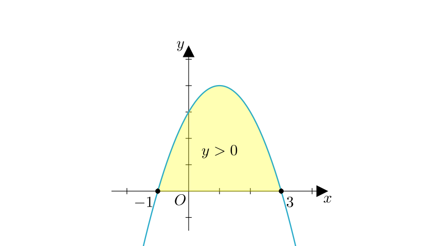
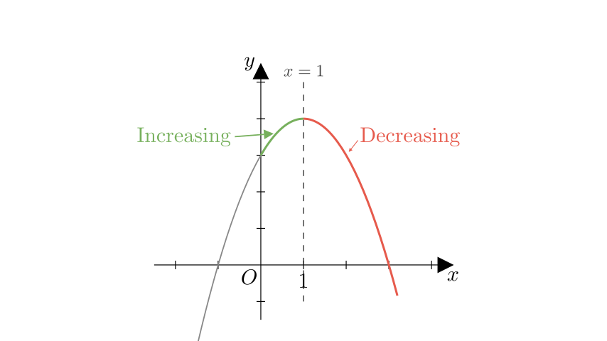

# problem_216_math_g9

**Problem Statement:**
As shown in the figure, the axis of symmetry of the parabola $y = ax^2 + bx + c$ ($a \neq 0$) is the line $x = 1$. One intersection point with the x-axis is $(-1, 0)$. Part of its graph is shown. Consider the following conclusions:

① $4ac < b^2$
② $3a + c > 0$
③ When $x > 0$, $y$ decreases as $x$ increases.
④ When $y > 0$, the range of $x$ is $-1 < x < 3$.
⑤ The two roots of the equation $ax^2 + bx + c = 0$ are $x_1 = -1$ and $x_2 = 3$.

Determine the number of correct conclusions among these options.

**Solution Approach:**
We will analyze the properties of the quadratic function based on the graph (opening direction, axis of symmetry, intersection points) to evaluate the coefficients $a, b, c$ and verify each of the five statements step-by-step.

**Step 1: Analyzing the Coefficients and Discriminant (Conclusion ①)**

First, let's observe the basic properties of the graph:
*   The parabola opens downwards, which implies $a < 0$.
*   The graph intersects the x-axis at two distinct points (one is given at $x = -1$, and by symmetry, there must be another on the positive side).

**Evaluating Conclusion ①:** $4ac < b^2$
This inequality can be rearranged as $b^2 - 4ac > 0$.
The expression $b^2 - 4ac$ is the **discriminant ($\Delta$)** of the quadratic equation.
*   If $\Delta > 0$, the parabola has two distinct x-intercepts.
*   Since the graph clearly crosses the x-axis at two distinct points, we know that $b^2 - 4ac > 0$, which means $b^2 > 4ac$ or $4ac < b^2$.

Therefore, **Conclusion ① is Correct.**

**Step 2: Finding the Roots and Range (Conclusions ④ and ⑤)**

**Evaluating Conclusion ⑤:** Roots of $ax^2 + bx + c = 0$
*   We are given the axis of symmetry is $x = 1$.
*   One root is $x_1 = -1$.
*   The distance from the root $x_1 = -1$ to the axis $x = 1$ is $|1 - (-1)| = 2$.
*   Due to symmetry, the other root $x_2$ must be 2 units to the right of the axis: $x_2 = 1 + 2 = 3$.
*   So, the roots are indeed $x_1 = -1$ and $x_2 = 3$.
Therefore, **Conclusion ⑤ is Correct.**

**Evaluating Conclusion ④:** Range of $x$ when $y > 0$
*   We are looking for the part of the graph that is *above* the x-axis ($y > 0$).
*   Since the parabola opens downwards ($a < 0$), the function values are positive between the two roots.
*   The roots are $-1$ and $3$.
*   Thus, $y > 0$ when $-1 < x < 3$.
Therefore, **Conclusion ④ is Correct.**

**Step 3: Analyzing Monotonicity (Conclusion ③)**

**Evaluating Conclusion ③:** When $x > 0$, $y$ decreases as $x$ increases.
*   The axis of symmetry is the line $x = 1$.
*   For a parabola opening downwards:
*   To the left of the axis ($x < 1$), $y$ increases as $x$ increases.
*   To the right of the axis ($x > 1$), $y$ decreases as $x$ increases.
*   The statement considers the interval $x > 0$.
*   This interval includes the range $0 < x < 1$, where the function is actually **increasing**.
*   It only starts decreasing when $x > 1$.

Because the function is not decreasing for the *entire* interval $x > 0$, **Conclusion ③ is Incorrect.**

**Step 4: Algebraic Verification (Conclusion ②)**

**Evaluating Conclusion ②:** $3a + c > 0$
Let's use the relationships we have established.
1.  **Axis of symmetry formula:** $x = -\frac{b}{2a} = 1 \implies b = -2a$.
2.  **Point on graph:** The graph passes through $(-1, 0)$. We can substitute $x = -1$ and $y = 0$ into the equation:
$$a(-1)^2 + b(-1) + c = 0$$
$$a - b + c = 0$$

Now, substitute $b = -2a$ into this equation:
$$a - (-2a) + c = 0$$
$$a + 2a + c = 0$$
$$3a + c = 0$$

The conclusion states $3a + c > 0$. However, we proved that $3a + c$ is exactly equal to 0.
Therefore, **Conclusion ② is Incorrect.**

**Final Count:**
*   ① Correct ($4ac < b^2$)
*   ② Incorrect ($3a + c = 0$)
*   ③ Incorrect (Increases on $0 < x < 1$)
*   ④ Correct ($-1 < x < 3$)
*   ⑤ Correct (Roots are -1, 3)

There are **3** correct conclusions (①, ④, ⑤).

**Final Answer:**
The correct choice is **B (3个)**.

