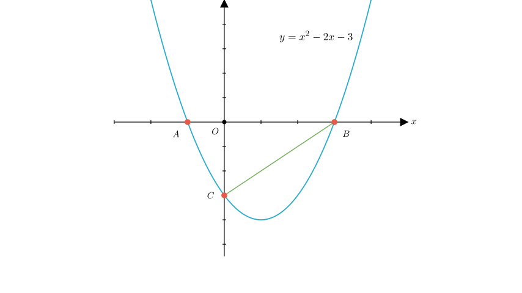
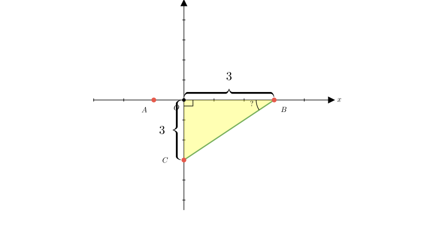
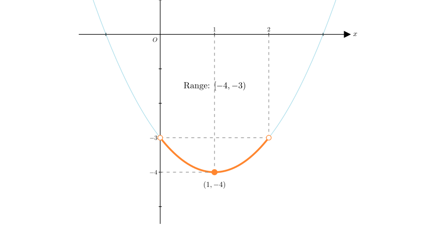
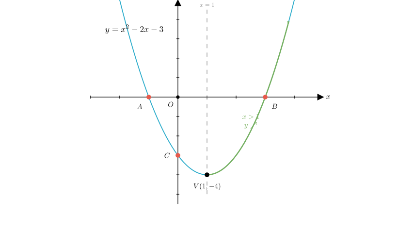

# problem_217_math_g9

**Problem Statement:**
As shown in the figure, the graph of the quadratic function $y = x^2 - 2x - 3$ intersects the $x$-axis at points $A$ and $B$, and intersects the $y$-axis at point $C$. Consider the following statements:
① $AB = 4$;
② $\angle ABC = 45^\circ$;
③ When $0 < x < 2$, then $-4 \le y < -3$;
④ When $x > 1$, $y$ increases as $x$ increases.

How many of these conclusions are correct?
A. 1
B. 2
C. 3
D. 4

**Solution Approach:**
We will verify each of the four statements step-by-step by analyzing the algebraic properties of the quadratic function and the geometric properties of its graph.

**Step 1: Analyze the Coordinates of A, B, and C**

First, let's determine the coordinates of the intersection points.

**For points A and B (x-intercepts):**
Set $y = 0$ in the equation:
$$x^2 - 2x - 3 = 0$$
Factor the quadratic:
$$(x - 3)(x + 1) = 0$$
This gives us roots $x_1 = 3$ and $x_2 = -1$.
Based on the diagram, $A$ is to the left of the y-axis and $B$ is to the right.
Therefore, the coordinates are $A(-1, 0)$ and $B(3, 0)$.

**For point C (y-intercept):**
Set $x = 0$ in the equation:
$$y = 0^2 - 2(0) - 3 = -3$$
Therefore, the coordinate is $C(0, -3)$.

**Verify Statement ①:**
The length of segment $AB$ is the distance between the x-coordinates:
$$AB = x_B - x_A = 3 - (-1) = 3 + 1 = 4$$
**Conclusion:** Statement ① is **Correct**.

**Step 2: Analyze Angle ABC**

We need to find the measure of $\angle ABC$. Since points $A$, $O$, and $B$ lie on the x-axis, $\angle ABC$ is the same as $\angle OBC$.

Look at $\triangle OBC$ in the diagram above:
*   Point $O$ is at $(0,0)$.
*   Point $B$ is at $(3,0)$, so the length $OB = 3$.
*   Point $C$ is at $(0,-3)$, so the length $OC = |-3| = 3$.
*   The angle $\angle BOC$ is $90^\circ$ because the axes are perpendicular.

Since $OB = OC = 3$ and $\angle BOC = 90^\circ$, triangle $\triangle OBC$ is an **isosceles right-angled triangle**.

Therefore, the base angles are equal:
$$\angle OBC = \angle OCB = 45^\circ$$
Consequently, $\angle ABC = 45^\circ$.

**Conclusion:** Statement ② is **Correct**.

**Step 3: Analyze the Range for $0 < x < 2$**

To verify Statement ③, we look at the behavior of the function within the interval $0 < x < 2$.

1.  **Find the Vertex:**
The axis of symmetry is $x = -\frac{b}{2a} = -\frac{-2}{2(1)} = 1$.
The y-value at the vertex is $y = 1^2 - 2(1) - 3 = -4$.
Vertex: $(1, -4)$.
Since $x=1$ is inside the interval $(0, 2)$, the minimum value of the function in this interval is $-4$.

2.  **Check the Endpoints:**
*   At $x = 0$: $y = -3$.
*   At $x = 2$: $y = 2^2 - 2(2) - 3 = 4 - 4 - 3 = -3$.

3.  **Determine the Range:**
The function starts at $y=-3$ (exclusive, since $x>0$), goes down to the minimum $y=-4$ (inclusive, since $x=1$ is included), and goes back up to $y=-3$ (exclusive, since $x<2$).

Therefore, the range of $y$ is $-4 \le y < -3$.

**Conclusion:** Statement ③ is **Correct**.

**Step 4: Analyze Monotonicity for $x > 1$**

We examine the behavior of the function when $x > 1$.

The quadratic function is $y = x^2 - 2x - 3$.
*   The coefficient of $x^2$ is $a = 1$, which is positive ($a > 0$). This means the parabola opens **upwards**.
*   The axis of symmetry is the line $x = 1$.

For a parabola opening upwards:
*   To the left of the axis of symmetry ($x < 1$), $y$ decreases as $x$ increases.
*   To the right of the axis of symmetry ($x > 1$), $y$ increases as $x$ increases.

Since the statement specifies $x > 1$, we are on the right side of the axis of symmetry, where the function is increasing.

**Conclusion:** Statement ④ is **Correct**.

**Final Count:**
*   Statement ①: Correct
*   Statement ②: Correct
*   Statement ③: Correct
*   Statement ④: Correct

There are 4 correct conclusions.

**Answer:** D

