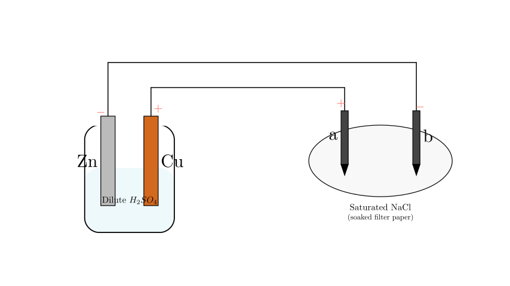
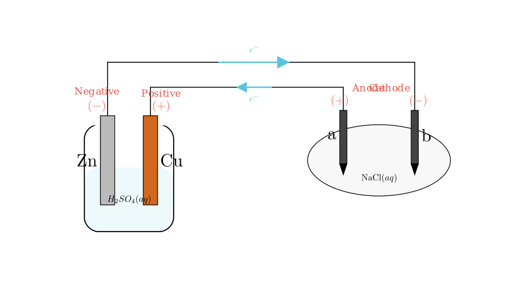
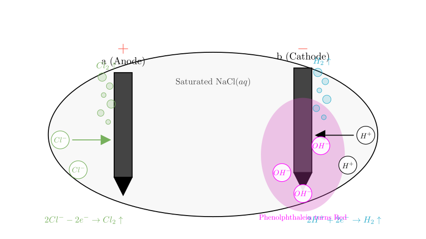
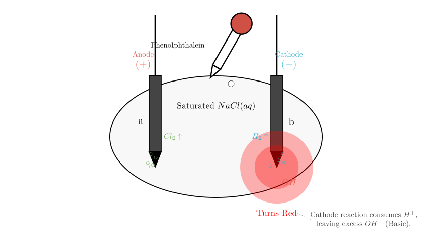

# problem_21_chemistry_g12

**Problem Statement:**
As shown in the figure, **a** and **b** are two graphite rods. Which of the following statements is correct?

A. **a** is the anode, where oxidation occurs; Zinc is the negative electrode and is reduced.
B. The direction of electron flow in the circuit is: Zinc $\rightarrow$ b $\rightarrow$ a $\rightarrow$ Copper.
C. If 0.2 mol of electrons pass through the circuit, 2.24 L of gas is produced on the copper plate.
D. If phenolphthalein is dripped onto the filter paper, the area near electrode **b** turns red.

**Solution Approach:**
To solve this problem, we must first identify the type of electrochemical cells involved. The setup consists of two parts:
1.  **Left side:** A beaker with Zinc and Copper electrodes in dilute sulfuric acid. This functions as a **Galvanic Cell (Primary Battery)** because it generates electricity through a spontaneous chemical reaction.
2.  **Right side:** Graphite rods (**a** and **b**) on filter paper soaked in saturated saline (NaCl solution). This functions as an **Electrolytic Cell** driven by the battery on the left.

We will determine the polarity of the electrodes, trace the electron flow, and analyze the chemical reactions at each electrode.

**Step 1: Analyzing the Galvanic Cell (Left Side)**

In the beaker containing dilute sulfuric acid ($H_2SO_4$):
*   **Zinc (Zn)** is more reactive than **Copper (Cu)**.
*   Therefore, **Zn** acts as the **Negative Electrode** (Anode of the battery). It loses electrons and dissolves: 
$$Zn - 2e^- \rightarrow Zn^{2+}$$
*   **Cu** acts as the **Positive Electrode** (Cathode of the battery). Hydrogen ions ($H^+$) from the acid gain electrons here to form hydrogen gas:
$$2H^+ + 2e^- \rightarrow H_2 \uparrow$$

**Step 2: Determining Polarity of the Electrolytic Cell (Right Side)**

We trace the connections to the graphite rods:
*   The **Zn** electrode (Negative) is connected to rod **b**. Therefore, **b** is the **Cathode** of the electrolytic cell.
*   The **Cu** electrode (Positive) is connected to rod **a**. Therefore, **a** is the **Anode** of the electrolytic cell.

**Step 3: Analyzing the Reactions in the Electrolytic Cell**

The filter paper contains saturated saline (NaCl solution), which contains $Na^+$, $Cl^-$, $H^+$, and $OH^-$ ions.

*   **At Anode 'a' (connected to positive Cu):** Negative ions move here. $Cl^-$ loses electrons (oxidation) more easily than $OH^-$.
$$2Cl^- - 2e^- \rightarrow Cl_2 \uparrow$$
(Chlorine gas is produced).

*   **At Cathode 'b' (connected to negative Zn):** Positive ions move here. $H^+$ gains electrons (reduction) more easily than $Na^+$.
$$2H^+ + 2e^- \rightarrow H_2 \uparrow$$
(Hydrogen gas is produced).

**Crucial Consequence at Cathode 'b':**
As $H^+$ ions are consumed to form hydrogen gas, the equilibrium of water ($H_2O \rightleftharpoons H^+ + OH^-$) shifts. This leaves an excess of hydroxide ions ($OH^-$) near electrode **b**, making the solution locally **alkaline (basic)**.

**Step 4: Evaluating the Options**

Let's check each statement against our analysis:

*   **A. "a is the anode... Zinc... is reduced"**
*   **a** is indeed the anode.
*   However, Zinc is the negative electrode of the battery, meaning it loses electrons (oxidation). The statement says Zinc is *reduced*.
*   **Incorrect.**

*   **B. "Electron flow: Zinc $\rightarrow$ b $\rightarrow$ a $\rightarrow$ Copper"**
*   Electrons flow from Zn to **b** through the wire.
*   However, electrons **do not** flow through the solution (electrolyte) from **b** to **a**. Inside the solution, charge is carried by the movement of ions ($Na^+$, $Cl^-$), not free electrons.
*   **Incorrect.**

*   **C. "0.2 mol electrons... 2.24 L gas on Copper plate"**
*   Reaction at Copper plate: $2H^+ + 2e^- \rightarrow H_2$.
*   Stoichiometry: 2 mol $e^-$ produces 1 mol $H_2$. So, 0.2 mol $e^-$ produces 0.1 mol $H_2$.
*   Volume: At **Standard Temperature and Pressure (STP)**, $V = 0.1 \text{ mol} \times 22.4 \text{ L/mol} = 2.24 \text{ L}$.
*   *Critical check:* The problem does not state "Standard Conditions" (STP). Without this condition, the volume cannot be confirmed as exactly 2.24 L.
*   **Likely Incorrect (due to missing conditions).**

*   **D. "Phenolphthalein... b turns red"**
*   As established in Step 3, the reaction at electrode **b** (Cathode) consumes $H^+$, leaving excess $OH^-$.
*   This creates a basic (alkaline) environment.
*   Phenolphthalein turns **red** in alkaline solutions.
*   **Correct.**

**Conclusion:**

*   **a** is the Anode (connected to positive Cu).
*   **b** is the Cathode (connected to negative Zn).
*   At the cathode **b**, hydrogen ions are discharged ($2H^+ + 2e^- \rightarrow H_2$), leading to an accumulation of hydroxide ions ($OH^-$).
*   The presence of $OH^-$ turns phenolphthalein red.

Therefore, the correct statement is **D**.

