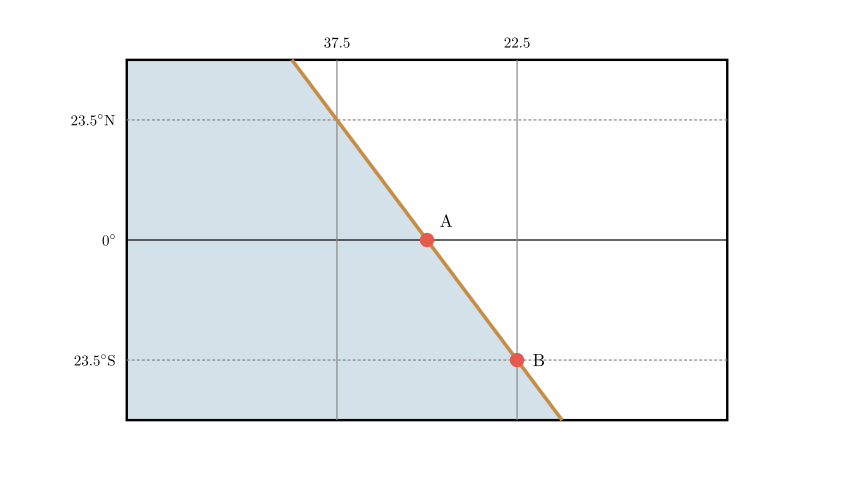
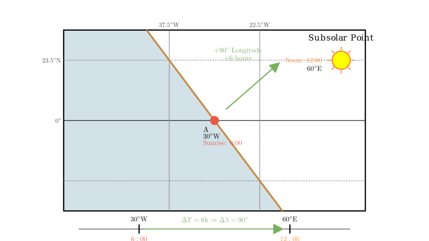
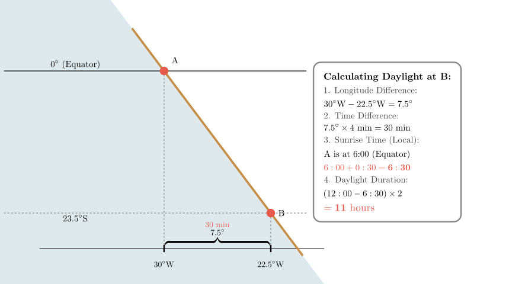
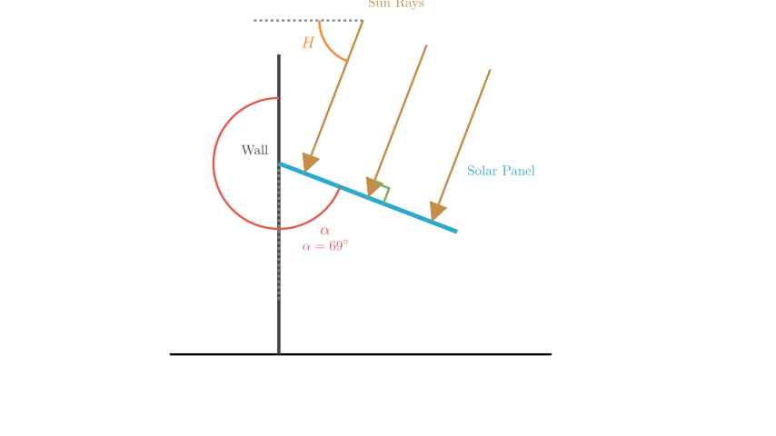

# problem_221_geography_g9

**Problem Statement:**
(2010 Shanghai Geography, 44—48, 8 points) The figure below shows the day and night distribution for a specific day in certain regions. The shaded area represents night, and the unshaded area represents day. Read the figure and answer the questions.

(1) Dividing by the Eastern and Western Hemispheres, the shaded portion in the figure is mainly located in the $\underline{\hspace{5em}}$ Hemisphere. At this moment, the local time at location 甲 (Jia) is $\underline{\hspace{5em}}$ o'clock.
(2) Dividing by the Southern and Northern Hemispheres, the subsolar point is currently located in the $\underline{\hspace{5em}}$ Hemisphere. The longitude of the subsolar point is $\underline{\hspace{5em}}$.
(3) The daylight duration at location 乙 (Yi) on this day is approximately $\underline{\hspace{5em}}$ hours.
(4) If this day is the 15th of the lunar month (Full Moon), people in the Shanghai area need to wait approximately $\underline{\hspace{5em}}$ hours to see a full moon rise from the eastern horizon.
(5) If the angle between the terminator line and the meridian at location 甲 is $10^\circ$, then the most suitable angle between the solar panel and the building's outer wall (the wall is perpendicular to the ground) at the Shanghai World Expo venue ($31^\circ$N) at noon on this day is approximately $\underline{\hspace{5em}}$.

**Solution Approach:**
We will analyze the geometry of the map projection to determine the coordinates of the key points (甲 and 乙) and the position of the subsolar point. By understanding the relationship between the terminator line (sunrise/sunset line), longitude, and time, we can calculate local times, daylight hours, and solar elevation angles.

**Step 1: Analyzing Coordinates and Hemisphere (Question 1)**

First, let's interpret the longitude labels. The numbers "37.5" and "22.5" decrease towards the right. In standard map conventions, longitude values that decrease towards the right indicate **West Longitude ($^\circ$W)** (since moving right typically implies moving East; if numbers go down, we are moving from a higher West longitude to a lower West longitude).

*   Left vertical line: $37.5^\circ$W
*   Right vertical line: $22.5^\circ$W
*   Grid spacing: $37.5 - 22.5 = 15^\circ$.

**Hemisphere:**
The Western Hemisphere is defined as the region from $20^\circ$W westward to $160^\circ$E. The shaded night region is to the *left* (West) of the $37.5^\circ$W line (e.g., $40^\circ$W, $50^\circ$W). Therefore, the shaded portion is located in the **Western** Hemisphere.

**Local Time at 甲 (Jia):**
Point 甲 is located at the intersection of the Equator ($0^\circ$) and the terminator line. Since the shaded area is on the West (left) and the day area is on the East (right), the Earth rotates from West to East into the sunlight. This boundary represents the **Sunrise** line (Morning Terminator).

On the Equator, sunrise always occurs at **6:00** local solar time.

**Step 2: Locating the Subsolar Point (Question 2)**

**Latitude:**
Observe the tilt of the terminator. The line runs from Northwest to Southeast. This means the "Day" area expands westward as we go North ($23.5^\circ$N has earlier sunrise than the Equator) and the "Night" area expands eastward as we go South. Consequently, the Northern Hemisphere has longer days (>12 hours) and the Southern Hemisphere has shorter days. This indicates it is Summer in the North; the sun is directly overhead in the **Northern** Hemisphere.

**Longitude:**
The subsolar point is the location where it is currently 12:00 (Noon).
1.  We determined 甲 is at sunrise (6:00).
2.  We need the longitude of 甲. 甲 lies exactly halfway between the vertical lines $37.5^\circ$W and $22.5^\circ$W (based on the grid geometry where the terminator is a straight line passing through intersections).
*   Longitude of 甲 = $(37.5 + 22.5) / 2 = 30^\circ$W.
3.  The time difference between Sunrise (6:00) and Noon (12:00) is 6 hours.
4.  Since the Earth rotates $15^\circ$ per hour, 6 hours corresponds to $90^\circ$ of longitude.
5.  Noon is to the East of sunrise.
*   Longitude = $30^\circ$W + $90^\circ$ East = **$60^\circ$E**.

**Step 3: Calculating Daylight at 乙 (Question 3)**

Point 乙 is located on the terminator (Sunrise line) at latitude $23.5^\circ$S.

1.  **Find the Longitude of 乙:** The diagram shows 乙 is located exactly on the vertical line labeled **$22.5^\circ$W**.
2.  **Calculate Sunrise Time:**
*   We know it is 6:00 local time at $30^\circ$W (Point 甲).
*   Point 乙 is at $22.5^\circ$W, which is $7.5^\circ$ East of 甲.
*   Time difference = $7.5^\circ \times 4$ min/degree = 30 minutes.
*   Since East is later, the local time at 乙 is $6:00 + 30$ min = 6:30.
*   Since 乙 is on the terminator, the sun is rising at **6:30** local time.
3.  **Calculate Daylight Duration:**
*   Formula: $\text{Daylight} = (\text{12:00} - \text{Sunrise Time}) \times 2$
*   $\text{Daylight} = (12:00 - 6:30) \times 2 = 5.5 \text{ hours} \times 2 = \mathbf{11} \text{ hours}$.

**Step 4: Moonrise in Shanghai (Question 4)**

*   **Context:** It is the 15th of the lunar month (Full Moon). The Full Moon rises roughly at sunset.
*   **Current Global Time:** The subsolar point is at $60^\circ$E (12:00).
*   **Shanghai Time:** Shanghai is approx. $120^\circ$E.
*   Difference = $60^\circ$ (4 hours).
*   Current time in Shanghai = $12:00 + 4\text{h} = 16:00$.
*   **Shanghai Sunset Time:**
*   Shanghai ($31^\circ$N) is in the Northern Hemisphere (Summer). Days are long.
*   At $23.5^\circ$S, day is 11h (Sunrise 6:30). By symmetry, at $23.5^\circ$N, day is 13h (Sunset 18:30).
*   Shanghai ($31^\circ$N) is further north, so the day is slightly longer than at $23.5^\circ$N. Sunset is likely around 18:40–19:00.
*   **Waiting Time:**
*   Time until Moonrise $\approx$ Time until Sunset.
*   $18:40 (\text{Sunset}) - 16:00 (\text{Current}) \approx 2 \text{ hours } 40 \text{ minutes}$.
*   The answer is approximately **2 to 3** hours.

**Step 5: Solar Panel Angle (Question 5)**

1.  **Determine Solar Declination ($\delta$):**
The problem states the angle between the terminator and the meridian is $10^\circ$. Geometrically, this angle is equal to the absolute value of the solar declination. Since the Northern Hemisphere is in summer, $\delta = 10^\circ$N.

2.  **Calculate Noon Sun Altitude ($H$) in Shanghai:**
*   Latitude of Shanghai ($\phi$) = $31^\circ$N.
*   Formula: $H = 90^\circ - |\phi - \delta|$
*   $H = 90^\circ - |31^\circ - 10^\circ| = 90^\circ - 21^\circ = 69^\circ$.
The sun is $69^\circ$ above the horizon at noon.

3.  **Determine Panel Angle:**
*   To maximize efficiency, the solar panel should be perpendicular to the sun's rays.
*   Let the panel be tilted away from the vertical wall.
*   The Sun's rays make an angle of $69^\circ$ with the horizontal ground.
*   Therefore, the rays make an angle of $90^\circ - 69^\circ = 21^\circ$ with the vertical.
*   For the panel to be perpendicular to the rays, the angle between the panel plane and the vertical wall must be equal to the sun's altitude angle? Let's verify with the diagram logic.
*   Imagine the sun is directly overhead ($90^\circ$). The panel should be horizontal ($90^\circ$ from wall).
*   Imagine the sun is on the horizon ($0^\circ$). The panel should be vertical ($0^\circ$ from wall).
*   The relationship is linear: The best angle between the panel and the vertical wall is equal to the Solar Altitude $H$.
*   Angle = **$69^\circ$**.

**Final Answer Recap:**
(1) **West**; **6**
(2) **North**; **$60^\circ$E**
(3) **11**
(4) **2** (or 3)
(5) **$69^\circ$**

