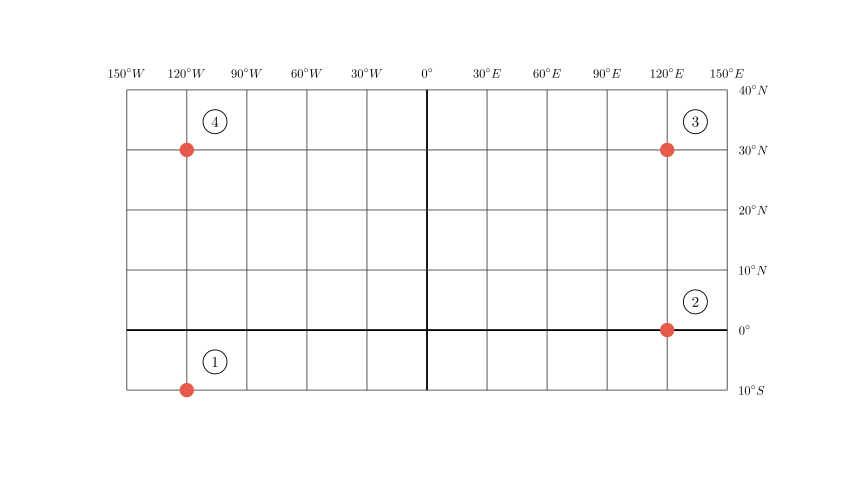
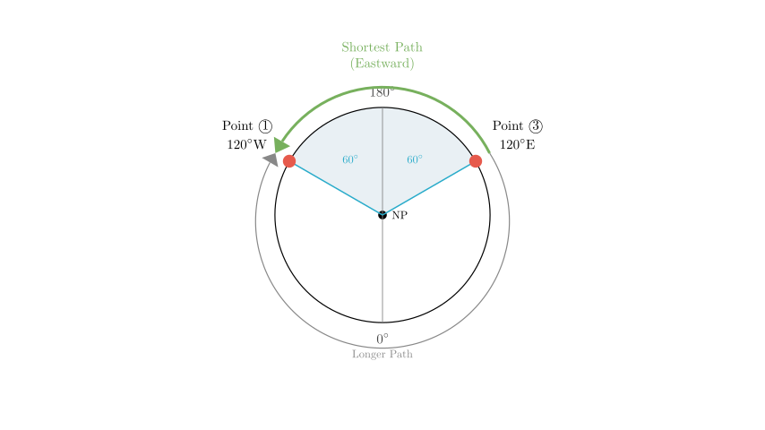
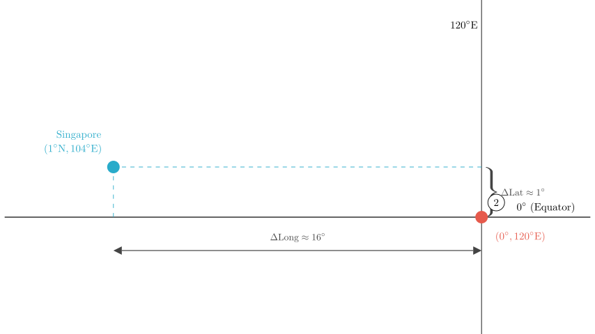

# problem_222_geography_g9

**Problem Statement:**

Read the latitude and longitude grid map and the material to answer the following questions.

**Material:** On the evening of August 26th, Singapore time, the first Youth Olympic Games concluded at the beautiful Marina Bay in Singapore ($1^\circ \text{N}, 104^\circ \text{E}$). The Mayor of Nanjing ($32^\circ \text{N}, 118^\circ \text{E}$), Ji Jianye, received the Olympic flag from IOC President Jacques Rogge, and the Youth Olympics will truly enter "Nanjing Time". (Xinhua Net Singapore August 25th dispatch)

(1) Point ① in the figure is in the $\underline{\hspace{5em}}$ direction relative to point ③.
(2) The latitude and longitude location of the host city of the first Youth Olympic Games, Singapore, is relatively close to $\underline{\hspace{5em}}$ (number) in the figure. Write down the latitude and longitude of ① $\underline{\hspace{5em}}$.

**Solution Approach:**
To solve this, we first need to determine the specific latitude and longitude coordinates for points ①, ②, ③, and ④ by reading the provided grid. Then, we will calculate the relative direction between points and compare coordinates to find the closest match for Singapore.

**Step 1: Determine the coordinates of the points.**

First, let's analyze the grid labels to establish the coordinate system:
*   **Longitude (Horizontal Axis):** The central vertical line is labeled $0^\circ$ (the Prime Meridian). To the left, the numbers increase ($30, 60, \dots, 150$), indicating **West Longitude (W)**. To the right, the numbers increase ($30, 60, \dots, 150$), indicating **East Longitude (E)**.
*   **Latitude (Vertical Axis):** The line labeled $0^\circ$ is the Equator. The numbers increase upwards ($10, 20, 30, 40$), indicating **North Latitude (N)**. The line below the Equator is labeled $10^\circ$, indicating **South Latitude (S)**.

Using this system, we can identify the coordinates:
*   **Point ①:** Located at longitude $120^\circ$ West and latitude $10^\circ$ South. Coordinates: **$(10^\circ \text{S}, 120^\circ \text{W})$**.
*   **Point ②:** Located at longitude $120^\circ$ East and latitude $0^\circ$. Coordinates: **$(0^\circ, 120^\circ \text{E})$**.
*   **Point ③:** Located at longitude $120^\circ$ East and latitude $30^\circ$ North. Coordinates: **$(30^\circ \text{N}, 120^\circ \text{E})$**.
*   **Point ④:** Located at longitude $120^\circ$ West and latitude $30^\circ$ North. Coordinates: **$(30^\circ \text{N}, 120^\circ \text{W})$**.

**Step 2: Determine the direction of Point ① relative to Point ③.**

We need to compare the positions of Point ① $(10^\circ \text{S}, 120^\circ \text{W})$ and Point ③ $(30^\circ \text{N}, 120^\circ \text{E})$.

*   **North-South Direction:** Point ① is at $10^\circ \text{S}$ and Point ③ is at $30^\circ \text{N}$. Since South is "below" North, Point ① is **South** of Point ③.

*   **East-West Direction:** This requires checking the shortest path (minor arc) between the two longitudes.

To determine the East-West relationship, we look for the shortest distance between the two longitudes:
*   Longitude of ③: $120^\circ \text{E}$
*   Longitude of ①: $120^\circ \text{W}$

The distance crossing the Prime Meridian ($0^\circ$) is $120 + 120 = 240^\circ$.
The distance crossing the International Date Line ($180^\circ$) is $(180 - 120) + (180 - 120) = 60 + 60 = 120^\circ$.

Since the path crossing the $180^\circ$ line is shorter ($120^\circ < 240^\circ$), we use that direction. From $120^\circ \text{E}$ traveling across $180^\circ$ to $120^\circ \text{W}$ is moving in the **Eastward** direction (following the Earth's rotation).

Combining these results:
*   Latitude: South
*   Longitude: East

Therefore, Point ① is in the **Southeast** direction relative to Point ③.

**Step 3: Locate Singapore relative to the grid points.**

The problem states Singapore's location is $(1^\circ \text{N}, 104^\circ \text{E})$. We need to find which numbered point is closest to this.

Let's compare Singapore $(1^\circ \text{N}, 104^\circ \text{E})$ with the grid points:

*   **Point ① $(10^\circ \text{S}, 120^\circ \text{W})$:** Very far in both latitude and longitude.
*   **Point ② $(0^\circ, 120^\circ \text{E})$:** 
*   Latitude difference: $|1^\circ - 0^\circ| = 1^\circ$ (Very close).
*   Longitude difference: $|120^\circ - 104^\circ| = 16^\circ$ (Relatively close).
*   **Point ③ $(30^\circ \text{N}, 120^\circ \text{E})$:** Latitude difference is $29^\circ$ (Far).
*   **Point ④ $(30^\circ \text{N}, 120^\circ \text{W})$:** Very far.

Point ② is geographically the closest to Singapore.

**Final Answer:**
(1) Point ① is in the **Southeast** direction relative to point ③.
(2) Singapore's position is closest to **②**. The latitude and longitude of ① is **$10^\circ \text{S}, 120^\circ \text{W}$** (or $120^\circ \text{W}, 10^\circ \text{S}$).

