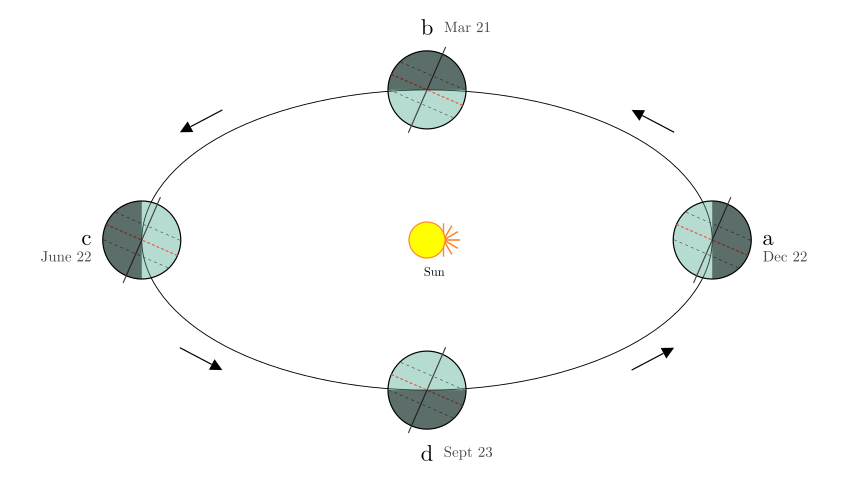
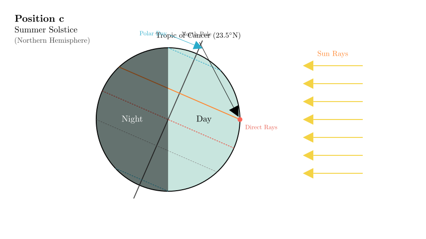
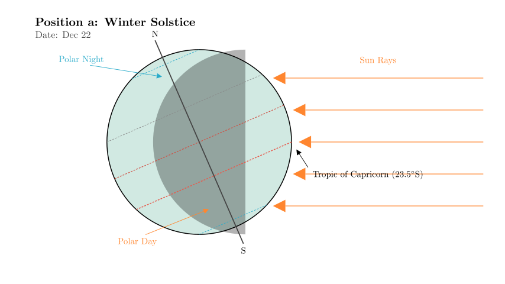
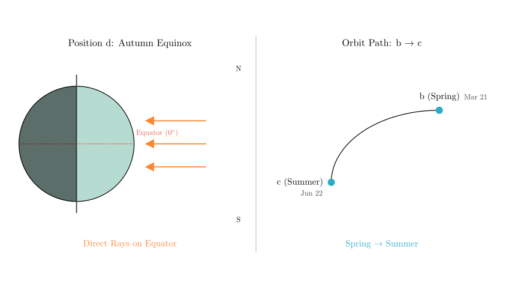

# problem_223_geography_g9

**Problem Statement:**

Read the "Schematic Diagram of Earth's Movement" and complete the following questions. (11 points)

(1) When the Earth revolves to position ______ (letter), the Northern Hemisphere receives the most solar heat. This day is the ______ (solstice/equinox) for the Northern Hemisphere. At this time, the condition of day and night length in Hua'an County is _________________.
(2) When the Earth revolves to position **a**, the direct rays of the sun fall on the ______ (latitude line). At this time, the South and North Polar circles will experience ______ and ______ phenomena respectively.
(3) On September 22nd or 23rd, the Earth revolves to position ______ (letter). At this time, the direct rays of the sun fall on the _________________ (latitude line).
(4) When the Earth moves from position **b** to position **c** on its orbit, the season in the Northern Hemisphere transitions from ______ season to ______ season.
(5) When we are happily spending our summer vacation, Australia is in the ______ season.

**Solution Approach:**

To solve this, we need to identify the seasons represented by positions **a**, **b**, **c**, and **d** in the orbital diagram. We do this by observing the tilt of the Earth's axis relative to the Sun.

1.  **Identify the Solstices:** Look at positions **a** and **c** where the Earth is shown sideways.
*   At position **c** (left), the North Pole (top of the axis) is tilted **towards** the Sun. This is the Summer Solstice in the Northern Hemisphere.
*   At position **a** (right), the North Pole is tilted **away** from the Sun. This is the Winter Solstice in the Northern Hemisphere.
2.  **Identify the Equinoxes:** The Earth revolves counter-clockwise (indicated by arrows).
*   Following Winter (**a**), the Earth moves to Spring. So, **b** is the Spring Equinox.
*   Following Summer (**c**), the Earth moves to Autumn. So, **d** is the Autumn Equinox.

Let's visualize the full orbit to confirm these positions.

**Step 1: Analyzing Question (1) — The Summer Solstice**

*   **Identify the position:** We need the position where the Northern Hemisphere gets the most heat. This occurs when the North Pole leans towards the Sun, allowing direct sunlight to hit the Northern Hemisphere. Looking at the diagram, at position **c**, the North Pole is tilted towards the Sun.
*   **Name the day:** This position corresponds to the **Summer Solstice** (approx. June 22).
*   **Day/Night Length:** During the Summer Solstice, the Northern Hemisphere experiences the longest days and shortest nights of the year. Therefore, Hua'an County (located in the Northern Hemisphere) will have **long days and short nights**.

**Answer (1):** c; Summer Solstice; long days and short nights (or "longest day, shortest night").

**Step 2: Analyzing Question (2) — The Winter Solstice**

*   **Identify the position:** The question asks about position **a**. As established, at position **a**, the North Pole tilts away from the Sun. This is the **Winter Solstice**.
*   **Direct Sun Rays:** Because the North Pole tilts away, the South Pole tilts towards the Sun. The direct rays of the sun strike the **Tropic of Capricorn** (23.5°S).
*   **Polar Phenomena:** 
*   **South Pole:** Since it leans towards the sun, the area inside the Antarctic Circle (South Polar Circle) experiences constant daylight, known as **Polar Day** (or Midnight Sun).
*   **North Pole:** Since it leans away, the area inside the Arctic Circle (North Polar Circle) experiences constant darkness, known as **Polar Night**.

**Answer (2):** Tropic of Capricorn (or 23.5°S); Polar Day; Polar Night.
*(Note: The order "South and North" in the question implies the first blank is for the South and the second for the North).*

**Step 3: Analyzing Questions (3) & (4) — Equinoxes and Transitions**

*   **Question (3):** September 22nd or 23rd corresponds to the **Autumn Equinox**.
*   Following the orbit counter-clockwise from Summer (c) to Winter (a), the intermediate point is the Autumn Equinox. This is position **d**.
*   During an equinox, the Earth's axis is not tilted towards or away from the Sun relative to the light rays. The sun shines directly on the **Equator** (0° latitude).

*   **Question (4):** Movement from **b** to **c**.
*   Position **b** is the Spring Equinox (March 21).
*   Position **c** is the Summer Solstice (June 22).
*   Therefore, the season transitions from **Spring** to **Summer**.

**Answer (3):** d; Equator.
**Answer (4):** Spring; Summer.

**Step 4: Analyzing Question (5) — Seasonal Differences**

*   **Context:** "When we are happily spending our summer vacation..."
*   In the context of the problem (Chinese education system), summer vacation occurs in July and August. This is Summer in the Northern Hemisphere.
*   **Southern Hemisphere:** Seasons in the Southern Hemisphere are always opposite to those in the Northern Hemisphere.
*   **Conclusion:** If it is Summer in the North, it is **Winter** in Australia (Southern Hemisphere).

**Answer (5):** Winter.

**Final Verification:**
*   (1) c (Summer) -> Max heat. Correct.
*   (2) a (Winter) -> Rays on Tropic of Capricorn -> S. Pole has Polar Day. Correct.
*   (3) Sept 23 -> Autumn -> d -> Equator. Correct.
*   (4) b (Spring) to c (Summer). Correct.
*   (5) N. Hem Summer = S. Hem Winter. Correct.

**Summary of Answers:**
(1) c; Summer Solstice; long days and short nights
(2) Tropic of Capricorn (23.5°S); Polar Day; Polar Night
(3) d; Equator
(4) Spring; Summer
(5) Winter

