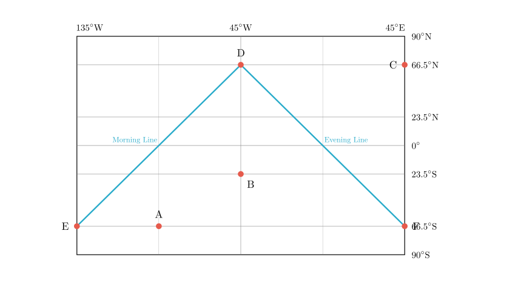
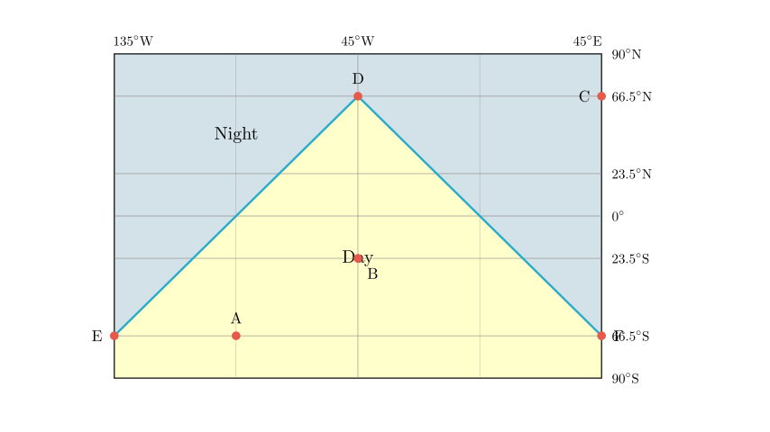
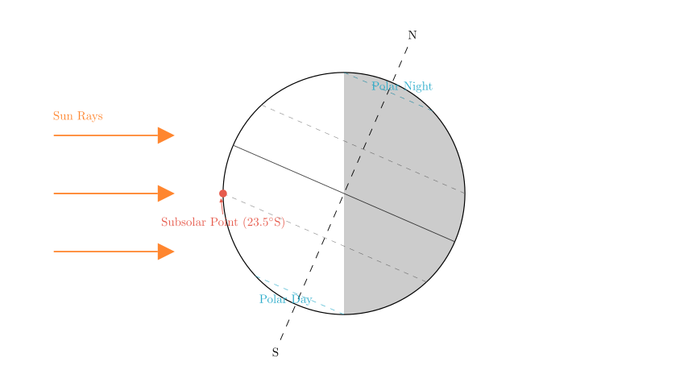
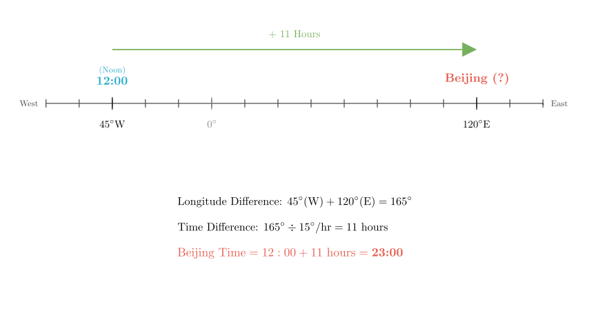

# problem_224_geography_g9

**Problem Statement:**

The figure below is a schematic diagram of solar illumination on a certain day. In the figure, EDF represents the terminator (circle of illumination), and ED is the sunrise line (morning terminator). Read the diagram and answer the questions.

(1) Identify the night hemisphere on the diagram and indicate its range with diagonal lines.
(2) The date shown in the diagram is around Month ______ Day ______. The geographic coordinates of the subsolar point are: Longitude ______, Latitude ______.
(3) Among the four points A, B, C, and D in the diagram, those with equal noon solar altitude are ______; those with equal local time are ______; those with equal linear velocity of rotation are ______.
(4) The Beijing time at this moment is ______ hours.
(5) The solar altitude at point D at this moment is ______; the noon solar altitude at point C is ______.

**Solution Approach:**

We will analyze the diagram to determine the position of the sun relative to the Earth. By identifying the terminator (line separating day and night) and the specific coordinates given (latitudes and longitudes), we can deduce the season, the solar point, and calculate local times and solar altitudes.

**Part (1): Identifying the Night Hemisphere**

The problem states that **ED is the sunrise line (morning terminator)**. As the Earth rotates from West to East (left to right on the map), locations cross the sunrise line from the night side into the day side. Therefore, the area to the **left (West)** of line ED is currently in darkness (Night), and the area to the **right (East)** is in daylight.

Similarly, DF is the sunset line. Locations cross it from day into night. Thus, the area to the **right** of DF is in darkness.

Since D is the northernmost point of this illuminated region, the area North of D (the Arctic region) is in the night hemisphere. Conversely, the triangular region bounded by EDF represents the Day Hemisphere.

To answer part (1), we shade the area **outside** the triangle EDF.

**Part (2): Determining Date and Subsolar Point**

1.  **Date:**
- Observing the terminator, the entire region North of the Arctic Circle (66.5°N) is in the Night Hemisphere (Polar Night).
- The entire region South of the Antarctic Circle (66.5°S) is in the Day Hemisphere (Polar Day).
- This phenomenon occurs on the **Winter Solstice** in the Northern Hemisphere.
- **Date:** Approximately **December 22**.

2.  **Subsolar Point (Solar Direct Point):**
- **Latitude:** On the Winter Solstice, the sun is directly overhead at the Tropic of Capricorn.
- **Latitude:** **23.5°S**.
- **Longitude:** The subsolar point is located on the meridian where it is currently 12:00 noon.
- The noon meridian is the central longitude of the day hemisphere. In the diagram, this corresponds to the longitude passing through point D, which bisects the day region.
- Looking at the longitude values: The left line is 135° and the middle line is 45°. Since Earth rotates West to East, longitude values decrease towards the East in the Western Hemisphere. The difference between 135° and 45° is 90°.
- If the left is 135°W, the middle is 45°W.
- Checking the pattern: 135°W $\rightarrow$ 45°W (difference 90°) $\rightarrow$ 45°E (difference 90°). This fits the grid.
- Therefore, the central meridian (noon) is **45°W**.
- **Longitude:** **45°W**.

**Part (3): Comparing Points A, B, C, D**

1.  **Equal Noon Solar Altitude:**
- Noon solar altitude depends solely on the latitude difference between the location and the subsolar point (23.5°S).
- Locations with the same latitude (or symmetric latitudes relative to the subsolar point) have the same noon solar altitude.
- **Point C** is at 66.5°N.
- **Point D** is at 66.5°N.
- Since C and D share the same latitude, they have the **equal noon solar altitude**.

2.  **Equal Local Time:**
- Local time is determined by longitude. Locations on the same meridian have the same local time.
- **Point B** is on the 45°W meridian.
- **Point D** is on the 45°W meridian.
- Therefore, **B and D** have the **equal local time**.

3.  **Equal Linear Velocity of Rotation:**
- Linear velocity depends on the absolute latitude ($v = v_{equator} \times \cos(\text{latitude})$). Locations with the same absolute latitude have the same speed.
- **Point C** is at 66.5°N.
- **Point D** is at 66.5°N.
- **Point A** is at 66.5°S.
- All three points are at $66.5^\circ$ latitude (North or South).
- Therefore, **A, C, and D** have **equal linear velocity**.

**Part (4): Calculating Beijing Time**

- We established that the local time at **45°W** is **12:00 (Noon)**.
- Beijing Time is based on the **120°E** meridian.
- **Step 1: Calculate Longitude Difference.**
- From 45°W to 0° (Prime Meridian) is 45°.
- From 0° to 120°E is 120°.
- Total difference = $45^\circ + 120^\circ = 165^\circ$.
- **Step 2: Convert to Time Difference.**
- Earth rotates 15° per hour.
- Time difference = $165^\circ / 15^\circ/\text{hr} = 11$ hours.
- **Step 3: Determine Direction.**
- Beijing (East) is ahead of 45°W (West). We add the time difference.
- Beijing Time = $12:00 + 11 \text{ hours} = 23:00$.

**Answer:** 23 (or 23:00).

**Part (5): Solar Altitude at D and C**

1.  **Solar Altitude at D:**
- Point D is located at 66.5°N and is on the terminator (the boundary between day and night).
- Normally, the solar altitude on the terminator is 0°.
- Additionally, D is at the noon meridian (12:00). On the Winter Solstice, the sun does not rise above the horizon for latitudes North of 66.5°N. At exactly 66.5°N (the Arctic Circle), the sun just touches the horizon at noon.
- Therefore, the solar altitude is **0°**.

2.  **Noon Solar Altitude at C:**
- The question asks for the "noon solar altitude" (正午太阳高度), which is the maximum solar altitude for that location on that day.
- Point C is also at 66.5°N.
- The formula for noon solar altitude is $H = 90^\circ - |\text{Latitude} - \text{Solar Latitude}|$.
- $H = 90^\circ - |66.5^\circ - (-23.5^\circ)|$ (using negative for South).
- $H = 90^\circ - |66.5^\circ + 23.5^\circ| = 90^\circ - 90^\circ = 0^\circ$.
- Therefore, the noon solar altitude at C is also **0°**.

**Final Answer Recap:**
(1) [See Diagram] Night is the area outside the triangle EDF.
(2) 12, 22; 45°W, 23.5°S
(3) C, D; B, D; A, C, D
(4) 23
(5) 0°, 0°

