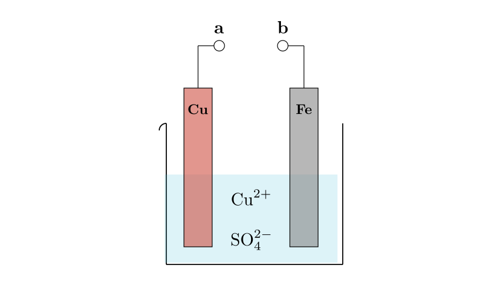
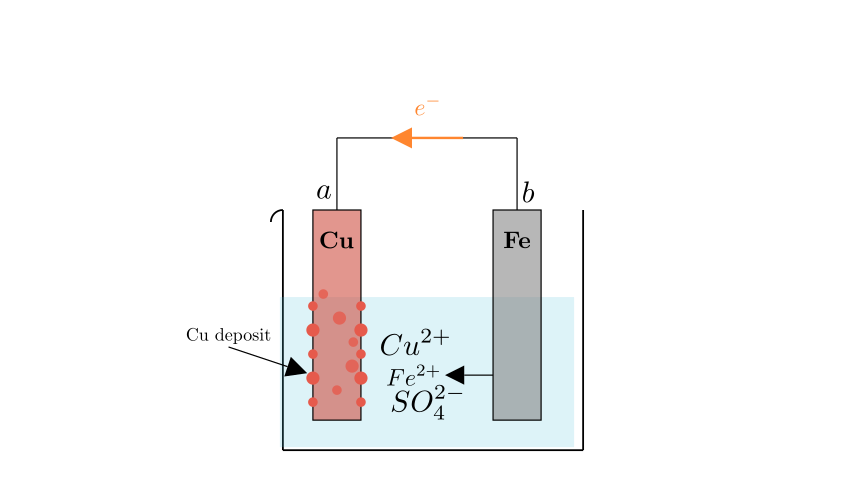
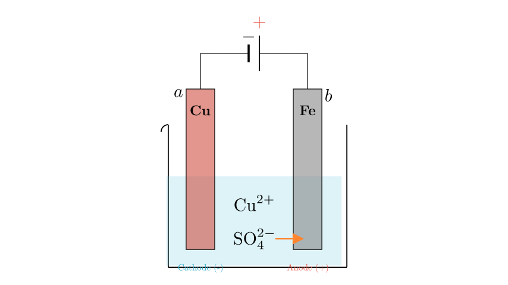
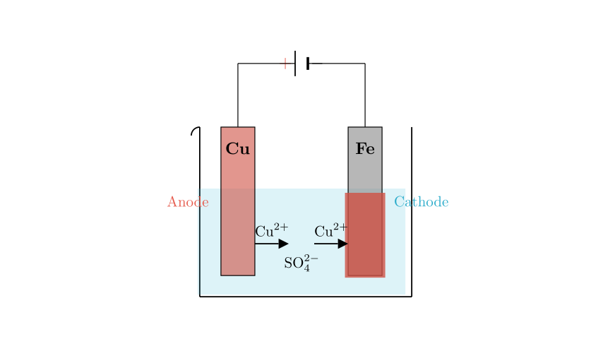

# problem_22_chemistry_g12

**Problem Statement:**

Which of the following statements regarding the device shown in the figure is incorrect?

A. When terminals **a** and **b** are connected by a wire, metallic copper is deposited on the copper sheet.
B. When **b** and **a** are connected to the positive and negative terminals of a DC power supply respectively, sulfate ions ($SO_4^{2-}$) move toward the iron electrode.
C. When **a** and **b** are connected to the positive and negative terminals of a DC power supply respectively, the reaction occurring on the iron sheet is $Cu^{2+} + 2e^- \rightarrow Cu$.
D. Regardless of how **a** and **b** are connected, the iron sheet will dissolve, and the solution will gradually change from blue to light green.

**Solution Approach:**
To solve this, we need to analyze the electrochemical behavior of the Copper (Cu) and Iron (Fe) electrodes in a Copper(II) Sulfate ($CuSO_4$) solution under different connection conditions. We will determine whether the setup acts as a galvanic cell (battery) or an electrolytic cell based on the connections, identify the anode and cathode for each case, and verify the chemical reactions and ion movements described in the options.

**Analysis of the Setup:**

The system consists of a Copper (Cu) electrode and an Iron (Fe) electrode immersed in an electrolyte solution containing copper ions ($Cu^{2+}$) and sulfate ions ($SO_4^{2-}$).

**Analyzing Option A (Galvanic Cell Mode):**
When **a** and **b** are connected by a wire, the device functions as a **galvanic cell** (a primary battery) because there is a spontaneous redox reaction between the two different metals.

*   **Reactivity:** Iron (Fe) is more reactive than Copper (Cu).
*   **Negative Electrode (Anode):** The more reactive metal, Fe, loses electrons (oxidation) and dissolves: $Fe - 2e^- \rightarrow Fe^{2+}$.
*   **Positive Electrode (Cathode):** Electrons flow through the wire to the Cu electrode. Here, copper ions in the solution gain electrons (reduction) and deposit as metallic copper: $Cu^{2+} + 2e^- \rightarrow Cu$.

Therefore, metallic copper deposits on the copper sheet. **Statement A is correct.**

**Analyzing Option B (Electrolytic Cell Mode 1):**

The statement proposes connecting **b (Fe)** to the positive terminal (+) and **a (Cu)** to the negative terminal (-) of a DC power supply. This creates an **electrolytic cell**.

*   **Anode (connected to +):** The Iron (Fe) electrode. Oxidation occurs here.
*   **Cathode (connected to -):** The Copper (Cu) electrode. Reduction occurs here.
*   **Ion Movement:** In an electrolytic cell, anions (negatively charged ions) move toward the Anode (positive electrode) to balance the charge.

Since the Iron electrode is the Anode, the sulfate ions ($SO_4^{2-}$) will move toward the Iron electrode. **Statement B is correct.**

**Analyzing Option C (Electrolytic Cell Mode 2):**

Now consider connecting **a (Cu)** to the positive terminal (+) and **b (Fe)** to the negative terminal (-).

*   **Anode (+):** Copper (Cu). The copper metal oxidizes: $Cu - 2e^- \rightarrow Cu^{2+}$.
*   **Cathode (-):** Iron (Fe). Reduction occurs here. The cations in solution ($Cu^{2+}$) move to the cathode and gain electrons.
*   **Reaction at Iron (Cathode):** $Cu^{2+} + 2e^- \rightarrow Cu$.

This process essentially plates copper onto the iron electrode. The reaction on the iron sheet is indeed the reduction of copper ions. **Statement C is correct.**

**Analyzing Option D (Verification):**

Statement D claims: "Regardless of how a and b are connected, the iron sheet will dissolve, and the solution will gradually change from blue to light green."

Let's review our findings:
1.  **Case A (Galvanic):** Fe acts as the anode and dissolves ($Fe \rightarrow Fe^{2+}$). The solution turns light green (due to $Fe^{2+}$). This fits the description.
2.  **Case B (Electrolytic, Fe = Anode):** Fe acts as the anode and dissolves ($Fe \rightarrow Fe^{2+}$). The solution turns light green. This fits.
3.  **Case C (Electrolytic, Fe = Cathode):** As seen in the previous step, Fe acts as the **cathode**. It is protected and does **not** dissolve. Instead, Copper is deposited onto the Iron. The Copper anode dissolves ($Cu \rightarrow Cu^{2+}$), maintaining the blue color of the solution (concentration of $Cu^{2+}$ remains relatively constant).

Since the Iron sheet does not dissolve and the solution does not turn green in Case C, the generalization in Statement D is false.

**Conclusion:**
The incorrect statement is D.

