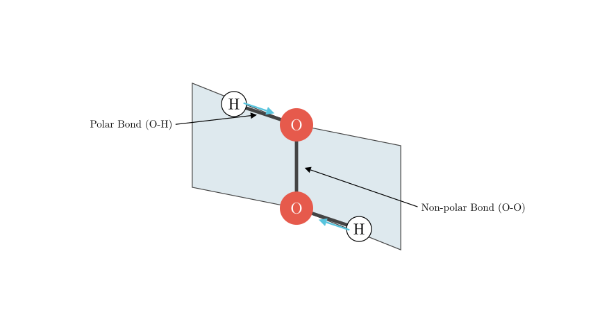
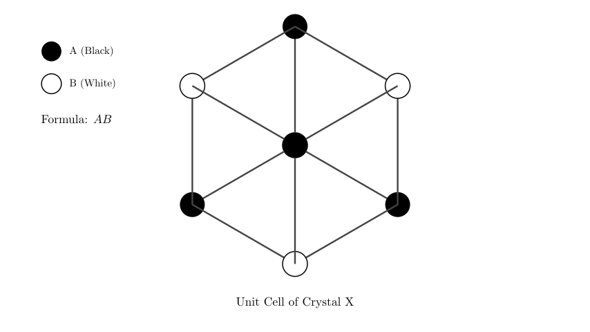
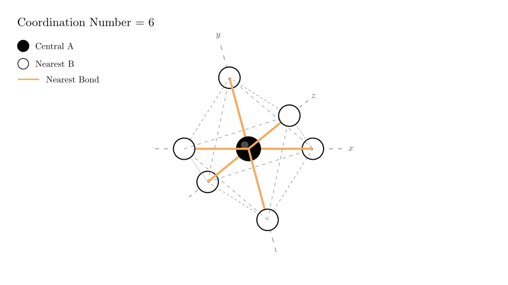

# problem_23_chemistry_g12

**Problem Statement:**
The molecular structure of H$_{2}$O$_{2}$ (hydrogen peroxide) and the structural unit of a certain ionic crystal X are shown in the figure. Which of the following statements is incorrect?

A. The H$_{2}$O$_{2}$ molecule is a polar molecule.
B. The forces existing in the H$_{2}$O$_{2}$ crystal include polar bonds, non-polar bonds, hydrogen bonds, and van der Waals forces.
C. The chemical formula of crystal X can be represented as AB.
D. In crystal X, the number of B ions closest to each A ion is 12.

**Solution Approach:**
We will analyze the properties of the H$_{2}$O$_{2}$ molecule based on its geometry to evaluate statements A and B. Then, we will interpret the unit cell diagram of crystal X to determine its stoichiometry (chemical formula) and the coordination number of the ions to evaluate statements C and D. The goal is to identify the single incorrect statement.

**Analysis of H$_{2}$O$_{2}$ (Statements A and B):**

1.  **Molecular Polarity (Statement A):**
The structure of H$_{2}$O$_{2}$ is often described as an "open book" shape. The two O-H bonds lie in different planes, creating a dihedral angle. Due to this asymmetry, the dipole moments of the polar O-H bonds do not cancel out. Therefore, the molecule has a net dipole moment.
*Conclusion: H$_{2}$O$_{2}$ is a polar molecule. Statement A is correct.*

2.  **Forces in the Crystal (Statement B):**
- **Intramolecular Forces (within the molecule):**
- The O-H bond is formed between atoms with different electronegativities, making it a **polar covalent bond**.
- The O-O bond is formed between identical atoms, making it a **non-polar covalent bond**.
- **Intermolecular Forces (between molecules):**
- Since H$_{2}$O$_{2}$ contains hydrogen attached to highly electronegative oxygen, it forms **hydrogen bonds** between molecules in the solid state.
- **Van der Waals forces** (dispersion forces) exist between all molecules.
*Conclusion: The crystal contains polar bonds, non-polar bonds, hydrogen bonds, and van der Waals forces. Statement B is correct.*

**Analysis of Crystal X Formula (Statement C):**

To determine the chemical formula, we examine the provided structural unit (the cube).

- The diagram shows a cube with ions located at the corners.
- There are 8 corners in total.
- Counting the ions in the diagram: There are 4 "A" ions (black) and 4 "B" ions (white) occupying alternating corners.
- In an infinite crystal lattice composed of repeating units like this, the ratio of A to B is maintained as 1:1.
- Alternatively, using the unit cell contribution method for this specific cube (assuming it represents the stoichiometry directly):
- Number of A ions = $4 \times \frac{1}{8} = 0.5$
- Number of B ions = $4 \times \frac{1}{8} = 0.5$
- Ratio A : B = $0.5 : 0.5 = 1 : 1$.

*Conclusion: The chemical formula is AB. Statement C is correct.*

**Analysis of Coordination Number (Statement D):**

We need to determine the number of B ions closest to a single A ion.

1.  **Identify the Geometry:** The structural unit shows A and B ions alternating at the corners of a cube. This arrangement corresponds to the rock salt (NaCl) crystal lattice structure.
2.  **Determine Neighbors:**
- Pick any A ion as the reference point.
- The nearest neighbors are the B ions located along the edges connected to that A ion.
- In a 3D cubic lattice, any given corner (vertex) is the meeting point of 6 edges (up, down, left, right, front, back).
- Therefore, each A ion is surrounded by 6 nearest B ions.
3.  **Evaluate Statement D:**
- Statement D claims the number of nearest B ions is 12.
- A coordination number of 12 is typical for "closest packing" of identical atoms (like in metallic crystals FCC or HCP), or for second-nearest neighbors in this lattice (A to A), but not for the nearest neighbors of opposite charge in an ionic AB crystal (which is typically 6 or 8).

*Conclusion: The coordination number is 6, not 12. Statement D is incorrect.*

**Final Answer:**
The incorrect statement is **D**.

