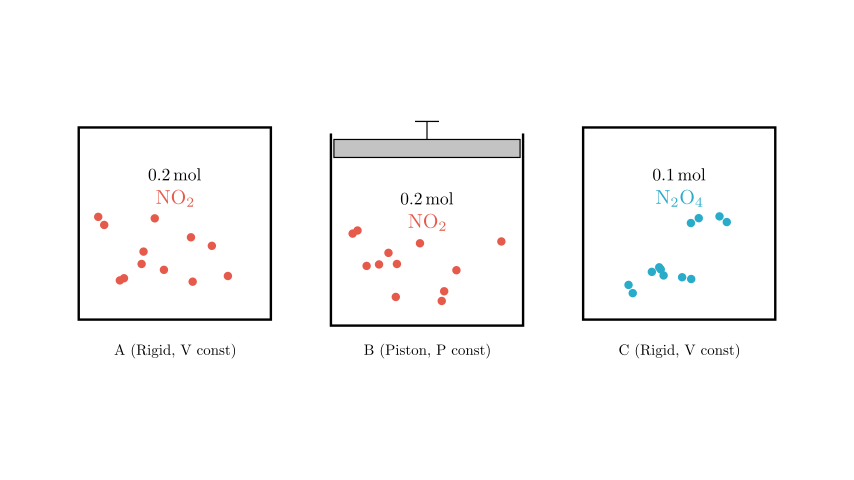
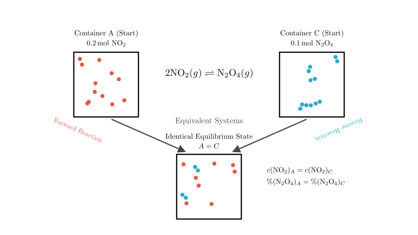
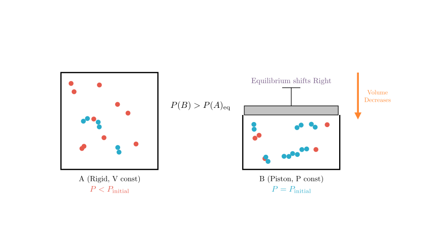
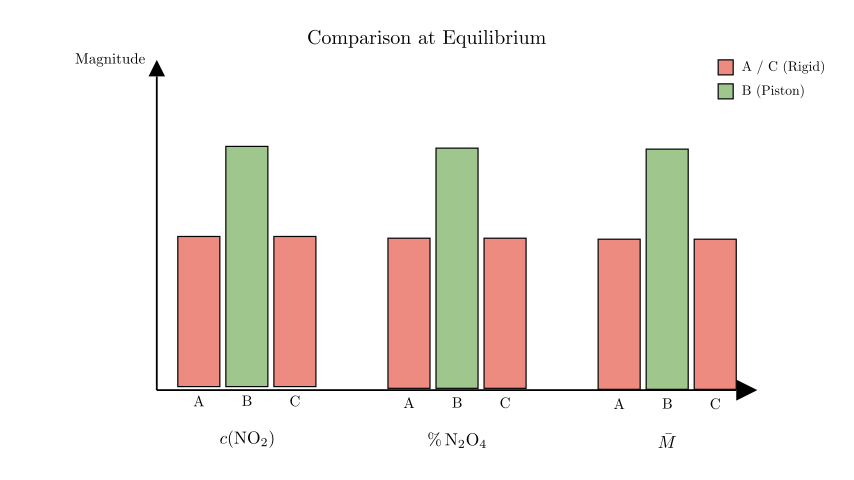

# problem_24_chemistry_g12

**Problem Statement:**
Three containers labeled A (甲), B (乙), and C (丙) initially contain the amounts of substances shown in the diagram. The initial volumes of the three containers are equal, and the temperatures are the same. During the reaction, the volumes of A and C remain constant, while the pressure in B remains constant. The reaction reaches equilibrium at a constant temperature. Which of the following statements is correct?

The reaction involved is the dimerization of nitrogen dioxide:
$$2NO_2(g) \rightleftharpoons N_2O_4(g)$$

**Options:**
A. At equilibrium, the order of concentration $c(NO_2)$ in the containers is: B > A > C
B. At equilibrium, the percentage content of $N_2O_4$: B > A = C
C. At equilibrium, the conversion rate of $NO_2$ in A and $N_2O_4$ in C cannot be the same.
D. At equilibrium, the average relative molecular mass of the mixture: A > B > C

**Solution Approach:**
We will solve this using the principles of Chemical Equilibrium, specifically focusing on:
1.  **Equivalent Equilibrium:** Comparing containers with different starting materials but stoichiometrically equivalent amounts (A and C).
2.  **Le Chatelier's Principle:** Analyzing the effect of constant volume (A) versus constant pressure (B) on the reaction equilibrium position.

**Step 1: Analyzing Containers A and C (Equivalent Equilibrium)**

First, let's compare Container A and Container C.
*   **Container A:** Starts with 0.2 mol of $NO_2$.
*   **Container C:** Starts with 0.1 mol of $N_2O_4$.

According to the stoichiometry of the reaction $2NO_2 \rightleftharpoons N_2O_4$, 1 mole of $N_2O_4$ can decompose to produce 2 moles of $NO_2$. Therefore, the initial 0.1 mol of $N_2O_4$ in Container C is chemically equivalent to starting with 0.2 mol of $NO_2$.

Since both containers have the **same volume**, **same temperature**, and **equivalent initial amounts** of matter, they represent the exact same chemical system approaching equilibrium from opposite directions.

**Conclusion for A and C:**
They will reach the **exact same equilibrium state**.
*   Concentration: $c(NO_2)_A = c(NO_2)_C$
*   Percentage of $N_2O_4$: $\%(N_2O_4)_A = \%(N_2O_4)_C$
*   Average Molar Mass: $M_A = M_C$

**Step 2: Analyzing Container B (Constant Pressure vs. Constant Volume)**

Now we compare Container A (Constant Volume) with Container B (Constant Pressure). Both start with 0.2 mol of $NO_2$.

The reaction is: $2NO_2(g) \rightarrow N_2O_4(g)$.
*   Reactants: 2 moles of gas.
*   Products: 1 mole of gas.
*   **Result:** As the reaction proceeds forward, the total number of gas moles decreases.

**In Container A (Rigid):**
As the number of moles decreases, the pressure inside the container drops ($P < P_{initial}$).

**In Container B (Piston):**
To maintain constant pressure ($P = P_{initial}$), the piston must move down to decrease the volume.
*   Effectively, Container B is like Container A but **compressed** to a smaller volume.

According to **Le Chatelier's Principle**, increasing pressure (by reducing volume) shifts the equilibrium toward the side with fewer moles of gas.
*   Shift: The equilibrium in B shifts further to the **right** (towards $N_2O_4$) compared to A.

**Step 3: Evaluating the Options**

Now we apply our findings to the specific options.

**Analysis of Option B: Percentage of $N_2O_4$**
*   We established that A and C are identical: $\%(N_2O_4)_A = \%(N_2O_4)_C$.
*   We established that B shifts further to the right (products) than A. This means B has a higher percentage of $N_2O_4$.
*   Result: $B > A = C$.
*   **Verdict:** This matches Option B.

**Analysis of Option A: Concentration of $NO_2$**
*   Comparison: B is compressed compared to A. While the shift to the right consumes $NO_2$, the volume compression increases the concentration of *all* species. In this specific reaction, the compression effect on concentration usually dominates the equilibrium shift reduction, so $c(NO_2)_B > c(NO_2)_A$.
*   However, we know $A = C$.
*   The option states $B > A > C$. Since $A$ is not greater than $C$ (they are equal), this statement is **False**.

**Analysis of Option C: Conversion Rates**
*   Let $\alpha$ be the conversion rate.
*   Since A and C reach the exact same state, is it possible for the numerical conversion rate of $NO_2$ (in A) to equal the conversion rate of $N_2O_4$ (in C)?
*   If the equilibrium moles of $N_2O_4$ is exactly 0.05 mol, then A has converted 0.1 mol $NO_2$ (50% conversion) and C has converted 0.05 mol $N_2O_4$ (50% conversion).
*   There is no physical law preventing this specific mathematical coincidence. Therefore, saying it is "impossible" is **False**.

**Analysis of Option D: Average Molar Mass ($M$)**
*   Formula: $M = \frac{m_{total}}{n_{total}}$.
*   Mass ($m_{total}$) is conserved in all containers.
*   Total moles ($n_{total}$): Reaction $2 \to 1$ reduces moles.
*   B shifts furthest to the right $\rightarrow$ B has the fewest total moles.
*   Smaller denominator ($n$) $\rightarrow$ Larger Molar Mass ($M$).
*   Order: $B > A = C$.
*   Option D says $A > B > C$. This is **False**.

**Final Conclusion**

Based on the step-by-step analysis:
1.  Containers A and C are equivalent systems ($A = C$).
2.  Container B is a constant-pressure system that compresses during the reaction, shifting equilibrium further toward products compared to A and C ($B > A=C$ for product formation).

Therefore, the percentage content of $N_2O_4$ follows the order **B > A = C**.

**Correct Answer:** Option B.

