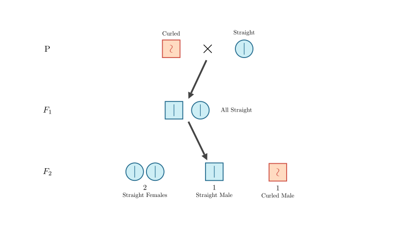
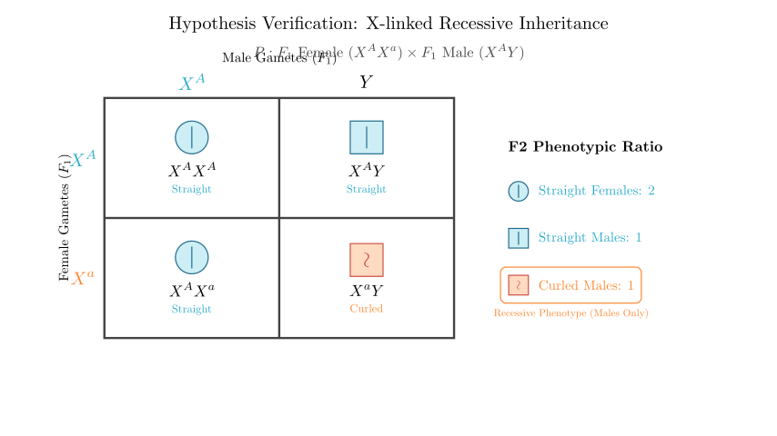
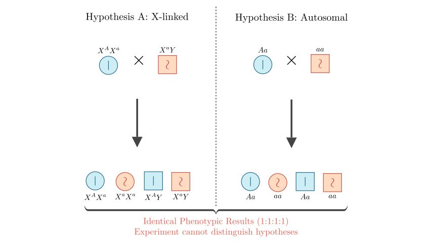
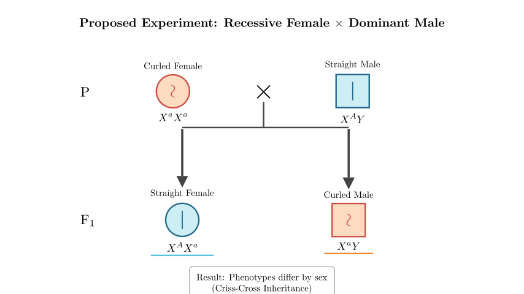

# problem_25_biology_g12

**Problem Statement:**
The hard and long hairs on the body surface of fruit flies are called bristles. In a naturally reproducing population of straight-bristle fruit flies, a single curled-bristle male fruit fly appeared accidentally. Please answer the following questions (alleles are represented by A and a):

1.  It is known that the gene controlling bristle traits is not located on the homologous region of the sex chromosomes. How is the curled-bristle trait produced and inherited? One hypothesis suggests that a dominant mutation occurred in the gene on the X chromosome in the germ cells of the parent generation (recessive gene mutated into a dominant gene). Please attempt to propose another hypothesis: __________________________________.
2.  If it is known that this curled-bristle male fruit fly was crossed with a straight-bristle female fruit fly, the F₁ generation consisted entirely of straight-bristle fruit flies. When the F₁ female and male fruit flies mated randomly, the phenotypes and ratio of the F₂ generation were: Straight-bristle Female : Straight-bristle Male : Curled-bristle Male = 2:1:1. At this point, the most reasonable hypothesis is __________________________________.
3.  To verify the hypothesis in question 2, a student designed a test cross experiment as shown in the diagram. Does this experiment and its phenomenon verify the hypothesis proposed in question 2? Please explain the reason: __________________________________.
4.  If you are provided with the following homozygous fruit flies as materials: Straight-bristle Female, Straight-bristle Male, Curled-bristle Female, Curled-bristle Male. Please design a test cross experiment to verify the hypothesis proposed in question 2 (no need to write the results). Experimental Plan: __________________________________.

**Solution Approach:**
We will analyze the inheritance pattern of the curled-bristle trait using Mendelian genetics. First, we will determine dominance based on the F₁ phenotype. Then, we will analyze the F₂ phenotypic ratio and sex distribution to determine chromosomal location (autosomal vs. X-linked). Finally, we will evaluate the validity of a proposed verification experiment and design a correct one to distinguish between inheritance modes.

**Step 1: Analyzing the Origin (Question 1)**

The problem asks for an alternative hypothesis to "Dominant mutation on the X chromosome." 

In genetics, if a trait appears suddenly in a single individual, it is typically due to a mutation. The alternative to a dominant mutation ($a \rightarrow A$) is a **recessive mutation** ($A \rightarrow a$).

Since the individual is male, the gene could be on the X chromosome or an autosome. If it were a recessive mutation on the X chromosome, the mother would have produced an egg with the mutated $X^a$ gene (or was a carrier), which the son inherited. This is a biologically plausible alternative.

**Answer for ①:** A recessive mutation occurred in the gene on the X chromosome in the germ cells of the parent generation (specifically the female parent).

**Step 2: Deduce Inheritance Pattern (Question 2)**

Now we look at the data from the cross:
1.  **Dominance:** Curled Male $\times$ Straight Female $\rightarrow$ F₁ All Straight.
*   This indicates that **Straight is Dominant (A)** and **Curled is Recessive (a)**.

2.  **Chromosomal Location:** F₁ $\times$ F₁ $\rightarrow$ F₂.
*   F₂ Females: All Straight.
*   F₂ Males: 1 Straight : 1 Curled.
*   The trait segregation differs by sex. Only males show the recessive (curled) phenotype in the F₂ generation. This "criss-cross" inheritance pattern strongly suggests **X-linked inheritance**.

Let's verify with the hypothesis: **The gene is recessive and located on the X chromosome.**
*   **P:** $X^aY$ (Curled Male) $\times$ $X^AX^A$ (Straight Female)
*   **F₁:** $X^AX^a$ (Straight Female) and $X^AY$ (Straight Male) $\rightarrow$ Matches "All Straight".
*   **F₁ mating:** $X^AX^a \times X^AY$

We can visualize this specific F₁ cross to confirm the F₂ ratios.

**Conclusion for Question 2:**
The Punnett square confirms the theoretical ratio:
*   Females: $1/2 X^AX^A + 1/2 X^AX^a$ = All Straight (Ratio 2 in total population).
*   Males: $1/2 X^AY$ (Straight) : $1/2 X^aY$ (Curled) (Ratio 1:1).
*   Total Ratio: 2 Straight Females : 1 Straight Male : 1 Curled Male.

**Answer for ②:** The gene controlling the curled bristle trait is a recessive gene located on the X chromosome.

**Step 3: Evaluating the Student's Experiment (Question 3)**

The student performed a test cross: F₁ Female ($X^AX^a$) $\times$ Curled Male ($X^aY$).
The results shown in the diagram are:
*   Straight Female ($X^AX^a$) : 1
*   Straight Male ($X^AY$) : 1
*   Curled Female ($X^aX^a$) : 1
*   Curled Male ($X^aY$) : 1

We must check if this result is *unique* to X-linked inheritance. Could Autosomal Recessive inheritance produce the same result?

Let's compare the two scenarios side-by-side.

**Analysis of Question 3:**
As shown in the comparison, both the X-linked recessive hypothesis ($X^AX^a \times X^aY$) and the Autosomal recessive hypothesis ($Aa \times aa$) result in a 1:1 ratio of straight to curled offspring in both males and females.

Because the phenotypic ratios and sex distributions are identical for this specific cross, the experiment **cannot** distinguish between the gene being on an autosome or the X chromosome.

**Answer for ③:** No. Because if the gene were located on an autosome (autosomal recessive inheritance), the test cross offspring would also show a ratio of straight bristles : curled bristles = 1 : 1, and there would be no difference between females and males. Thus, it cannot rule out the possibility of the gene being on an autosome.

**Step 4: Designing a Valid Experiment (Question 4)**

To distinguish X-linked inheritance from autosomal inheritance, we need a cross where the results depend on the sex of the offspring. The most effective method is a **Reciprocal Cross** or specifically crossing a **Recessive Female with a Dominant Male**.

**Available Materials:**
*   Homozygous Straight Female ($X^AX^A$)
*   Straight Male ($X^AY$)
*   Curled Female ($X^aX^a$)
*   Curled Male ($X^aY$)

**Proposed Plan:** Cross the **Curled-bristle Female** with the **Straight-bristle Male**.

*   **If X-linked:**
*   P: $X^aX^a$ (Curled Female) $\times$ X^AY (Straight Male)
*   F₁ Females ($X^AX^a$): All Straight (inherit $X^A$ from father).
*   F₁ Males ($X^aY$): All Curled (inherit $X^a$ from mother).
*   **Result:** Phenotypes differ by sex.

*   **If Autosomal:**
*   P: $aa$ (Curled Female) $\times$ $AA$ (Straight Male)
*   F₁: All $Aa$ (Straight).
*   **Result:** No difference between sexes; all are straight.

This experiment clearly differentiates the two hypotheses.

**Answer for ④:** Select **Curled-bristle Female** and **Straight-bristle Male** for hybridization (test cross).

**Summary:**
1.  **Hypothesis:** Recessive mutation on X chromosome.
2.  **Inheritance:** X-linked Recessive (deduced from F₂ sex bias).
3.  **Verification:** The student's cross was invalid because it yields ambiguous results.
4.  **Design:** A cross between a recessive female and a dominant male reveals X-linked inheritance through "criss-cross" transmission (mother to son).

