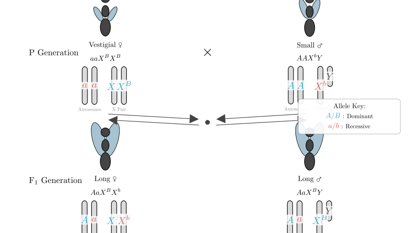
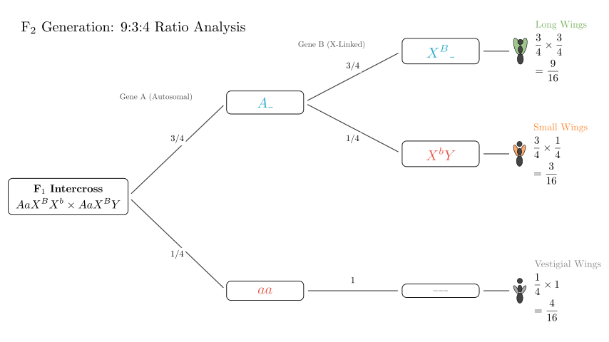
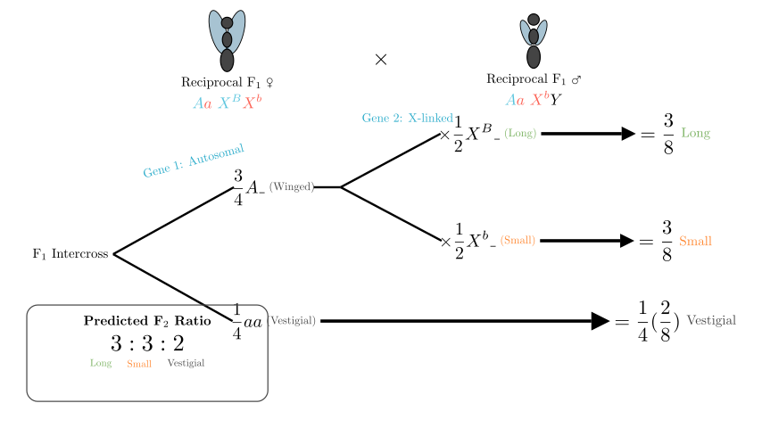

# problem_26_biology_g12

**问题陈述：**
某研究小组使用纯合的果蝇（*Drosophila melanogaster*）进行了如下实验：残翅 ♀ × 小翅 ♂。F₁ 代全为长翅果蝇，且雌雄比例约为 1:1。F₁ 雌雄个体相互交配获得 F₂ 代，结果如下表所示：

| F₂ 表型 | 数量 | 小计 | 比例 |
| :--- | :--- | :--- | :--- |
| 长翅 ♀ | 548 | 804 | 9.43 |
| 长翅 ♂ | 256 | | |
| 小翅 ♀ | 0 | 239 | 2.81 |
| 小翅 ♂ | 239 | | |
| 残翅 ♀ | 153 | 321 | 3.76 |
| 残翅 ♂ | 168 | | |

**问题：**
(1) 根据结果，翅型的遗传遵循 _____________ 定律。理由是 _________。
(2) 写出亲本的基因型 ________________（自行设定的字母）。
(3) 为了验证某些判断，设计一个反交实验，即 ____________。如果所得 F₁ 果蝇有两种翅型，其表型为 ____________________。继续让这些 F₁ 雌雄个体交配获得 F₂，预测翅型比例为 长翅 : 小翅 : 残翅 = _______________。

**解题思路：**
我们将分析 F₂ 代的表型比例，以确定涉及的基因数量及其染色体位置（常染色体 vs 性连锁）。9:3:4 的比例表明存在两对相互作用的基因（上位效应）。“小翅”性状的性别特异性分布表明其为 X 连锁遗传。我们将通过图解杂交过程来确认基因型并预测反交结果。

**步骤 1：分析 F₂ 比例和遗传模式**

首先，让我们看一看 F₂ 代中每种翅表型的总数：
- **长翅：** 804
- **小翅：** 239
- **残翅：** 321

将这些数值除以最小的组（约 85，源自总数 1364 的 1/16），我们得到的比例约为 **9:3:4**。
- 经典的孟德尔双杂合比例是 9:3:3:1。
- 9:3:4 的比例是**隐性上位**的特征性变形，即一对基因的隐性纯合状态（如 *aa*）掩盖了另一对基因的表达。

**步骤 2：确定染色体位置**
接下来，我们检查性状在性别上的分布：
- **小翅：** *仅*出现在雄性中（239 只雄性，0 只雌性）。这强烈表明控制 小翅 vs 长翅 性状的基因是 **X 连锁**的。
- **残翅：** 在雌性（153）和雄性（168）中均有出现，比例约为 1:1。这表明导致残翅的上位基因位于**常染色体**上。

**问题 (1) & (2) 的结论：**
- 遗传遵循**自由组合定律（独立分配定律）**，因为这两对基因（一对常染色体，一对 X 连锁）是独立分离的。
- 让我们设定字母：
- **A/a（常染色体）：** *A_* 允许翅发育，*aa* 导致残翅（上位）。
- **B/b（X 连锁）：** *Xᴮ* 导致长翅（显性），*Xᵇ* 导致小翅（隐性）。
- **亲本基因型：**
- 残翅雌性亲本必须是 *aa*（对应残翅）和 *XᴮXᴮ*（必须将显性长翅等位基因传给 F₁ 雄性，因为 F₁ 雄性均为长翅）。
- 小翅雄性亲本必须是 *AA*（纯合）和 *XᵇY*（对应小翅）。
- **亲本：** 残翅 ♀ (*aaXᴮXᴮ*) × 小翅 ♂ (*AAXᵇY*)。

**步骤 3：设计反交实验（问题 3）**

为了验证我们关于其中一个基因是 X 连锁的假设，我们进行**反交**（交换亲本的表型）。

- **正交：** 残翅 ♀ × 小翅 ♂
- **反交：** 小翅 ♀ × 残翅 ♂

**反交亲本的基因型：**
- **小翅 ♀：** 必须是 *AA*（有翅）和 *XᵇXᵇ*（小翅）。基因型：**AAXᵇXᵇ**。
- **残翅 ♂：** 必须是 *aa*（残翅）。由于原始残翅品系携带显性 *B* 等位基因（由第一个实验中的 F₁ 雄性证明），该雄性为 **aaXᴮY**。

**预测反交 F₁：**
- 杂交：*AAXᵇXᵇ* × *aaXᴮY*
- **后代：**
- 雌性从母亲那里获得 *Xᵇ*，从父亲那里获得 *Xᴮ* → *AaXᴮXᵇ*（**长翅**）
- 雄性从母亲那里获得 *Xᵇ*，从父亲那里获得 *Y* → *AaXᵇY*（**小翅**）

因此，F₁ 代将有两种翅型：**雌性为长翅，雄性为小翅**。

**步骤 4：预测反交 F₂ 比例**

我们现在让反交 F₁ 个体相互交配：
- **F₁ 雌性：** *AaXᴮXᵇ*
- **F₁ 雄性：** *AaXᵇY*

**自由组合分析：**
1. **常染色体基因 (A/a)：** *Aa* × *Aa*
- 3/4 *A_*（有翅）
- 1/4 *aa*（残翅）

2. **性连锁基因 (B/b)：** *XᴮXᵇ* × *XᵇY*
- 后代基因型：*XᴮXᵇ*, *XᵇXᵇ*, *XᴮY*, *XᵇY*
- 表型（如果存在 *A_*）：
- 显性（长翅，*Xᴮ_*）：1/2（1 雌 + 1 雄）
- 隐性（小翅，*Xᵇ_*）：1/2（1 雌 + 1 雄）

**组合概率 (F₂)：**
- **长翅：** (3/4 *A_*) × (1/2 *B_*) = **3/8**
- **小翅：** (3/4 *A_*) × (1/2 *bb*) = **3/8**
- **残翅：** (1/4 *aa*) × (1 *任意*) = **1/4**（或 2/8）

**最终比例：**
长翅 : 小翅 : 残翅 = 3 : 3 : 2

**最终答案回顾：**
(1) **自由组合定律**；F₂ 代显示出 9:3:4 的比例（9:3:3:1 的变体），且性状由位于不同同源染色体上的两对非等位基因控制（一对常染色体，一对性连锁）。
(2) 亲本：残翅 ♀ **aaXᴮXᴮ**，小翅 ♂ **AAXᵇY**。
(3) 反交实验：**小翅 ♀ × 残翅 ♂**；F₁ 表型：**雌性为长翅，雄性为小翅**；预测 F₂ 比例：**3:3:2**。