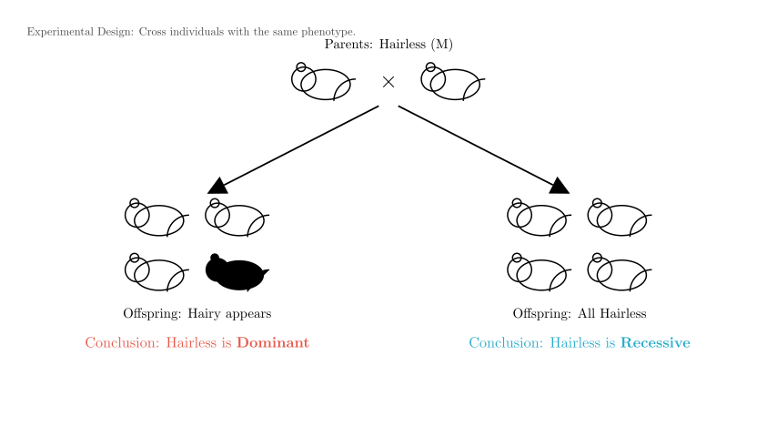
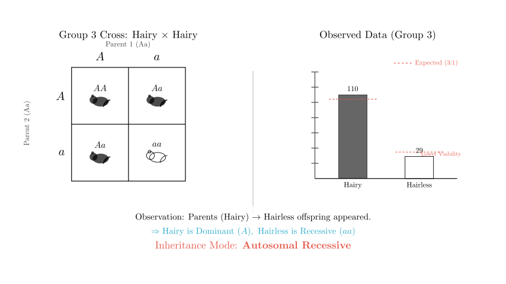
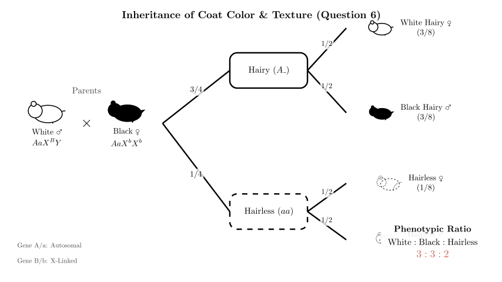
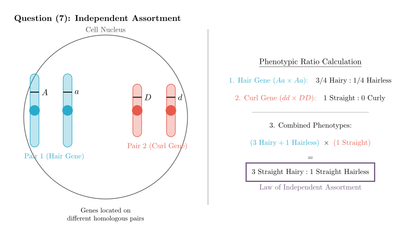

# problem_28_biology_g12

# Biology Genetics Problem: Inheritance Patterns & Gene Interactions

**Problem Statement:**
Answer the following questions regarding biological genetics.
A certain animal species M, which is conventionally bred, usually has a population of individuals with black hair. Occasionally, a few hairless M individuals are found in the population, and these hairless M individuals include both females and males. (Genes for hairy and hairless are represented by A and a).

**(1)** To determine whether the hairless gene is dominant or recessive, the parent combination of M to be selected for mating is: __________________. Explain based on the results: __________________.
**(2)** If the hairless gene is known to be dominant, and a hairy female M mates with an occasionally appearing hairless male M multiple times, producing offspring where all hairless individuals are female and all hairy individuals are male, does this result contradict the statement "hairless M individuals include both females and males" in the prompt? Your reason is: __________________.
**(3)** If 6 groups of M are selected for mating and the results are as shown in the table below, please analyze and answer:
*(See table in original image showing cross results)*
Based on the table, the inheritance mode of the hairless gene is __________________.
**(4)** Research found that the protein expressed by the hairless gene reduces the function of thyroid hormone receptors. Please use the data in the table to explain this in connection with the function of thyroid hormone: __________________.
**(5)** A single base in a codon associated with the hairless gene was replaced by another base. The possible result of this mutation is __________________.
**(6)** If the offspring from Group 2 continue to mate and produce offspring, a white-haired male individual appears. If this male mates with a hairy female offspring from Group 2, and the resulting offspring are all white-haired females and all black-haired males, then the inheritance mode of the white hair gene is __________________. The phenotypes and their ratios in the offspring produced by this mating are __________________, and the genotype of the hairless individuals among them is __________________. (Black and white hair genes are represented by B and b).
**(7)** If the Group 1 combination continues to mate and produce many offspring, curly-haired individuals appear. It is known that curly hair is an autosomal recessive trait. If a curly-haired individual from the Group 1 offspring mates with a straight-haired individual to produce many offspring, and no curly-haired individuals appear in the offspring (result is Straight 3/4, Hairless 1/4), judge whether the genes controlling hairy/hairless and straight/curly traits follow the __________________ Law. Your reason is: __________________.

---

**Solution Approach:**
We will solve this step-by-step:
1.  **Experimental Design:** Logic for testing dominance.
2.  **Hypothesis Testing:** Analyzing sex-linkage scenarios.
3.  **Data Analysis:** Using the provided table to determine the actual mode of inheritance (Autosomal vs. Sex-linked, Dominant vs. Recessive).
4.  **Molecular & Physiological Context:** Connecting genetic ratios to thyroid function and mutation types.
5.  **Complex Crosses:** Solving for two-gene inheritance involving coat color (X-linked) and texture (Autosomal).

### Part 1: Determining Dominance

To determine if the "hairless" trait is dominant or recessive, we look for a cross that can reveal hidden alleles.

**Answer (1):**
*   **Parent Combination:** **Hairless $\times$ Hairless**
*   **Explanation:** If **hairy** offspring appear in the progeny, it proves that the hairless trait is **dominant** (because the parents would be heterozygous $Aa$, segregating the recessive $aa$ hairy trait). If all offspring are hairless, it supports the trait being recessive (though strictly, this requires large numbers, but in genetic logic problems, segregation implies dominance of the parent phenotype).

### Part 2: Hypothetical Sex-Linkage

**Answer (2):**
*   **Contradiction?** **No.**
*   **Reason:** The result (Hairless daughters, Hairy sons) is characteristic of **X-linked Dominant** inheritance.
*   Cross: Hairy Female ($X^aX^a$) $\times$ Hairless Male ($X^AY$).
*   Offspring: Daughters ($X^AX^a$, Hairless) and Sons ($X^aY$, Hairy).
*   This inheritance mode allows for both male ($X^AY$) and female ($X^AX^-$) hairless individuals to exist in the general population, so it does not contradict the prompt.

---

### Part 3: Analyzing the Data Table

We need to determine the actual inheritance mode using the provided table.
*   **Group 3:** Hairy $\times$ Hairy $\to$ 110 Hairy : 29 Hairless.
*   **Observation:** Two parents with the same phenotype produced offspring with a different phenotype (Hairless).
*   **Deduction:** "Hairy" is Dominant ($A$), and "Hairless" is Recessive ($aa$).
*   **Sex Distribution:** In Groups 1, 2, and 3, the hairless trait appears in both males and females with roughly equal frequency (e.g., Group 3 has 14 female and 15 male hairless offspring).

**Answer (3):**
*   **Inheritance Mode:** **Autosomal Recessive Inheritance**.

### Part 4: Thyroid Hormone & Viability

**Answer (4):**
*   **Explanation:** In Group 3, the ratio of Hairy to Hairless is $110:29$ (approx. 3.8:1), which deviates from the expected Mendelian ratio of $3:1$. The number of hairless individuals is lower than expected.
*   **Connection:** Thyroid hormone is essential for growth and development. The problem states the hairless gene protein reduces thyroid receptor function. This functional decline likely leads to **reduced viability or increased mortality** in the hairless ($aa$) individuals during development, resulting in fewer surviving hairless offspring than theoretically expected.

### Part 5: Mutation Type

**Answer (5):**
*   **Result:** **An amino acid in the polypeptide chain is replaced (Missense mutation)** or **Translation is terminated prematurely (Nonsense mutation)**.
*   **Reasoning:** Since the mutation leads to a "decline in function" (phenotypic change), it is not a silent mutation. It implies a change in the protein's primary structure.

---

### Part 6: The White Hair Mutation (Complex Cross)

**Scenario:**
*   A **White Male** appears from Group 2 offspring.
*   Cross: **White Male** $\times$ **Group 2 F1 Hairy Female**.
*   Result: **Females are all White**, **Males are all Black**.

**Deduction of Color Inheritance:**
*   This specific "Criss-Cross" pattern (Father passes trait to all daughters, Mother passes trait to all sons) strongly indicates **X-linked inheritance**.
*   Since the father ($XY$) passes his X only to daughters, and they *all* show the trait (White), the White allele must be **Dominant** on the X chromosome.
*   **Mode:** **X-linked Dominant**.
*   Alleles: White ($X^B$), Black ($X^b$).

**Deduction of Genotypes:**
*   **Hair Gene (Autosomal Recessive):**
*   Group 2 Parents: Hairy ($Aa$) $\times$ Hairless ($aa$). (Based on ~1:1 offspring ratio in table).
*   Group 2 Offspring (F1): $1/2$ Hairy ($Aa$), $1/2$ Hairless ($aa$).
*   The parents for this new cross are selected from these F1s.
*   **Male Parent:** Must be Hairy to show "White" color? (Usually, hairless implies no color, so he must be $Aa$). Genotype: **$AaX^BY$**.
*   **Female Parent:** Hairy ($Aa$). Since she is from the black-haired population lineage, she is Black ($X^bX^b$). Genotype: **$AaX^bX^b$**.

**The Cross:** $AaX^BY$ $\times$ $AaX^bX^b$

**Answer (6):**
*   **Inheritance Mode of White Hair:** **X-linked Dominant Inheritance**.
*   **Phenotypes and Ratios:**
*   Combining the probabilities:
*   Hairy ($3/4$) $\times$ Female White ($1/2$) = **$3/8$ White Hairy Female**
*   Hairy ($3/4$) $\times$ Male Black ($1/2$) = **$3/8$ Black Hairy Male**
*   Hairless ($1/4$) $\times$ Female ($1/2$) = **$1/8$ Hairless Female**
*   Hairless ($1/4$) $\times$ Male ($1/2$) = **$1/8$ Hairless Male**
*   **Final Answer:** **White Hairy Female : Black Hairy Male : Hairless = 3 : 3 : 2** (or 3:3:1:1 if separating hairless by sex).
*   **Genotype of Hairless Individuals:**
*   They are $aa$.
*   Females received $X^B$ from father and $X^b$ from mother: **$aaX^BX^b$**.
*   Males received $Y$ from father and $X^b$ from mother: **$aaX^bY$**.

---

### Part 7: Curly Hair & Law of Inheritance

**Scenario:**
*   Curly is Autosomal Recessive ($dd$). Straight is Dominant ($D\_$).
*   Cross: **Curly ($dd$)** from Group 1 $\times$ **Straight ($D\_$)**.
*   Result: **Straight 3/4, Hairless 1/4**. (No Curly offspring).

**Analysis:**
*   **Hair Gene ($A/a$):** The ratio of Hairy (Straight) to Hairless is $3:1$. This implies the parents were both heterozygous for the hair gene ($Aa \times Aa$).
*   **Curl Gene ($D/d$):** All hairy offspring are Straight. There are no Curly offspring.
*   Parent 1 was Curly ($dd$).
*   Parent 2 was Straight. For no curly offspring to appear ($dd \times D\_ \to$ all $D\_$), Parent 2 must be homozygous dominant (**$DD$**).
*   Cross: $dd \times DD \to$ all $Dd$ (Straight).
*   **Combined Result:** The phenotypic ratio (3 Straight : 1 Hairless) matches the product of the individual gene ratios:
*   ($3$ Hairy : $1$ Hairless) $\times$ ($1$ Straight : $0$ Curly).
*   This indicates the genes segregate independently.

**Answer (7):**
*   **Law:** **Law of Free Combination (Independent Assortment)**.
*   **Reason:** The offspring phenotypic ratio is Straight : Hairless = 3:1. This is consistent with the independent inheritance of the hair gene (Aa $\times$ Aa $\to$ 3:1) and the curl gene (dd $\times$ DD $\to$ all straight), where the segregation of alleles for one trait does not influence the other.

### Summary of Answers

**(1)** Hairless $\times$ Hairless; If hairy offspring appear, hairless is dominant (otherwise recessive).
**(2)** No; This is characteristic of X-linked dominant inheritance (offspring phenotypes segregate by sex).
**(3)** Autosomal Recessive.
**(4)** The mutation reduces thyroid receptor function, affecting development and viability, causing the proportion of hairless individuals (recessive homozygotes) to be lower than the theoretical 1/4.
**(5)** Replacement of an amino acid (missense) or premature termination (nonsense).
**(6)** X-linked Dominant; White Hairy Female : Black Hairy Male : Hairless = 3:3:2; $aaX^BX^b$ and $aaX^bY$.
**(7)** Law of Free Combination (Independent Assortment); The phenotypic ratio of the offspring (3:1) is the product of the segregation ratios of the two independent traits (3:1 for hair/hairless and 1:0 for straight/curly).

