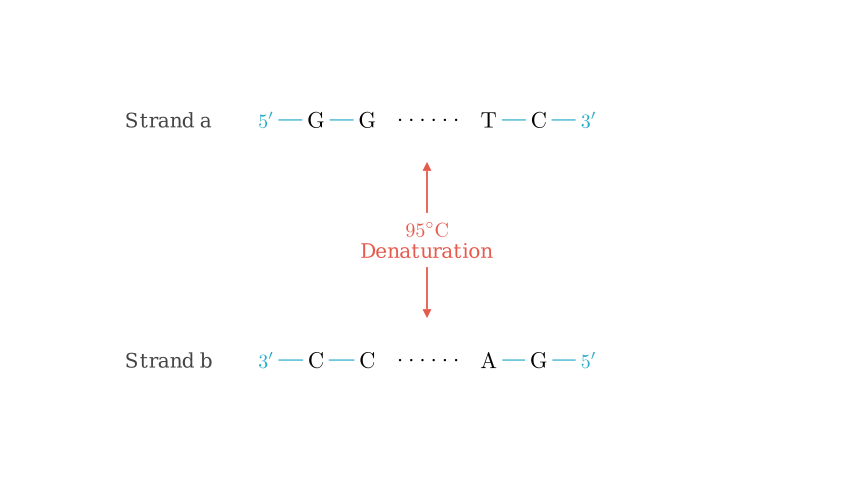
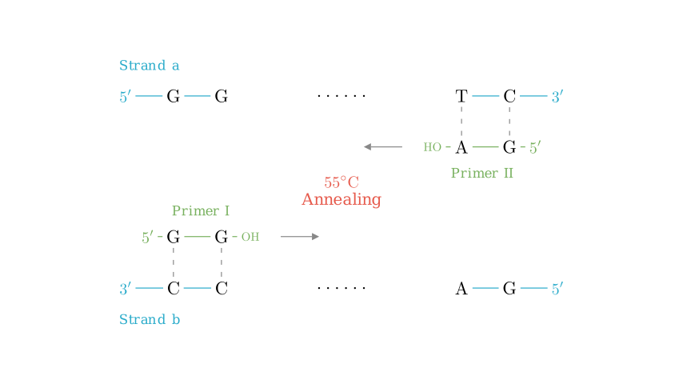
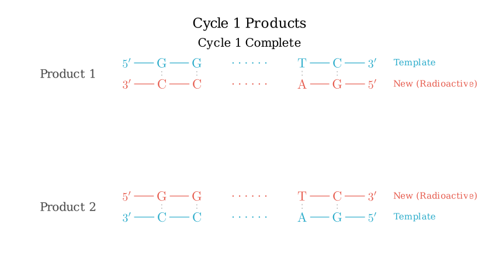
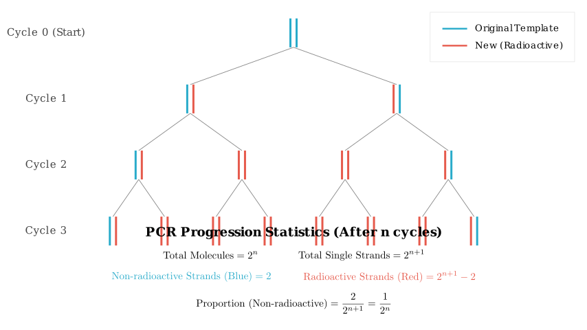

# problem_29_biology_g12

**Problem Statement**

In genetic disease analysis and criminal investigations, it is often necessary to analyze sample DNA. PCR (Polymerase Chain Reaction) technology can rapidly amplify DNA fragments, replicating millions of DNA copies within a few hours. This effectively solves the problem of analyzing samples with very low DNA content. Based on the diagram provided, answer the following questions.

**(1)** Write the sequence for **Primer II** (引物 II) on the corresponding line and place Primer II in the appropriate position during the annealing (renaturation) step ($55^\circ$C).
**(2)** Write the sequences of the DNA molecules generated after one cycle on the corresponding lines.
**(3)** If the four types of deoxyribonucleotides used as raw materials are labeled with $^{32}$P, analyze the characteristics of the DNA molecules generated after one cycle: ________________________________. After $n$ cycles, the proportion of single strands containing **no** radioactivity to the total number of single strands is ________.
**(4)** The prerequisite for the PCR reaction process is ________. PCR technology utilizes the principle of DNA's ________ to solve this problem.
**(5)** During the analysis of sample DNA, it was found that the DNA is mixed with some histones. The substance that can be added to remove these histones is ________.

---

**Solution Approach**

To solve this, we need to understand the basic mechanism of PCR:
1.  **Denaturation ($95^\circ$C):** DNA strands separate.
2.  **Annealing ($55^\circ$C):** Primers bind to complementary sequences. Crucially, DNA polymerase works in the 5' to 3' direction, so primers must bind to the 3' end of the template strand.
3.  **Extension ($72^\circ$C):** New strands are synthesized.

We will analyze the sequence complementarity to determine the primer, visualize the replication process to determine the products, and use the semi-conservative replication model to calculate the radioactive ratios.

**Step 1: Identifying Primer II (Question 1)**

PCR requires two primers. A primer must bind to the **3' end** of the template strand to allow DNA polymerase to synthesize the new strand in the 5' $\to$ 3' direction.

*   **Primer I Analysis:** The diagram shows Primer I (5'-G-G-OH) binding to Strand 'b'. Strand 'b' runs 3' $\to$ 5', starting with 3'-C-C... This matches because G pairs with C.
*   **Primer II Analysis:** Primer II must bind to the 3' end of **Strand 'a'**.
*   Strand 'a' sequence at the 3' end: **...T-C-3'**
*   The primer must be complementary and antiparallel.
*   Complementary bases: A pairs with T, G pairs with C.
*   Alignment:
*   Template: $5' - \dots - T - C - 3'$
*   Primer:   $3' - \dots - A - G - 5'$

Reading the primer in the standard 5' $\to$ 3' direction, the sequence is **5'-G-A-OH**.

**Step 2: Extension and Cycle 1 Products (Question 2)**

During the extension phase ($72^\circ$C), Taq polymerase extends the primers by adding free nucleotides complementary to the template.

*   **Top Molecule:** The template is Strand 'a' (5'-G-G...T-C-3'). The new strand is synthesized complementary to it. The result is a double-stranded DNA identical to the original parent molecule.
*   **Bottom Molecule:** The template is Strand 'b' (3'-C-C...A-G-5'). The new strand is synthesized complementary to it. The result is also a double-stranded DNA identical to the original parent molecule.

Therefore, the products written on the lines for Question 2 are simply the full double-stranded sequences:
1.  $5'-G-G......T-C-3'$
2.  $3'-C-C......A-G-5'$

**Step 3: Radioactive Labeling Analysis (Question 3)**

If the raw materials (dNTPs) are labeled with $^{32}$P, every newly synthesized strand will be radioactive. The original template strands remain non-radioactive.

**After Cycle 1:**
As shown in the diagram above, DNA replication is **semi-conservative**. Each of the 2 resulting DNA molecules consists of:
1.  One original non-radioactive strand (Parent).
2.  One newly synthesized radioactive strand (Daughter).
*Answer:* Each DNA molecule contains one radioactive chain and one non-radioactive chain.

**After $n$ Cycles:**
*   Total DNA molecules = $2^n$
*   Total single strands = $2 \times 2^n = 2^{n+1}$
*   Original non-radioactive strands = 2 (The two strands we started with never disappear, they just act as templates).
*   All other strands are newly synthesized and therefore radioactive.

Calculation for the proportion of non-radioactive strands:
$$ \frac{\text{Non-radioactive strands}}{\text{Total strands}} = \frac{2}{2^{n+1}} = \frac{1}{2^n} $$

**Step 4: Principles and Purification (Questions 4 & 5)**

**(4) Prerequisites & Principle:**
*   **Prerequisite:** To perform PCR, you must know the nucleotide sequence of at least the ends of the target DNA segment. This is necessary to synthesize the specific **primers**.
*   **Principle:** PCR is essentially in vitro DNA replication. It relies on the principle of **DNA semi-conservative replication** (specifically utilizing thermal denaturation and thermostable polymerase).

**(5) Removing Histones:**
*   Chromosomal DNA in cells is wrapped around proteins called histones.
*   To purify the DNA, we need to degrade these proteins.
*   **Protease** (specifically Protease K) is the enzyme used to break down proteins/histones without damaging the DNA.

---

**Final Answer Summary**

**(1)** Primer II: **$5'-G-A-OH$** (or $5'-HO-A-G-3'$).
*Placement:* It binds to the 3' end of the top strand (Strand a).

**(2)** Generated DNA:
$5'-G-G......T-C-3'$
$3'-C-C......A-G-5'$

**(3)**
*Characteristics:* **Each DNA molecule consists of one labeled (radioactive) strand and one unlabeled (non-radioactive) strand.**
*Proportion:* **$1/2^n$**

**(4)**
*Prerequisite:* **The nucleotide sequence of the target gene (to synthesize primers).**
*Principle:* **DNA Replication (Semi-conservative replication).**

**(5)** **Protease** (or Protease K).

