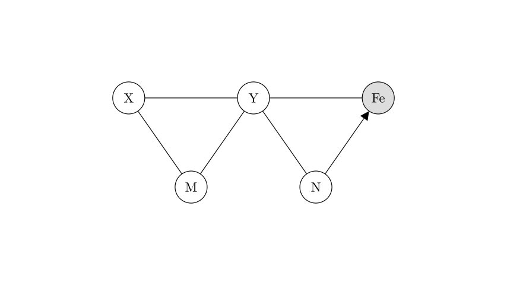
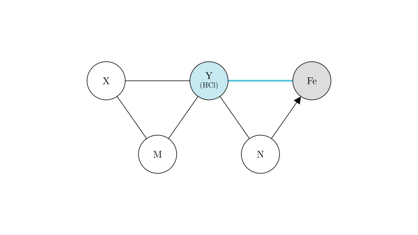
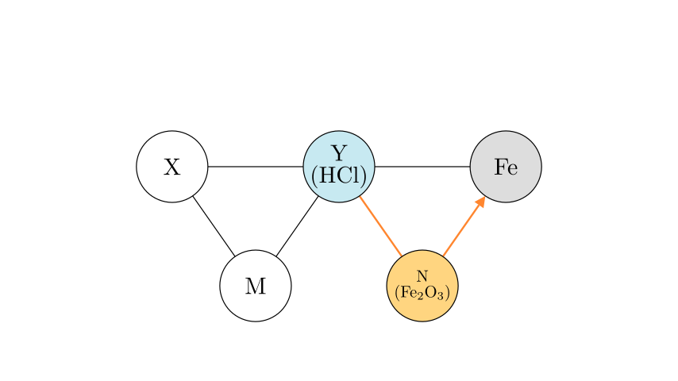
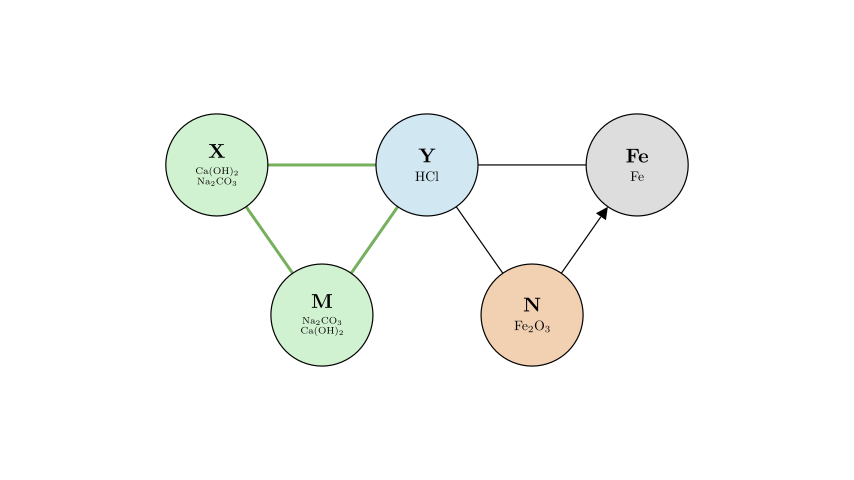

# problem_30_chemistry_g9

**Problem Statement:**
There are five substances: Iron (Fe), Iron(III) oxide (Fe₂O₃), Dilute hydrochloric acid (HCl), Calcium hydroxide solution (Ca(OH)₂), and Sodium carbonate solution (Na₂CO₃). Their reaction and conversion relationships are shown in the diagram below. In the diagram, "—" indicates that the connected substances can chemically react, and "→" indicates a conversion relationship. Which of the following judgments is reasonable?

A. X must be sodium carbonate solution.
B. Y must be calcium hydroxide solution.
C. The reactions converting N to Iron are all displacement reactions.
D. The reactions between any two of X, Y, and M are all double displacement (metathesis) reactions.

**Solution Approach:**
1. **Anchor Point:** Start with the known substance "Iron" (Fe) to identify its immediate neighbor Y.
2. **Identify N:** Use the conversion relationship N → Fe.
3. **Identify X and M:** Use the reaction network (the triangle relationship) to assign the remaining substances.
4. **Evaluate Options:** Check each statement against the identified substances and reaction types.

**Step 1: Identify Substance Y**

We start with the known substance, **Iron (Fe)**. Looking at the list of five substances:
- Iron (Fe)
- Iron(III) oxide (Fe₂O₃)
- Dilute hydrochloric acid (HCl)
- Calcium hydroxide (Ca(OH)₂)
- Sodium carbonate (Na₂CO₃)

In the diagram, **Y** reacts directly with **Iron (Fe)**. Let's check which of the remaining four substances can react with Iron:
- **Fe₂O₃:** Does not react with Fe.
- **Ca(OH)₂ (Base):** Metals generally do not react with bases (except amphoteric ones, which Fe is not).
- **Na₂CO₃ (Salt):** Iron does not react with sodium carbonate (Iron is less reactive than Sodium, so no displacement; no other reaction mechanism).
- **HCl (Acid):** Iron reacts with dilute hydrochloric acid to form ferrous chloride and hydrogen gas ($$Fe + 2HCl \rightarrow FeCl_2 + H_2 \uparrow$$).

**Conclusion:** **Y** must be **Dilute Hydrochloric Acid (HCl)**.

**Step 2: Identify Substance N**

Next, look at **N**. The diagram shows a conversion: **N → Fe**.

Remaining substances: Fe₂O₃, Ca(OH)₂, Na₂CO₃.

Which of these can be converted into Iron?
- **Ca(OH)₂ / Na₂CO₃:** It is chemically difficult to convert calcium hydroxide or sodium carbonate directly into elemental iron in a standard single-step context relevant to this level of chemistry.
- **Fe₂O₃ (Iron Oxide):** Iron ores (oxides) are smelted to produce iron. This is a standard reaction (e.g., in a blast furnace).
- Example: $$Fe_2O_3 + 3CO \xrightarrow{high\ temp} 2Fe + 3CO_2$$
- Example: $$Fe_2O_3 + 3H_2 \xrightarrow{\Delta} 2Fe + 3H_2O$$

Additionally, the diagram shows **N reacts with Y (HCl)**.
- Does Fe₂O₃ react with HCl? Yes: $$Fe_2O_3 + 6HCl \rightarrow 2FeCl_3 + 3H_2O$$.

**Conclusion:** **N** is **Iron(III) oxide (Fe₂O₃)**.

**Step 3: Identify X and M**

The remaining substances are **Calcium hydroxide (Ca(OH)₂)** and **Sodium carbonate (Na₂CO₃)**.

Let's analyze the relationships for X and M in the diagram:
1. **X reacts with Y (HCl):**
- $$Ca(OH)_2 + 2HCl \rightarrow CaCl_2 + 2H_2O$$ (Reaction occurs).
- $$Na_2CO_3 + 2HCl \rightarrow 2NaCl + H_2O + CO_2 \uparrow$$ (Reaction occurs).
2. **M reacts with Y (HCl):** Both react (see above).
3. **X reacts with M:**
- Does Ca(OH)₂ react with Na₂CO₃?
- $$Ca(OH)_2 + Na_2CO_3 \rightarrow CaCO_3 \downarrow + 2NaOH$$.
- Yes, a white precipitate forms.

Since both remaining substances react with HCl and with each other, and their structural position in the diagram (relative to Y and each other) is symmetric, **X and M are interchangeable**. One is Ca(OH)₂ and the other is Na₂CO₃, but we cannot strictly determine which is which based solely on the diagram's topology.

**Step 4: Evaluate the Options**

Now we verify the statements A, B, C, and D.

- **A. X must be sodium carbonate solution.**
- *False.* Since X and M are symmetric (both react with HCl and with each other), X could be Calcium hydroxide. There is no constraint forcing it to be Sodium carbonate.

- **B. Y must be calcium hydroxide solution.**
- *False.* We determined Y is HCl because it is the only substance that reacts with Iron.

- **C. The reactions converting N to Iron are all displacement reactions.**
- *False.* N is Fe₂O₃.
- A displacement reaction (single replacement) follows the form $$A + BC \rightarrow AC + B$$ (Element + Compound).
- While reduction with Carbon ($$3C + 2Fe_2O_3 \rightarrow 4Fe + 3CO_2$$) or Hydrogen ($$3H_2 + Fe_2O_3 \rightarrow 2Fe + 3H_2O$$) are displacement reactions, the industrial reduction using Carbon Monoxide ($$3CO + Fe_2O_3 \rightarrow 2Fe + 3CO_2$$) involves two compounds reacting to form an element and a compound. This is a redox reaction but **not** a displacement reaction. Since the option says "all," it is incorrect.

- **D. The reactions between any two of X, Y, and M are all double displacement reactions.**
- *True.* Let's check the three reactions in the triangle:
1. **X + Y** (Base/Salt + Acid):
- $$Ca(OH)_2 + 2HCl \rightarrow CaCl_2 + 2H_2O$$ (Neutralization, a type of Double Displacement).
- $$Na_2CO_3 + 2HCl \rightarrow 2NaCl + H_2O + CO_2$$ (Double Displacement).
2. **M + Y** (Salt/Base + Acid): Same as above.
3. **X + M** (Base + Salt):
- $$Ca(OH)_2 + Na_2CO_3 \rightarrow CaCO_3 \downarrow + 2NaOH$$ (Double Displacement).
- All these reactions involve the exchange of components between two compounds ($$AB + CD \rightarrow AD + CB$$).

**Final Answer:** The reasonable judgment is **D**.

