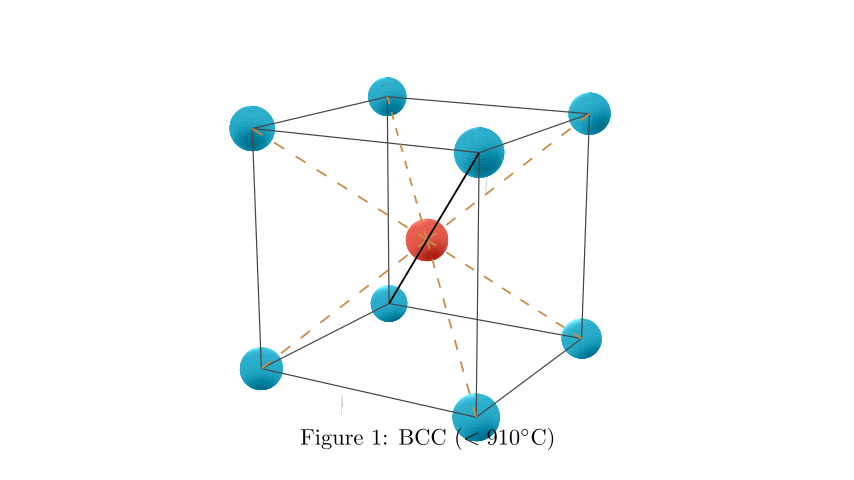
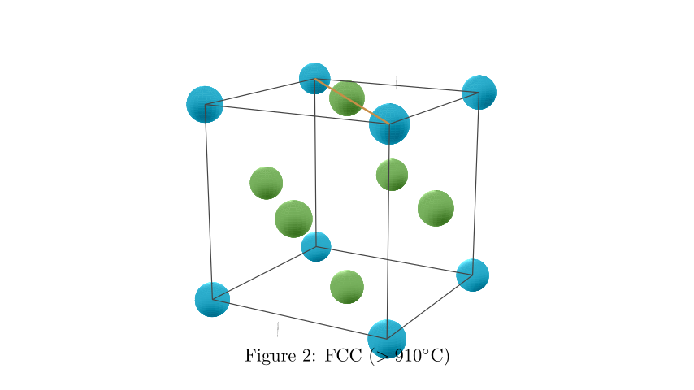
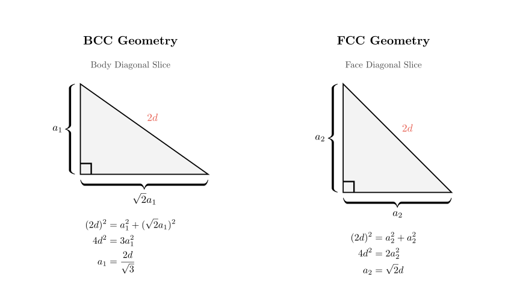
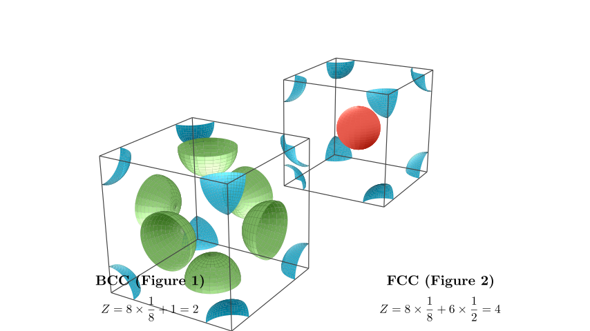

# problem_31_chemistry_g9

**Problem Statement:**
The basic structural unit of pure iron crystal below 910°C is shown in Figure 1, and above 910°C, it transforms into the structural unit shown in Figure 2. The distance between the nearest iron atoms is the same in both crystals.

(1) In the pure iron crystal below 910°C, the number of iron atoms equidistant and closest to a given iron atom is $\underline{\hspace{3em}}$. In the pure iron crystal above 910°C, the number of iron atoms equidistant and closest to a given iron atom is $\underline{\hspace{3em}}$.
(2) The ratio of the edge lengths of the basic structural units before and after the crystal transformation (ratio of below 910°C to above 910°C) is $\underline{\hspace{3em}}$.
(3) The ratio of the densities before and after the transformation temperature (ratio of below 910°C to above 910°C) is $\underline{\hspace{3em}}$.

**Solution Approach:**
This problem requires understanding crystal lattice structures, specifically Body-Centered Cubic (BCC) and Face-Centered Cubic (FCC) lattices. We will:
1. Identify the coordination numbers (nearest neighbors) for both structures visually.
2. Use geometry to relate the unit cell edge length ($a$) to the nearest neighbor distance ($d$) for both cases.
3. Calculate the ratio of edge lengths.
4. Determine the number of atoms per unit cell ($Z$) and calculate the density ratio using the volume and atomic count.

**Part 1: Coordination Numbers**

**Below 910°C (Figure 1):**
The structure shown in Figure 1 is a **Body-Centered Cubic (BCC)** lattice.
- Looking at the diagram, the iron atom in the center is surrounded by 8 atoms located at the corners of the cube.
- All these 8 corner atoms are equidistant from the center.
- Therefore, the coordination number (number of nearest neighbors) is **8**.

**Above 910°C (Figure 2):**
The structure in Figure 2 is a **Face-Centered Cubic (FCC)** lattice.
- In this structure, atoms are located at the corners and the centers of the faces.
- The nearest neighbors to a corner atom are the face-centered atoms.
- Let's visualize the FCC structure to count these neighbors accurately.

**Coordination Number for FCC:**
In the Face-Centered Cubic structure:
- Select any atom (for example, a face-centered atom). It touches the 4 corner atoms of its own face.
- It also touches 8 other face-centered atoms in the adjacent unit cells (or adjacent faces).
- Total nearest neighbors = 4 + 8 = **12**.

**Part 2: Edge Length Ratio**

We are given that the **nearest neighbor distance ($d$)** is the same in both crystals. We need to express the edge length ($a$) in terms of $d$ for both structures.

**For BCC (Figure 1):**
- The atoms touch along the **body diagonal** of the cube.
- The length of the body diagonal is $a_1\sqrt{3}$.
- This diagonal contains two nearest neighbor distances (center to corner).
- Equation: $2d = a_1\sqrt{3} \implies a_1 = \frac{2d}{\sqrt{3}}$.

**For FCC (Figure 2):**
- The atoms touch along the **face diagonal** of the cube.
- The length of the face diagonal is $a_2\sqrt{2}$.
- This diagonal contains two nearest neighbor distances (corner to face-center).
- Equation: $2d = a_2\sqrt{2} \implies a_2 = \frac{2d}{\sqrt{2}} = d\sqrt{2}$.

**Calculation of Edge Ratio:**
We need the ratio $a_1 : a_2$ (Below 910°C : Above 910°C).

$$ \frac{a_1}{a_2} = \frac{\frac{2d}{\sqrt{3}}}{d\sqrt{2}} $$

Simplifying:
$$ \frac{a_1}{a_2} = \frac{2}{\sqrt{3} \cdot \sqrt{2}} = \frac{2}{\sqrt{6}} $$

To rationalize the denominator or express simply:
$$ \frac{2}{\sqrt{6}} = \frac{2\sqrt{6}}{6} = \frac{\sqrt{6}}{3} $$

So, the ratio is **$\sqrt{6} : 3$** (or equivalently $2 : \sqrt{6}$).

**Part 3: Density Ratio**

Density ($\rho$) is defined as Mass ($m$) divided by Volume ($V$).
$$ \rho = \frac{Z \cdot M}{N_A \cdot V} $$
Where:
- $Z$ is the number of atoms per unit cell.
- $M$ is the molar mass (constant for pure iron).
- $N_A$ is Avogadro's constant.
- $V$ is the volume of the unit cell ($a^3$).

Since $M$ and $N_A$ are constant, the ratio of densities depends only on $Z$ and $V$:
$$ \frac{\rho_1}{\rho_2} = \frac{Z_1 / V_1}{Z_2 / V_2} = \frac{Z_1}{Z_2} \times \frac{V_2}{V_1} $$

**Final Calculation:**

1. **Determine Z (Atoms per cell):**
- **BCC ($Z_1$):** $8 \text{ corners} \times \frac{1}{8} + 1 \text{ center} = 2$ atoms.
- **FCC ($Z_2$):** $8 \text{ corners} \times \frac{1}{8} + 6 \text{ faces} \times \frac{1}{2} = 4$ atoms.

2. **Determine Volumes ($V = a^3$):**
- $V_1 = a_1^3 = \left(\frac{2d}{\sqrt{3}}\right)^3 = \frac{8d^3}{3\sqrt{3}}$
- $V_2 = a_2^3 = (d\sqrt{2})^3 = 2\sqrt{2}d^3$

3. **Calculate Ratio:**
$$ \frac{\rho_1}{\rho_2} = \frac{2}{4} \times \frac{2\sqrt{2}d^3}{\frac{8d^3}{3\sqrt{3}}} $$

Simplify the fraction:
$$ \frac{\rho_1}{\rho_2} = \frac{1}{2} \times \frac{2\sqrt{2} \cdot 3\sqrt{3}}{8} $$
$$ \frac{\rho_1}{\rho_2} = \frac{1}{2} \times \frac{6\sqrt{6}}{8} $$
$$ \frac{\rho_1}{\rho_2} = \frac{3\sqrt{6}}{8} $$

**Final Answers:**
(1) **8**; **12**
(2) **$\sqrt{6} : 3$** (or $2 : \sqrt{6}$)
(3) **$3\sqrt{6} : 8$**

