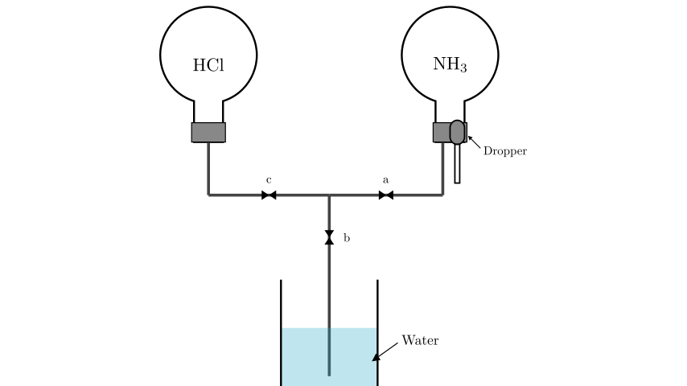
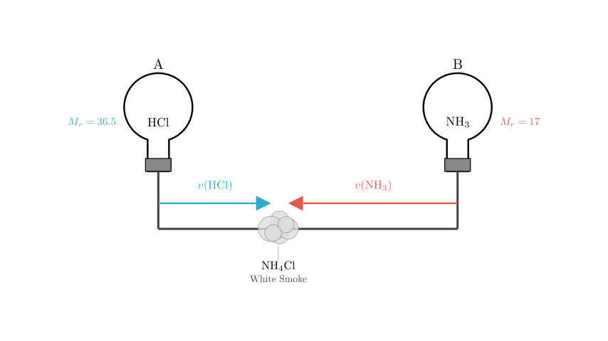
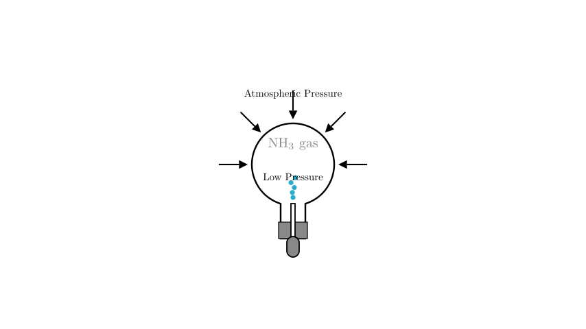
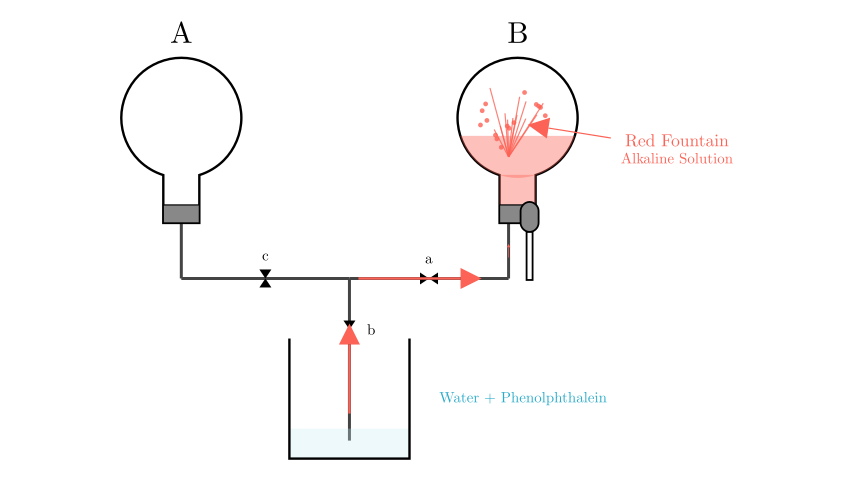

# problem_32_chemistry_g9

**Problem Statement:**
When learning about particles, a teacher used the apparatus shown in the figure for an experiment: Flask A is filled with hydrogen chloride (HCl) gas, and Flask B is filled with ammonia gas ($NH_3$). It is known that both ammonia and hydrogen chloride are extremely soluble in water. When ammonia meets hydrogen chloride, the following chemical reaction occurs: Ammonia + Hydrogen Chloride $\rightarrow$ Ammonium Chloride (white solid), producing a large amount of white smoke. It is also known that the molecular movement speed is inversely proportional to its mass.

**Answer the following questions:**
(1) To observe white smoke in this apparatus, how should one operate it? $\underline{\hspace{3cm}}$. The white smoke produced is closer to the $\underline{\hspace{1cm}}$ (fill in "A" or "B") flask end. The reason is: $\underline{\hspace{3cm}}$. From this experiment, information obtained about particles includes $\underline{\hspace{3cm}}$, $\underline{\hspace{3cm}}$ (write any two points).
(2) If stopcocks a, b, and c are closed, and a few drops of colorless phenolphthalein are added to the water in the beaker. Then, squeeze the water from the rubber dropper into Flask B, and subsequently open stopcocks a and b. The observed phenomenon is $\underline{\hspace{3cm}}$, and the reason for this phenomenon is $\underline{\hspace{3cm}}$.

**Solution Approach:**
We will solve this by applying the kinetic molecular theory to explain gas diffusion rates based on molecular mass (Graham's Law concept) for part (1), and principles of gas solubility and atmospheric pressure to explain the "fountain experiment" phenomenon for part (2).

**Part (1): Gas Diffusion and Reaction**

**Operation:**
To observe the reaction between the two gases, they must be allowed to mix. The gases are stored separately in Flask A and Flask B. The connecting path involves the horizontal tubing. Therefore, to connect Flask A and Flask B, we must **open stopcocks a and c**. Stopcock b should remain closed to prevent gases from entering the beaker or air entering the system.

**Observation Location:**
The problem states that molecular movement speed is inversely proportional to mass (specifically relative molecular mass). Let's calculate the relative molecular masses ($M_r$):
- $M_r(\text{NH}_3) = 14 + 1 \times 3 = 17$
- $M_r(\text{HCl}) = 1 + 35.5 = 36.5$

Since ammonia ($M_r=17$) is lighter than hydrogen chloride ($M_r=36.5$), ammonia molecules move faster. Consequently, in the time it takes for the gases to diffuse through the tube, the ammonia will travel a longer distance than the hydrogen chloride. Therefore, the meeting point where they react to form white smoke will be closer to the source of the slower gas.

**Result:** The white smoke is closer to **Flask A**.

**Reasoning Summary for Part (1):**
The ammonia molecules have a smaller relative molecular mass compared to hydrogen chloride molecules, so they move faster. They travel further down the tube before colliding with the HCl molecules.

**Information about Particles:**
From this experiment, we can deduce several properties of particles (molecules):
1. **Molecules are in constant motion:** The gases moved through the tube without external force.
2. **Molecules have different masses and speeds:** The reaction did not happen exactly in the middle.
3. **Molecules can react chemically:** New particles (solid ammonium chloride) were formed from gaseous particles.

---

**Part (2): The Fountain Experiment**

**Setup:**
- Stopcocks a, b, and c are initially closed.
- The beaker contains water with phenolphthalein (an indicator that turns red in basic/alkaline solutions).
- The dropper contains water.

**Step 1: Creating the Pressure Difference**
When the rubber dropper is squeezed, water enters Flask B (which contains ammonia gas). Ammonia is extremely soluble in water (1 volume of water can dissolve ~700 volumes of ammonia). As the ammonia dissolves into the small amount of water from the dropper, the amount of gas in Flask B decreases drastically.

**Step 2: The Fountain Effect**
After the pressure in Flask B drops, we open stopcocks **a** and **b**.
- Stopcock **a** connects the tube to Flask B.
- Stopcock **b** connects the tube to the beaker.
- Stopcock **c** remains closed (isolating Flask A).

This creates a continuous path from the water in the beaker to the low-pressure environment in Flask B. Because the atmospheric pressure pushing on the surface of the water in the beaker is much stronger than the low pressure inside Flask B, the water is forced rapidly up the tube and sprays into Flask B.

**Chemical Reaction & Color Change:**
Ammonia dissolves in water to form ammonia water (ammonium hydroxide), which is a weak base:
$$NH_3 + H_2O \rightleftharpoons NH_4^+ + OH^-$$
The presence of hydroxide ions ($OH^-$) makes the solution alkaline. Phenolphthalein turns **red** in alkaline solutions.

**Observed Phenomenon:**
Water from the beaker rapidly flows into Flask B, forming a **red fountain**.

**Final Recap and Answer Verification:**

(1) **Operation:** Open stopcocks a and c.
**Location:** Closer to **A**.
**Reason:** The relative molecular mass of ammonia (17) is smaller than that of hydrogen chloride (36.5), so ammonia molecules move faster than hydrogen chloride molecules.
**Particle Info:** Molecules are constantly moving; Molecular speed is related to mass.

(2) **Phenomenon:** The water in the beaker enters Flask B, forming a fountain, and the liquid turns red.
**Reason:** Ammonia dissolves in the water squeezed from the dropper, causing the gas pressure in Flask B to decrease significantly. Atmospheric pressure pushes the water from the beaker into Flask B. The resulting ammonia solution is alkaline, turning the phenolphthalein red.

