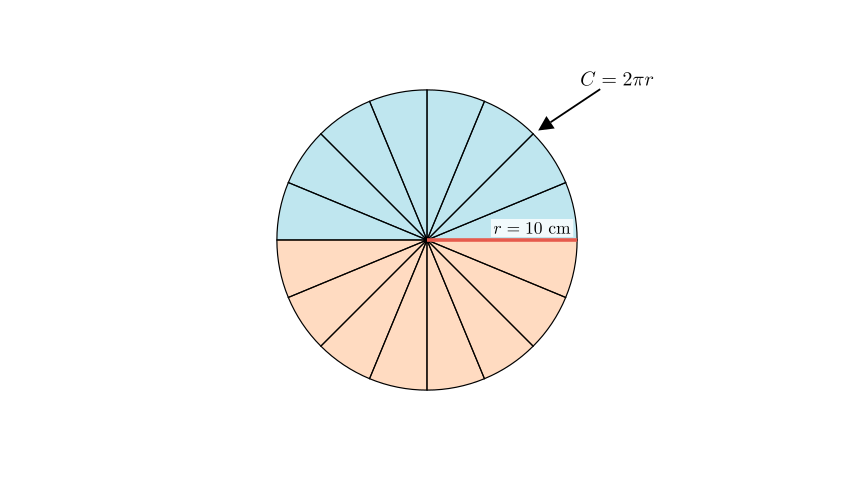
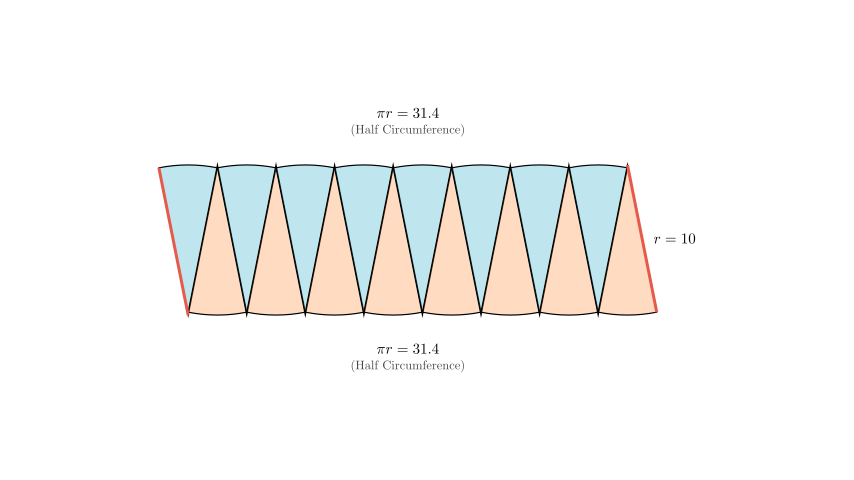
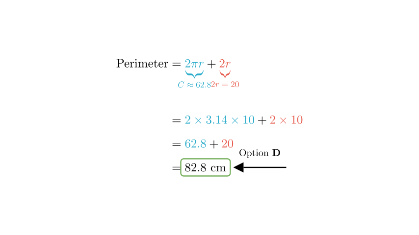

# problem_35_math_g6

**Problem Statement:**
As shown in the figure, a circle with a radius of $10\text{ cm}$ is cut and rearranged into an approximate rectangle. What is the perimeter of the resulting rectangle?

**Options:**
A. $31.4\text{ cm}$
B. $62.8\text{ cm}$
C. $72.8\text{ cm}$
D. $82.8\text{ cm}$

**Solution Approach:**
To solve this, we need to understand the geometric transformation from a circle to the approximate rectangle. We will identify which parts of the circle correspond to the length and width of the new rectangle and then sum them to find the new perimeter.

**Step 1: Analyzing the Transformation**

When we cut a circle into many small sectors and rearrange them, they form a shape that resembles a rectangle (as shown in the problem image). 

*   **The "Width" (Height):** The short vertical sides of this rectangle correspond exactly to the radius of the circle.
*   **The "Length":** The top and bottom edges of the rectangle are made up of the curved arcs of the sectors.

Let's visualize this rearrangement to see exactly where the perimeter comes from.

**Step 2: Calculating the Lengths**

From the diagram, we can determine the dimensions of the new shape:

1.  **Top and Bottom Edges:** These are formed by the circumference of the circle. The top edge is half the circumference, and the bottom edge is the other half. Together, they equal the full circumference of the original circle.
$$ \text{Top} + \text{Bottom} = \text{Circumference} = 2 \times \pi \times r $$

2.  **Left and Right Edges:** These vertical sides are formed by the radius of the sectors.
$$ \text{Left} + \text{Right} = r + r = 2r $$

**Step 3: Computing the Total Perimeter**

The perimeter of the rectangle is the sum of all four sides:
$$ \text{Perimeter} = (\text{Top} + \text{Bottom}) + (\text{Left} + \text{Right}) $$
$$ \text{Perimeter} = \text{Circumference} + 2 \times \text{Radius} $$
$$ \text{Perimeter} = 2\pi r + 2r $$

**Final Calculation:**

Given that the radius $r = 10\text{ cm}$ and taking $\pi \approx 3.14$:

1.  **Calculate the Circumference portion:**
$$ 2 \times 3.14 \times 10 = 62.8\text{ cm} $$

2.  **Calculate the Radius portion:**
$$ 2 \times 10 = 20\text{ cm} $$

3.  **Add them together:**
$$ 62.8 + 20 = 82.8\text{ cm} $$

**Conclusion:**
The perimeter of the approximate rectangle is $82.8\text{ cm}$.

Comparing this to the options:
A. 31.4
B. 62.8
C. 72.8
D. 82.8

The correct option is **D**.

