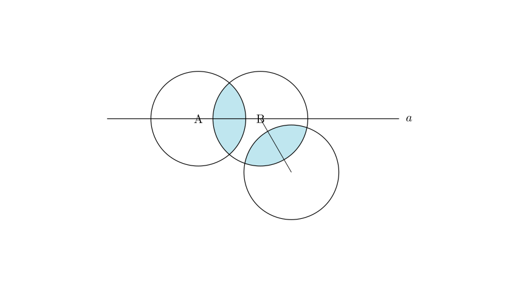
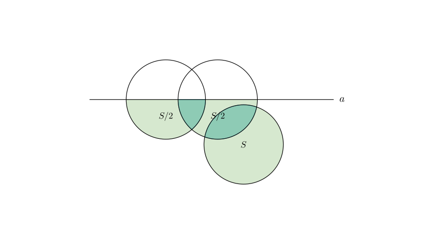

# problem_36_math_g6

**Problem Statement:**
There are three circles, each with an area of $S$, placed on a table (as shown in the diagram). The total area covered on the table is $2S + 2$, and the areas of the two overlapping regions are equal. Line $a$ passes through the centers of two circles, A and B. If the area covered by the circles below line $a$ is 9, determine the value of $S$.

**Options:**
A. 5
B. 5.5
C. 6
D. 6.5

**Solution Approach:**
We will solve this using the Principle of Inclusion-Exclusion for areas.
1.  First, we express the total covered area in terms of $S$ and the overlap area $x$ to find a relationship between them.
2.  Next, we analyze the area covered below line $a$. Since line $a$ passes through the centers of circles A and B, it bisects them. Based on the diagram and problem context, circle C lies entirely below line $a$.
3.  We will set up an equation for the area below the line and solve the system of linear equations to find $S$.

**Step 1: Analyze the Total Covered Area**

Let the area of each circle be $S$.
Let the area of the overlap between Circle A and Circle B be $x$.
The problem states that the overlapping regions are equal, so the overlap between Circle B and Circle C is also $x$.
There is no common overlap between all three circles (A and C do not touch).

Using the formula for the area of a union of sets:
$$ \text{Total Area} = \text{Area}(A) + \text{Area}(B) + \text{Area}(C) - \text{Overlap}(A,B) - \text{Overlap}(B,C) $$
$$ \text{Total Area} = S + S + S - x - x $$
$$ \text{Total Area} = 3S - 2x $$

We are given that the total covered area is $2S + 2$. Equating these expressions:
$$ 3S - 2x = 2S + 2 $$
Rearranging to solve for $S$ in terms of $x$:
$$ S - 2x = 2 \implies S = 2x + 2 \quad \text{--- (Equation 1)} $$

**Step 2: Analyze the Area Below Line $a$**

Now we consider the area covered *below* the horizontal line $a$.

*   **Circles A and B:** Since line $a$ passes through their centers, it cuts both circles exactly in half.
*   Area of Circle A below line $a$ = $S/2$.
*   Area of Circle B below line $a$ = $S/2$.
*   **Overlap (A & B):** The overlap between A and B is symmetric about the line connecting their centers (line $a$). Thus, exactly half of this overlap lies below the line.
*   Overlap area below line $a$ = $x/2$.
*   **Circle C:** The diagram shows Circle C attached to the bottom-right of Circle B. In geometry problems of this type, unless specified otherwise, the third circle is positioned such that it lies entirely within the region below the line passing through the other two centers.
*   Area of Circle C below line $a$ = $S$.
*   **Overlap (B & C):** Since Circle C is entirely below the line, and the bottom half of B is below the line, the entire overlap between B and C lies below line $a$.
*   Overlap area below line $a$ = $x$.

**Step 3: Formulate the Equation**

The total area covered below the line is the sum of the individual parts minus the overlaps (to avoid double counting):
$$ \text{Area}_{\text{below}} = (\text{A}_{\text{below}}) + (\text{B}_{\text{below}}) + (\text{C}_{\text{below}}) - (\text{Overlap AB}_{\text{below}}) - (\text{Overlap BC}_{\text{below}}) $$

Substituting the values:
$$ 9 = \frac{S}{2} + \frac{S}{2} + S - \frac{x}{2} - x $$
$$ 9 = 2S - 1.5x \quad \text{--- (Equation 2)} $$

**Step 4: Solve the System of Equations**

We have a system of two equations:
1.  $S = 2x + 2$
2.  $2S - 1.5x = 9$

From Equation 1, we can express $x$ in terms of $S$:
$$ 2x = S - 2 \implies x = \frac{S - 2}{2} = 0.5S - 1 $$

Substitute this expression for $x$ into Equation 2:
$$ 2S - 1.5(0.5S - 1) = 9 $$
$$ 2S - 0.75S + 1.5 = 9 $$
$$ 1.25S = 7.5 $$

Now, solve for $S$:
$$ S = \frac{7.5}{1.25} $$
To simplify, multiply numerator and denominator by 100:
$$ S = \frac{750}{125} $$
$$ S = 6 $$

**Verification:**
If $S = 6$:
*   $x = 0.5(6) - 1 = 2$.
*   Total Area = $3(6) - 2(2) = 18 - 4 = 14$.
*   Check given total area: $2S + 2 = 2(6) + 2 = 14$. (Matches)
*   Area Below = $2(6) - 1.5(2) = 12 - 3 = 9$. (Matches given value)

**Final Answer:**
The value of $S$ is 6.

Therefore, the correct option is **C**.

