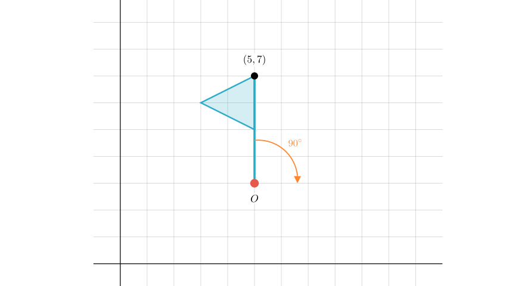
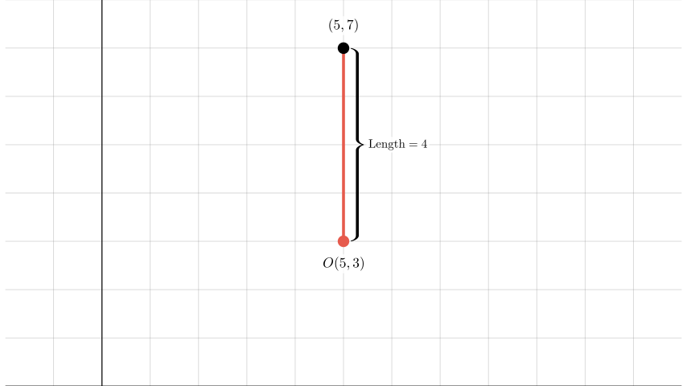
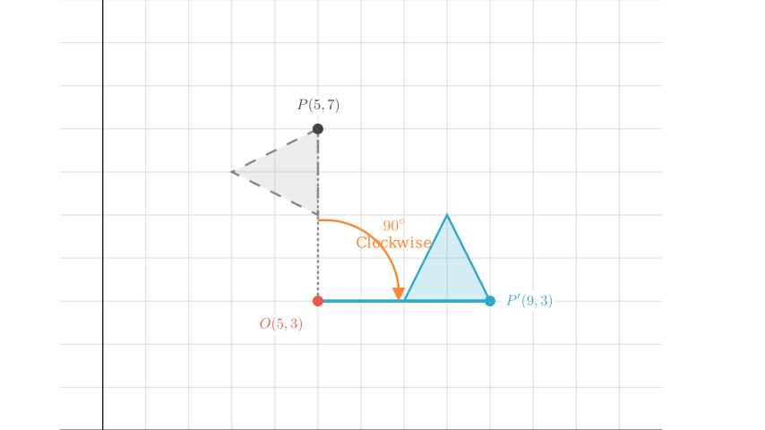
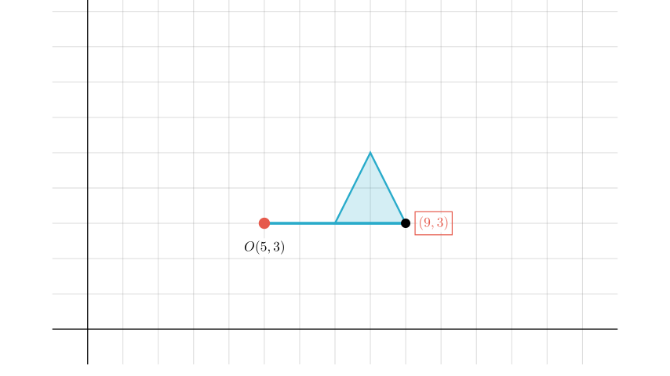

# problem_39_math_g6

**Problem Statement:**
As shown in the figure, the vertex of the small flag is represented by the number pair $(5, 7)$. Now, the small flag is rotated 90° clockwise around point $O$. The vertex of the small flag can now be represented by the number pair (   ).

**Options:**
A. $(7, 5)$
B. $(10, 3)$
C. $(9, 3)$
D. $(1, 3)$

**Solution Approach:**
To solve this problem, we first need to determine the coordinates of the center of rotation, point $O$, by analyzing the grid. Then, we will perform a geometric rotation of the vertex point around $O$ to find its new coordinates.

**Step 1: Determine the coordinates of the center of rotation, point $O$.**

The problem states that the top vertex of the flag is at $(5, 7)$. The flagpole is a vertical line segment going downwards from this vertex. By observing the grid in the diagram, we can count the grid units to find the position of point $O$ at the bottom of the pole.

The vertex is at a y-coordinate of 7. Counting down the grid lines from the vertex to point $O$:
1.  From $y=7$ to $y=6$ (1 unit)
2.  From $y=6$ to $y=5$ (2 units)
3.  From $y=5$ to $y=4$ (3 units)
4.  From $y=4$ to $y=3$ (4 units)

Point $O$ is located 4 units directly below the vertex. Since the vertex is at $x=5$, point $O$ is also at $x=5$. Therefore, the coordinates of point $O$ are $(5, 3)$.

**Step 2: Rotate the vertex 90° clockwise around point $O$.**

Now we perform the rotation. We are rotating the flag 90° clockwise around the center $O(5, 3)$.

Currently, the vector from $O$ to the vertex is vertical, pointing upwards by 4 units.
-   Current direction: Up (positive y-axis direction).
-   Rotation: 90° Clockwise.
-   New direction: Right (positive x-axis direction).

The distance from the center $O$ must remain constant (4 units). Therefore, the new position of the vertex will be 4 units to the **right** of point $O$.

**Step 3: Calculate the new coordinates.**

Starting from the center $O(5, 3)$, we move 4 units to the right along the horizontal line.

-   **New x-coordinate:** $5 + 4 = 9$
-   **New y-coordinate:** The vertical position does not change relative to the x-axis during a horizontal move, so $y = 3$.

Thus, the new coordinates of the vertex are $(9, 3)$.

**Conclusion:**

After rotating the flag 90° clockwise around point $O(5, 3)$, the vertex originally at $(5, 7)$ moves to $(9, 3)$.

Comparing this result with the given options:
A. $(7, 5)$
B. $(10, 3)$
C. $(9, 3)$
D. $(1, 3)$

The correct match is **Option C**.

