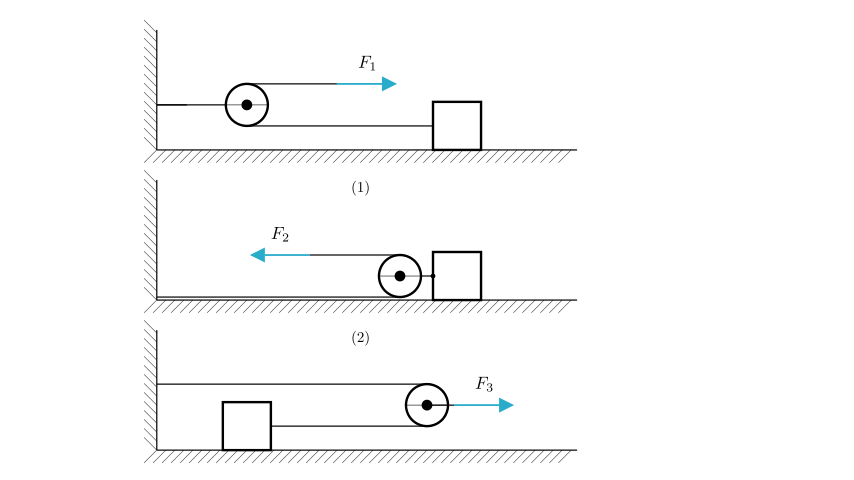
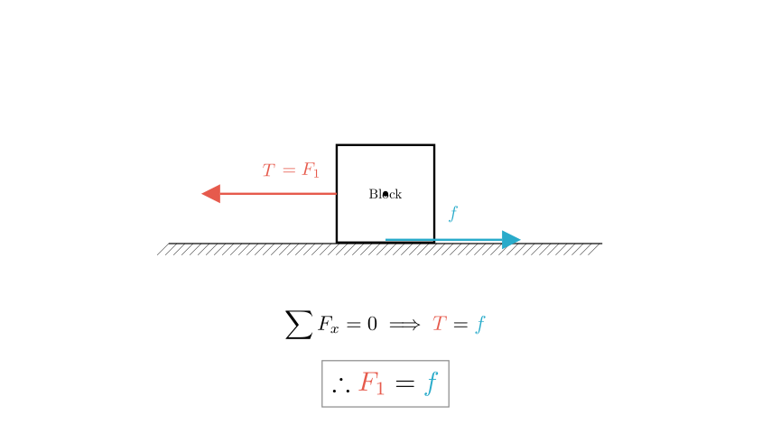
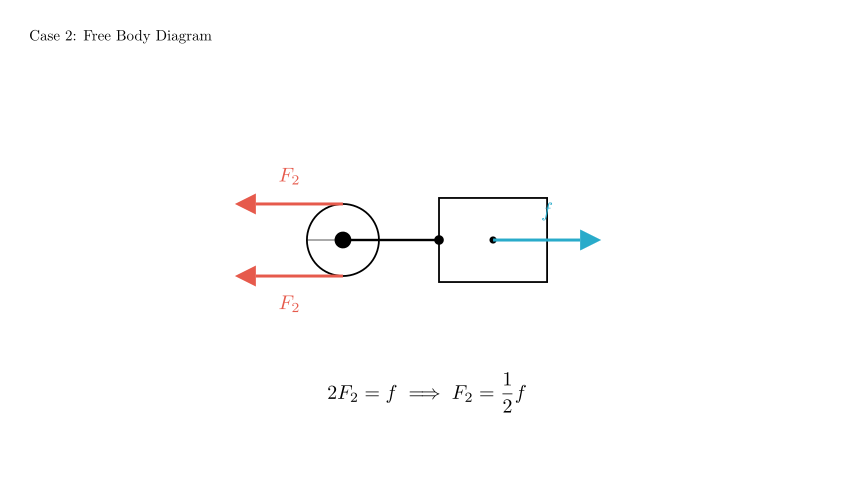
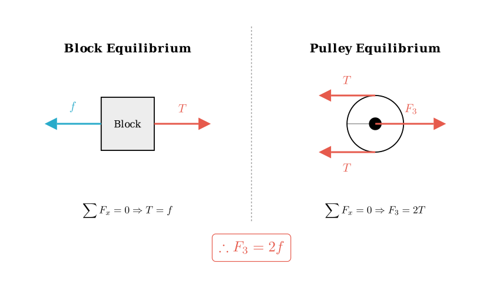

# problem_3_physics_g9

**Problem Statement:**
As shown in the figure, use three methods to pull the same object on the same horizontal ground for uniform linear motion. The pulling forces are $F_1$, $F_2$, and $F_3$ respectively. Then:
A. $F_1 > F_2 > F_3$
B. $F_1 < F_2 < F_3$
C. $F_2 > F_1 > F_3$
D. $F_2 < F_1 < F_3$

**Solution Approach:**
Since the object moves in **uniform linear motion** in all three cases, the net force on the object (and the pulley systems) must be zero according to Newton's First Law.

We assume the friction force $f$ experienced by the block is the same in all cases because the object and the ground remain identical. We will analyze the relationship between the pulling force ($F$) and the friction ($f$) for each scenario using Free Body Diagrams (FBDs).

**Case 1: Fixed Pulley**

In the first setup, the pulley is attached to the wall. This is a **fixed pulley**. A fixed pulley changes the direction of the force but does not change its magnitude.

- The rope tension $T$ is equal to the pulling force $F_1$.
- The block is moving uniformly, so the tension pulling the block balances the sliding friction force $f$.

Therefore:
$$T = F_1$$
$$T = f \implies F_1 = f$$

**Case 2: Movable Pulley (Force applied to rope)**

In the second setup, the pulley is attached to the block and moves with it. The rope is anchored to the wall, goes around the pulley, and is pulled by force $F_2$.

- This is a standard movable pulley system where the effort is applied to the rope.
- There are **two segments** of rope pulling the block unit against the friction.
- Each segment carries tension $T = F_2$.

For the block to move uniformly, the total forward force ($2T$) must balance the friction $f$:
$$2F_2 = f$$
$$F_2 = \frac{1}{2}f$$

**Case 3: Movable Pulley (Force applied to axle)**

In the third setup, the force $F_3$ is applied directly to the axle of the movable pulley. The rope connects the wall to the block, passing over the pulley.

- **Forces on the Pulley:** The force $F_3$ pulls to the right. It is balanced by the tension $T$ in the two rope segments pulling to the left. So, $F_3 = 2T$.
- **Forces on the Block:** The block is pulled by the rope tension $T$. Since it moves uniformly, $T = f$.

Substituting $T = f$ into the pulley equation:
$$F_3 = 2T$$
$$F_3 = 2f$$

**Conclusion and Comparison**

We have derived the magnitude of each pulling force in terms of the friction $f$:

1.  $F_1 = f$
2.  $F_2 = 0.5f$
3.  $F_3 = 2f$

Comparing these values:
$$0.5f < f < 2f$$
Therefore:
$$F_2 < F_1 < F_3$$

**Verification:**
- $F_2$ uses a movable pulley to gain mechanical advantage (force is halved).
- $F_3$ applies effort to the axle, which is a mechanical disadvantage (force is doubled to gain speed/distance).
- $F_1$ is a direct 1:1 transfer.

The correct option is **D**.

