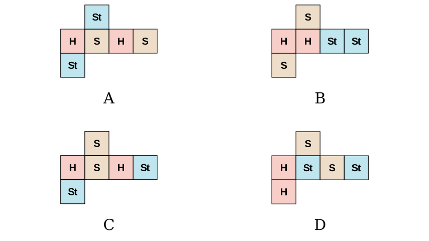
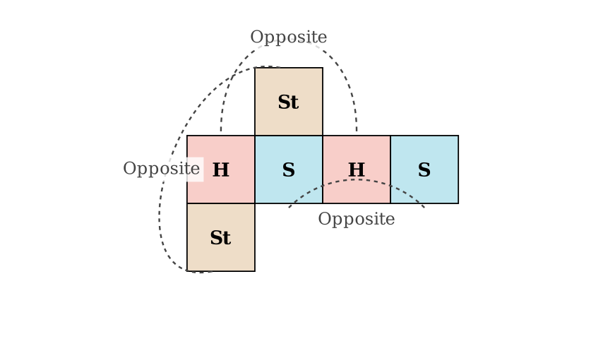

# problem_40_math_g6

**Problem Statement:**
Xiaoxiao made a cubic gift box as shown in the figure. The patterns on opposite faces of the cube are identical. Which of the following plane figures (A, B, C, or D) could be the net from which this cubic gift box was folded?

**Solution Approach:**
1.  **Analyze the Constraints:** The problem states that opposite faces have identical patterns. This means the cube must have:
*   Two "Heart" faces opposite each other.
*   Two "Smiley" faces opposite each other.
*   Two "Star" faces opposite each other.
2.  **Analyze the Nets:** We will examine each option (A, B, C, D) using the rules of cube folding. Specifically, we will look for rows of squares where faces separated by one square must be opposite in the 3D form.
3.  **Elimination:** We will discard any option where non-identical patterns end up on opposite faces.

**Analyzing the Folding Rules:**

In a cube net, a common configuration involves a straight row of four squares. When folded into a cube:
*   The **1st** square in the row is opposite the **3rd** square.
*   The **2nd** square in the row is opposite the **4th** square.
*   The remaining flaps (top and bottom) form the remaining opposite pair.

Let's apply this rule to check if the "Opposite Faces are Identical" condition is met.

**Step-by-Step Evaluation:**

*   **Option B:**
*   The main row is: Heart - Heart - Star - Star.
*   Comparing positions 1 and 3: **Heart** is opposite **Star**.
*   *Result:* This violates the rule (Heart must be opposite Heart). Option B is incorrect.

*   **Option C:**
*   The main row is: Heart - Smiley - Heart - Star.
*   Comparing positions 2 and 4: **Smiley** is opposite **Star**.
*   *Result:* This violates the rule (Smiley must be opposite Smiley). Option C is incorrect.

*   **Option D:**
*   The main row is: Heart - Star - Smiley - Star.
*   Comparing positions 1 and 3: **Heart** is opposite **Smiley**.
*   *Result:* This violates the rule. Option D is incorrect.

**Verifying Option A:**

Let's look closely at **Option A**:
*   **The Main Row:** The sequence is Heart (1) - Smiley (2) - Heart (3) - Smiley (4).
*   Position 1 (Heart) is opposite Position 3 (Heart). **Matches.**
*   Position 2 (Smiley) is opposite Position 4 (Smiley). **Matches.**

*   **The Flaps:** 
*   There is a Star attached to the top of the 2nd square.
*   There is a Star attached to the bottom of the 1st square.
*   When the row of four is folded into the lateral sides of the cube, the top flap closes the top, and the bottom flap closes the bottom. Thus, the top Star is opposite the bottom Star. **Matches.**

**Conclusion:**
Only Option A satisfies the condition that all pairs of opposite faces have identical patterns.

**Final Answer:** A

