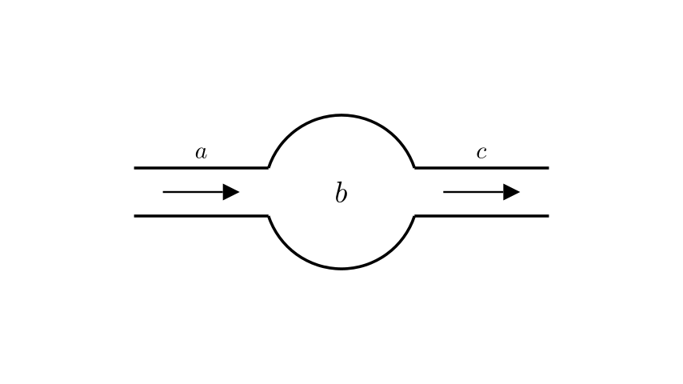
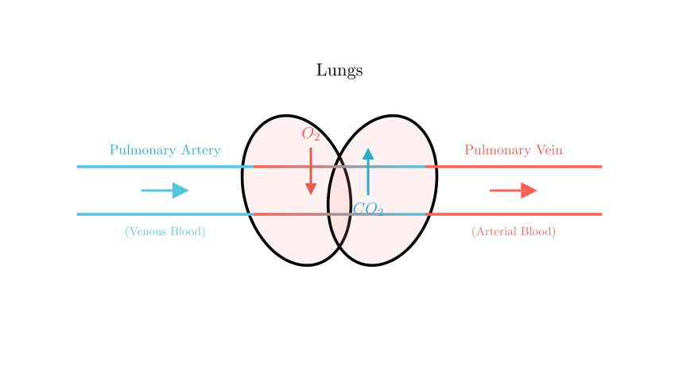
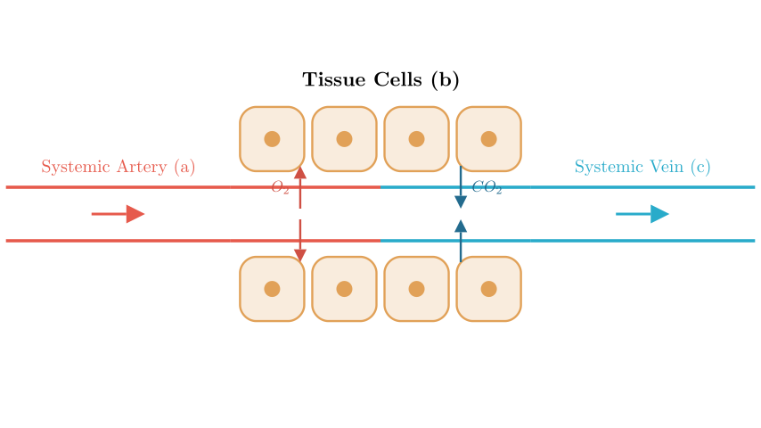

# problem_45_biology_g9

**Problem Statement:**
The diagram below is a schematic of blood flowing through a certain organ. Which of the following statements is correct?

A. If **b** represents the heart, then vessel **c** carries venous blood.
B. If **b** represents the lungs, then vessel **c** carries venous blood.
C. If **b** represents the small intestine, then vessel **c** carries arterial blood.
D. If **b** represents tissue cells, then vessel **c** carries venous blood.

**Solution Approach:**
To solve this problem, we need to apply the principles of human blood circulation. We will analyze the gas exchange and blood composition changes that occur in different organs (lungs vs. systemic tissues) and the direction of blood flow through the heart. The generic diagram shows blood flowing from vessel **a** (inflow), through organ **b**, to vessel **c** (outflow). We will evaluate each option to see if the blood type (arterial vs. venous) in the outflow vessel **c** matches the physiological reality.

**Analyzing Option B: The Lungs (Pulmonary Circulation)**

Let's first look at Option B. If **b** represents the lungs, this describes the pulmonary circulation loop.

1.  **Inflow (a):** Blood enters the lungs from the heart via the **Pulmonary Artery**. This blood has just returned from the body, so it is oxygen-poor and carbon dioxide-rich (Venous Blood).
2.  **Process in Lungs (b):** Gas exchange occurs. Carbon dioxide is released into the alveoli, and oxygen is absorbed into the blood.
3.  **Outflow (c):** Blood leaves the lungs via the **Pulmonary Vein**. Because it has been oxygenated, it is now **Arterial Blood** (oxygen-rich).

Therefore, if **b** is the lungs, vessel **c** contains arterial blood. Option B claims it carries venous blood, so **Option B is incorrect**.

**Analyzing Options C and D: Systemic Circulation (Tissues/Small Intestine)**

Now let's consider the systemic circulation, where blood flows to body tissues (like the small intestine or general tissue cells).

1.  **Inflow (a):** Blood enters tissues via systemic **Arteries**. This blood comes from the left side of the heart and is oxygen-rich (**Arterial Blood**).
2.  **Process in Tissues (b):** Cells perform cellular respiration. They consume oxygen and produce carbon dioxide.
3.  **Outflow (c):** Blood leaves the tissues via systemic **Veins**. Because oxygen has been consumed, this is now **Venous Blood** (oxygen-poor).

**Evaluating Option C:** If **b** is the small intestine, the outflow **c** (mesenteric veins/hepatic portal vein) carries venous blood. Option C claims it is arterial, so **Option C is incorrect**.

**Evaluating Option D:** If **b** represents tissue cells, the outflow **c** is a vein carrying venous blood. Option D claims it carries venous blood, which is **correct**.

**Analyzing Option A: The Heart**

Finally, let's check Option A. If **b** is the heart:
- The heart pumps blood *into* arteries.
- If we look at the right side of the heart: Blood enters from veins (Venous) and leaves via the Pulmonary Artery (Venous). Here, **c** would be venous.
- If we look at the left side of the heart: Blood enters from pulmonary veins (Arterial) and leaves via the Aorta (Arterial). Here, **c** would be arterial.

Since the outcome depends on which side of the heart we are discussing, Option A is not a strictly correct statement in all contexts compared to Option D, which describes a fundamental physiological rule for all systemic tissues. Furthermore, in the context of "blood flowing *through* an organ" diagrams, we usually analyze the change in blood composition caused by that organ's metabolic activity (like in D) rather than the heart's pumping action.

**Conclusion:**
Based on our analysis:
- Lungs turn Venous blood $\rightarrow$ Arterial.
- Tissues (including Small Intestine) turn Arterial blood $\rightarrow$ Venous.

Therefore, the statement "If b represents tissue cells, then vessel c carries venous blood" is the scientifically accurate description.

**Final Answer:** The correct option is **D**.

