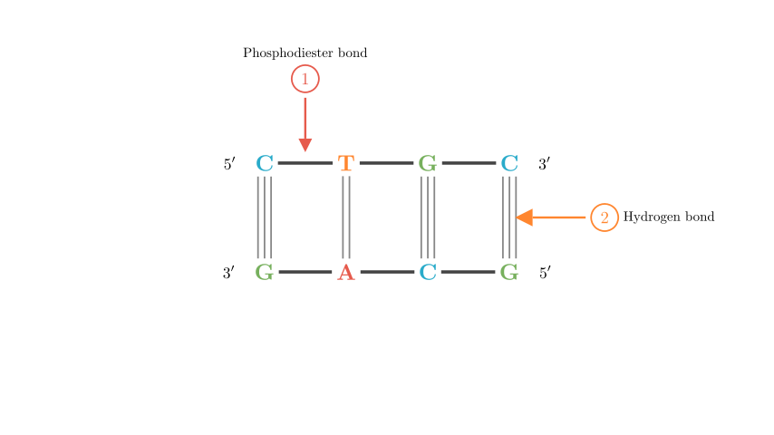
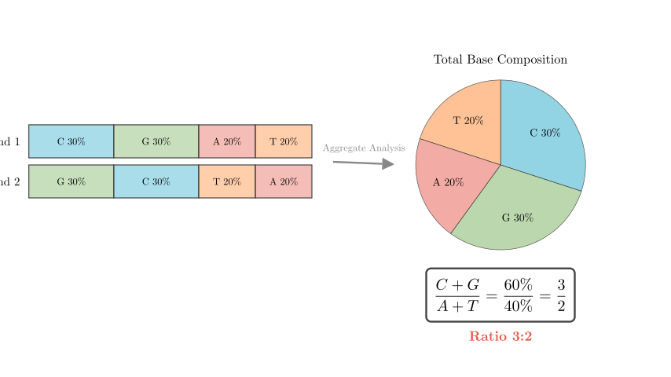
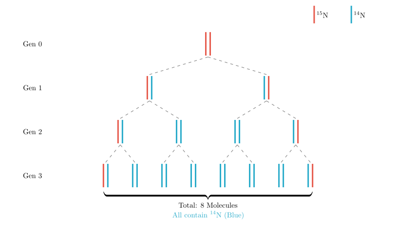

# problem_46_biology_g9

**题目描述：**

如图所示，是一个真核细胞中某基因（用 $^{15}$N 标记）的结构示意图。在该基因中，胞嘧啶（C）占所有碱基的 30%。下列说法正确的是？

A. 解旋酶作用于部位 ① 和 ②。
B. 在该基因的一条核苷酸链中，(C+G)/(A+T) 的比值为 3:2。
C. 若部位 ① 后的胸腺嘧啶（T）变为腺嘌呤（A），经过 $n$ 次复制后，突变的基因占总数的 1/4。
D. 该基因在含 $^{14}$N 的培养液中复制 3 次后，含 $^{14}$N 的 DNA 分子占总数的 3/4。

**解题思路：**

我们将分析图中所示的 DNA 结构，以确定部位 ① 和 ② 的化学键。然后，我们将应用查哥夫法则（碱基互补配对原则）计算选项 B 的碱基比例。最后，我们将利用半保留复制原理来评估突变（选项 C）和同位素标记（选项 D）的结果。

**步骤 1：分析酶作用位点（选项 A）**

让我们识别图中标记的结构：
- **部位 ①：** 箭头指向一个核苷酸的磷酸基团与下一个核苷酸的糖之间的连接。这是**磷酸二酯键**，它构成了 DNA 链稳定的骨架。
- **部位 ②：** 箭头指向互补碱基之间的连接（例如 C 和 G 之间）。这些是**氢键**，它们将两条链连接在一起。

**解旋酶的功能：**
解旋酶是一种参与 DNA 复制的酶，负责“解开”双螺旋。它通过断裂碱基对之间的**氢键**来分离链。因此，解旋酶作用于**部位 ②**。

作用于部位 ①（磷酸二酯键）的酶包括限制性核酸内切酶（用于切割 DNA）和 DNA 连接酶（用于连接 DNA）。

*结论：* 选项 A 声称解旋酶作用于 ① 和 ②，这是**不正确的**。

**步骤 2：计算碱基比例（选项 B）**

已知胞嘧啶（C）占该基因总碱基数的 30%。

根据碱基互补配对原则（查哥夫法则）：
- C 的数量等于 G 的数量（$C = G$）。
- A 的数量等于 T 的数量（$A = T$）。

**计算：**
1. 因为 $C = 30\%$，所以 $G = 30\%$。
2. C 和 G 的总和为 $30\% + 30\% = 60\%$。
3. 剩余的碱基是 A 和 T。总碱基数 = 100%。
$A + T = 100\% - (C + G) = 100\% - 60\% = 40\%$。
4. 因为 $A = T$，所以 $A = 20\%$ 且 $T = 20\%$。

**比例计算：**
整个 DNA 分子中 (C + G) 与 (A + T) 的比值为：
$$ \frac{C+G}{A+T} = \frac{60\%}{40\%} = \frac{3}{2} $$

**单链特性：**
由于碱基互补配对，一条链上的 $(C+G)$ 数量对应于互补链上的 $(G+C)$ 数量。同样，一条链上的 $(A+T)$ 对应于另一条链上的 $(T+A)$。因此，无论是双链还是每一条单链，$\frac{C+G}{A+T}$ 的比值都是恒定的。

*结论：* 选项 B 指出比值为 3:2，这是**正确的**。

**步骤 3：分析同位素标记复制（选项 D）**

该基因最初被 $^{15}$N 标记（两条链）。它在含 $^{14}$N 的培养基中复制 3 次。

**复制追踪：**
- **起始（第 0 代）：** 1 个分子，两条链均为 $^{15}$N。
- **第 1 轮：** 2 个分子。每个分子含有一条原始的 $^{15}$N 链和一条新的 $^{14}$N 链。（都含有 $^{14}$N）。
- **第 2 轮：** 4 个分子。2 条 $^{15}$N 链保留在 2 个杂合分子中。另外 2 个分子是纯 $^{14}$N 的。
- **第 3 轮：** 8 个分子（$2^3$）。2 条原始的 $^{15}$N 链仍然存在，形成 2 个杂合分子（$^{15}$N/$^{14}$N）。其余 $8 - 2 = 6$ 个分子完全由新链组成（$^{14}$N/$^{14}$N）。

**评估选项：**
题目问的是**含有** $^{14}$N 的 DNA 分子的比例。
- 杂合分子（$^{15}$N/$^{14}$N）含有 $^{14}$N。
- 纯分子（$^{14}$N/$^{14}$N）含有 $^{14}$N。
- 由于每一条新合成的链都是 $^{14}$N，因此**每一个生成的 DNA 分子**（8 个中的 8 个）都至少含有一条 $^{14}$N 链。
- 比例 = $8/8 = 100\%$。

选项 D 声称该比例为 3/4（这实际上是*只*含 $^{14}$N 的分子的比例）。因此，选项 D 是**不正确的**。

**步骤 4：分析突变（选项 C）**

如果部位 ① 处的碱基 T 变为 A，则一条链上发生了点突变。
- **复制前：** 一条链带有突变（A），另一条链具有原始序列（与 T 互补，即 A）。*注：这造成了错配或代表了模板的改变。*
- **复制：** DNA 链分离。
1. 突变链（A）作为模板与 T 配对，产生一个突变基因（A-T 对）。
2. 原始互补链作为模板，产生原始基因序列。
- **结果：** 50% 的子代分子将携带突变，50% 为正常。这个 1/2 的比例在随后的几代（$n$ 次复制）中保持不变，因为突变系和正常系都将稳定遗传。

选项 C 声称突变基因占 1/4。这是**不正确的**；应该是 1/2。

**最终结论**

- **A 错误：** 解旋酶仅作用于氢键（②），不作用于磷酸二酯键（①）。
- **B 正确：** 该基因及其单链的碱基比例 (C+G)/(A+T) 均为 3:2。
- **C 错误：** 一条链上的突变导致 50% (1/2) 的后代携带突变，而不是 1/4。
- **D 错误：** 所有生成的 DNA 分子（100%）都含有新的同位素 $^{14}$N，而不是 3/4。

**正确答案：** B